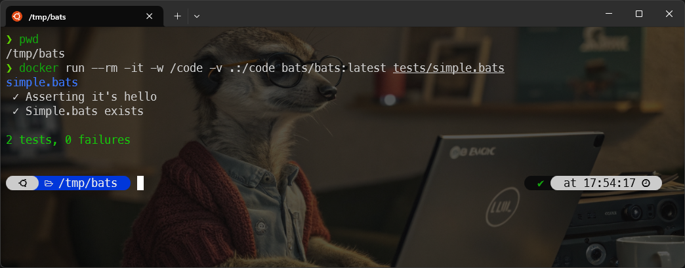
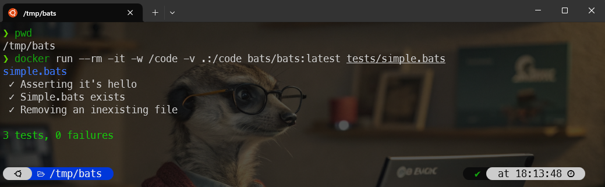

Like all command-line developers, I write Linux Bash scripts.  Like any programmer, I'm supposed to write unit tests. Well, I have to admit that I rarely write them.

Some time ago, I wrote a set of Bash scripts that make up a library of functions (just like a framework) and here, the interest in having unit tests is even greater since these functions are supposed to be stable and can be used as foundations for more advanced scripts.

In this article, we look at how to write unit tests for Bash scripts.

<!-- truncate -->

## Let's start with a little hors d'oeuvre

Like always, first, we'll create a new folder so we can play with some examples.

Please run `mkdir -p /tmp/bats && cd $_` to create a temporary folder and jump in it; then run `code .` to start VSCode and open the folder.

We'll create a simple illustration file, let's call it `tests/simple.bats` and copy/paste the following content:

<details>

<summary>tests/simple.bats</summary>

```bash
#!/usr/bin/env bats

setup() {    
    bats_load_library bats-support
    bats_load_library bats-assert
}

@test "Asserting it's hello" {
  run echo "hello"
  assert_output "hello"
  assert_success
}

@test "Simple.bats exists" {
  run ls tests/simple.bats 
  assert_output --regexp "tests\/[Ss]imple\.bats"
  assert_success
}
```

</details>

And now, the very difficult part is, ouch no, so easy in fact, to run [Bats-core](https://bats-core.readthedocs.io/en/stable/):

```bash
docker run --rm -it -v .:/code bats/bats:latest /code/tests/simple.bats                     
```

And ... it works.



### What did we do?

We've created a very basic example with two checks. 

The first one is called *Asserting it's hello* and we've fired `echo "hello"` just like we can make in a Shell script. Then running `assert_output "hello"` we are checking the output of the fired command is `hello` and it's a success (so it's `hello` and nothing else)

This is done using this script:

```bash
@test "Asserting it's hello" {
  run echo "hello"
  assert_output "hello"
  assert_success
}
```

And the second check is called *Simple.bats exists* and we're just doing a `ls tests/simple.bats` and check if, for the illustration, `tests/Simple.bats` or `tests/simple.bats` is returned in the list of file (this, to illustrate the use of a regular expression).

```bash
@test "Simple.bats exists" {
  run ls tests/simple.bats 
  assert_output --regexp "tests\/[Ss]imple\.bats"
  assert_success
}
```

### Asserting a failure 

Of course we can also assert a failure. Edit your `tests/simple.bats` file like this:

<details>

<summary>tests/simple.bats</summary>

```bash
#!/usr/bin/env bats

setup() {    
    bats_load_library bats-support
    bats_load_library bats-assert
}

@test "Asserting it's hello" {
  run echo "hello"
  assert_output "hello"
  assert_success
}

@test "Simple.bats exists" {
  run ls tests/simple.bats 
  assert_output --regexp "tests\/[Ss]imple\.bats"
  assert_success
}

# highlight-start
@test "Removing an inexisting file" {
  run rm tests/INEXTISTING_FILE
  assert_failure
}
# highlight-end
```

</details>

So, we'll just try to remove a not-existing file and we expect, for sure, a failure:



## Some real world use cases

Create a test scenario.

Imagine the following, simplified, tree structure:

```bash
.
├── src
│   └── assert.sh
└── tests
    ├── assert.bats
```

The file `src/assert.sh` contains your Linux shell code you want to test. Your test scenario should be stored in the `tests` folder. Since we'll write tests for the `src/assert.sh` file, let's create the  `tests/assert.bats`.

Below the content of the `~/src/assert.sh`. Very simple function to check the existence of a file on the filesystem. This very straight-forward function will return 0 if the file exists and 1 otherwise. The filename has to be passed as a parameter to the function.


<details>

<summary>src/assert.sh</summary>


```bash
#!/usr/bin/env bash

function assert::fileExists() {
    [[ -f "$1" ]]
}
```

</details>

Below the content of the `test/assert.bats`.


<details>

<summary>tests/assert.bats</summary>


```bash
#!/usr/bin/env bats

setup() {
    bats_load_library bats-assert

    DIR="$(cd "$(dirname "$BATS_TEST_FILENAME")" >/dev/null 2>&1 && pwd)"
    PATH="$DIR/../src:$PATH"
}

@test "Assert file exists on an existing file" {
  source assert.sh
  run assert::fileExists "assert.sh"
  assert_success
}

@test "Assert file exists on an not existing file" {
  source assert.sh
  run assert::fileExists "file.sh"
  assert_failure
}
```

</details>


My repo `https://github.com/cavo789/bash_unit_testing_using_bats`

The command line:

```bash
docker run --rm -it -v .:/code bats/bats:latest /code/tests/test.bats                     
```

The `tests/test.bats` file:

