At work, I'm part of a team of PHP developers where we work together to create a very large proprietary application with a web interface.

This application is developed using the Laravel framework and we use [PHPUnit](https://phpunit.de/index.html) and [Pes](https://pestphp.com/) to run our unit tests.

However, in addition to the unit tests, we are also putting in place a tool that will simulate actions on our interface, such as accessing the login page, entering a login and password, simulating the click on the 'login' button and then on the new page displaying ... (a long list of actions).  

It's a bit like asking a human to play out scenarios over and over again, every day, to make sure we haven't introduced any regressions in our latest developments, like a cool new feature whose code changes have broken a previous feature.

For this, we're using [Behat](https://docs.behat.org/en/latest/). This is a [composer](https://getcomposer.org/) dependency you can add to your project (or a new one). The idea is to be able to write assertions in pure English (or French) like "I go to the ABC website then I'll click on the blog menu item and I should receive a list of blog items" or "In the search box, I type Docker then I click on the search button and I should receive articles having the Docker tags".

<!-- truncate -->

As you can read on the [Behat](https://docs.behat.org/en/latest/) site, *Behat is an open source Behavior-Driven Development framework for PHP. It is a tool to support you in delivering software that matters through continuous communication, deliberate discovery and test-automation.*  This means that, in fact, you can start to write your scenarios even before coding. You can ask to your client to write assertions in common english. Once done, the developper will start to code and once done, he just need to run the written scenarios to make sure the software answers to the client requirements.

Let's play.

## Create a new project

As you know if you're a regular reader of my blog, I drink, eat and breathe Docker, which means that I no longer have PHP, composer or anything else on my computer.

To illustrate this blog, I'm going to quickly create a little 'from scratch' project with Docker, PHP 8.2 and composer. If you already have a project and you want to reuse it, you can skip this chapter.

* Create a temporary directory: `mkdir /tmp/behat && cd $_`.

* Create a file called `Dockerfile` with this content:

```Dockerfile
# The user and group ID of the user to create
ARG DOCKER_UID=1000
ARG DOCKER_GID=1000
ARG USERNAME=johndoe
ARG CHROME_VERSION=115.0.5763.0

FROM php:8.2-fpm

# Install system dependencies
RUN apt-get update && apt-get install -y git jq zip unzip wget gnupg \
    && apt-get clean \
    && rm -rf /tmp/* /var/list/apt/*

# We'll create a new user with the same uid/gid than ours, on our host machine.
ARG DOCKER_UID
ARG DOCKER_GID
ARG USERNAME

RUN groupadd --gid ${DOCKER_GID} "${USERNAME}" \
    && useradd --home-dir /home/"${USERNAME}" --create-home --uid ${DOCKER_UID} \
        --gid ${DOCKER_GID} --shell /bin/sh --skel /dev/null "${USERNAME}"

ARG CHROME_VERSION
ARG DOWNLOAD_URL="https://googlechromelabs.github.io/chrome-for-testing/known-good-versions-with-downloads.json"
    
# Download Chrome (the browser and the driver)
RUN wget --no-check-certificate --no-verbose -O - https://dl-ssl.google.com/linux/linux_signing_key.pub | apt-key add - \
    && sh -c 'echo "deb https://dl.google.com/linux/chrome/deb/ stable main" >> /etc/apt/sources.list.d/google.list' \
    && apt-get update -yqq \
    && apt-get install -y --no-install-recommends -yq gconf-service libasound2 libatk1.0-0 libc6 libcairo2 \
        libcups2 libdbus-1-3 libexpat1 libfontconfig1 libgbm1 libgcc1 libgconf-2-4 \
        libgdk-pixbuf2.0-0 libglib2.0-0 libgtk-3-0 libnspr4 libpango-1.0-0 \
        libpangocairo-1.0-0 libstdc++6 libx11-6 libx11-xcb1 libxcb1 libxcomposite1 \
        libxcursor1 libxdamage1 libxext6 libxfixes3 libxi6 libxrandr2 libxrender1 \
        libxss1 libxtst6 ca-certificates fonts-liberation libnss3 lsb-release \
        xdg-utils \
    && apt-get clean \
    && rm -rf /tmp/* /var/list/apt/* \
    # --- Download the browser ---
    && ZIP_URL=$(curl $DOWNLOAD_URL | jq -r ".versions[] | select(.version==\""$CHROME_VERSION"\").downloads.chrome[] | select(.platform==\""linux64"\") .url") \
    && wget --no-check-certificate --no-verbose -O /tmp/chrome_browser.zip $ZIP_URL \
    && printf "\e[0;105m%s\e[0;0m\n" "Using chromedriver $(/usr/local/bin/chrome/chromedriver --version)" \
    #  Unzip and create the /usr/local/bin/chromedriver executable  (-j means don't create a subfolder with the name of the archive; unzip in the folder directly)
    && unzip -j /tmp/chrome_browser.zip -d /usr/local/bin/chrome \
    && rm -f /tmp/chrome_browser.zip \
    && ls -alh /usr/local/bin/chrome \
    && chmod +x /usr/local/bin/chrome/chrome \
    # --- Download the driver ---
    && ZIP_URL=$(curl $DOWNLOAD_URL | jq -r ".versions[] | select(.version==\""$CHROME_VERSION"\").downloads.chromedriver[] | select(.platform==\""linux64"\") .url") \
    && wget --no-check-certificate --no-verbose -O /tmp/chrome_driver.zip $ZIP_URL \
    #  Unzip and create the /usr/local/bin/chromedriver executable  (-j means don't create a subfolder with the name of the archive; unzip in the folder directly)
    && unzip -j /tmp/chrome_driver.zip -d /usr/local/bin/chrome \
    && rm -f /tmp/chrome_driver.zip \
    && chmod +x /usr/local/bin/chrome/chrome \
    # Make some cleanup
    && apt-get clean \
    && rm -rf /tmp/* /var/list/apt/*

# Get latest Composer
COPY --from=composer:latest /usr/bin/composer /usr/bin/composer

RUN mkdir /opt/behat

# Set working directory
WORKDIR /opt/behat
```

* Create a file called `docker-compose.yml` with this content:

```yaml
services:
  app:
    build: 
      context: .
      args:
        - DOCKER_UID=1000
        - DOCKER_GID=1000
        - USERNAME=johndoe
    container_name: php-app
    working_dir: /opt/behat
    volumes:
      - ./:/opt/behat
```

* Run `docker compose up --detach` to create your Docker container

We'll check if the Chrome driver is correctly installed by running `docker compose exec -u $(id -u):$(id -g) app /usr/local/bin/chrome/chromedriver --version`. Same for the Chrome browser `docker compose exec -u $(id -u):$(id -g) app /usr/local/bin/chrome/chrome --version`. Nice!

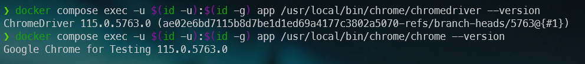

Ok, let's do one more thing; we need to create our `composer.json` file since we need to include the PHP `behat` dependency.

* Run `docker compose exec -u $(id -u):$(id -g) app /bin/bash` to start an interactive shell in your Docker container and be yourself (i.e. by using `-u $(id -u):$(id -g)` files and folders created in Docker will be owned by you),

* Run `composer init` to start the composer wizard; type any value you want f.i.
    * Package name: `johndoe/behat`,
    * Description: `Introduction to behat`,
    * Author: `John Doe`,
    * Minimum Stability: *Just press enter*,
    * Packate Type: `project`,
    * License: *Just press enter*,
    * Composer will ask if you want to define dependencies and dev dependencies; answer `no` twice right now,
    * The next question will be about PSR-4, *just press enter*,
    * Finally answer `yes` to the confirmation message.

Now, if you're curious, you'll see you've a new file called `composer.json` and two folders called `src` and `vendor`.

## Let's install behat

As stated in the [How to install?](https://docs.behat.org/en/latest/quick_start.html#installation) documentation, you just need to execute `composer require --dev behat/behat:^3` to install Behat as a dev dependency.

Once installed, you can start Behat by running `vendor/bin/behat` but right now, you'll got an error and this is perfectly normal since we need to start to write our first scenario.

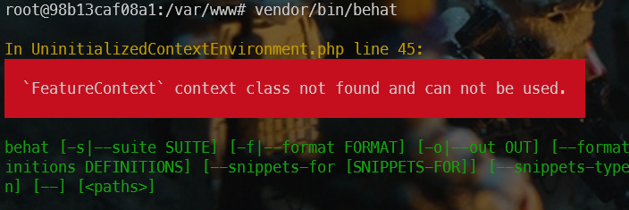

As you can read in the official documentation, just run `vendor/bin/behat --init` to create the required files.

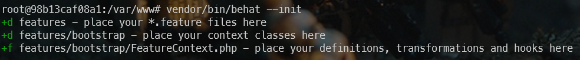

If you look at your folder, you can see you've now a new folder called `features/bootstrap` with a file called `FeatureContext.php`.

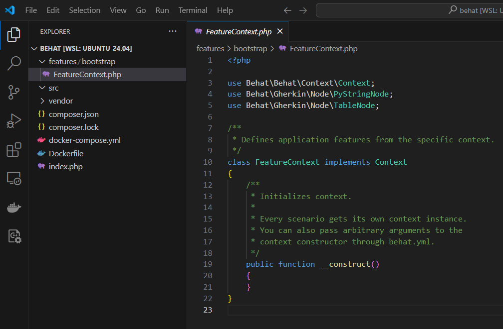

## Time to learn more about features

A feature is something you want to play using automation. For instance:

```
Feature: Clicking on the Blog menu item should gives me the list of articles

  Scenario: I click on the Blog menu
    Given I am on "https://www.avonture.be"
    Then I click on the "Blog" menu item
    Then I should be on "/blog"
```

This has to be put in a file having the `.feature` extension in the  `features` folder; let's create the `Blog.feature` file with this content:

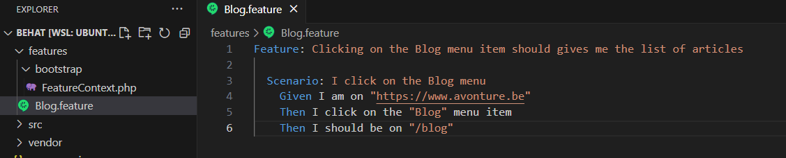

:::note Think to install `Cucumber (Gerkin) Full Support`
If you're using Visual Studio Code, you can install [Cucumber (Gerkin) Full Support](https://marketplace.visualstudio.com/items?itemName=alexkrechik.cucumberautocomplete) to get colorization, a better integration in vscode like autocompletion.
:::

Your scenario here above is using three **steps**:

1. `Given I am on "https://www.avonture.be"`,
2. `Then I click on the "Blog" menu item` and
3. `Then I should be on "/blog"`. 

You've to learn to Behat how to *translate* these sentences (it's the [Gherkin language](https://cucumber.io/docs/gherkin/)) in PHP code.

## Writing your steps in PHP

Now, please open the file `features/bootsrap/FeatureContext.php` in your preferred editor:

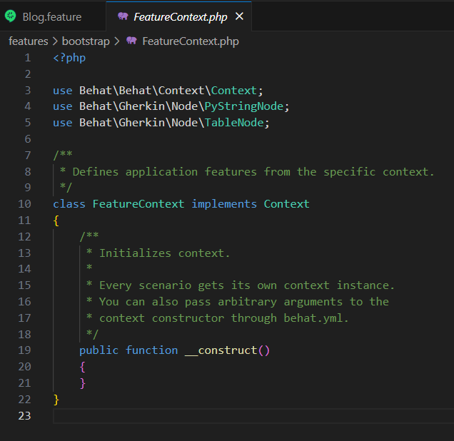

As you can see, this is the default file, added by Behat. We need to create some PHP code here but how?

Go back to your console and run `vendor/bin/behat --dry-run --append-snippets`. This will ask Behat to create the steps for you, automagically.


Please type `1` to ask Behat to use your `FeatureContext.php` file. You'll then get a confirmation on screen:

```bash
u features/bootstrap/FeatureContext.php - `I am on "https://www.avonture.be"` definition added
u features/bootstrap/FeatureContext.php - `I click on the "Blog" menu item` definition added
u features/bootstrap/FeatureContext.php - `I should be on "/blog"` definition added
```

Please open the file `features/bootsrap/FeatureContext.php` once more in your preferred editor:

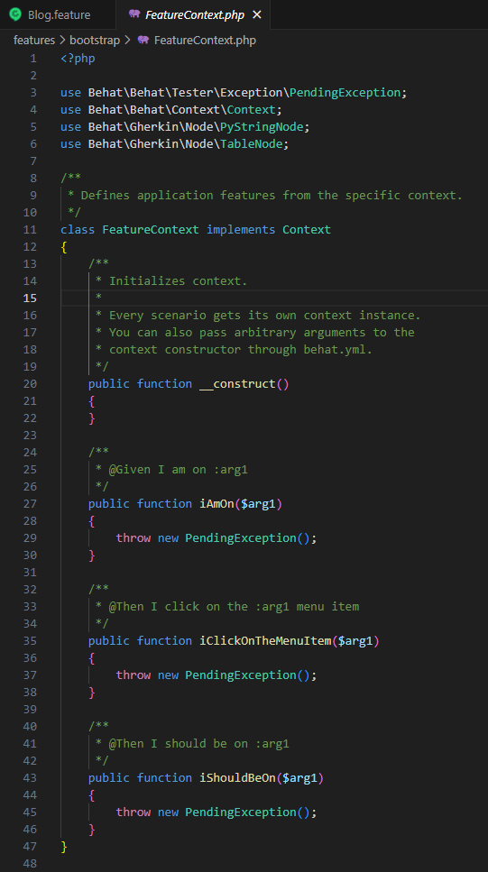

Nice isn't?

And, now, before even starting to code, let's ask Behat to run our scenario; please run `vendor/bin/behat` in the console:


Wow! So nice! We've thus ask Behat to run our scenario and he knows that we've three steps and we still need to write the associated code in PHP (therefore the **TODO: write pending definition** message in yellow).

Let's give ourselves the means to do the best we can as quickly as possible, without reinventing the wheel if someone else has already done it. Let's install two new dependencies. In your console, please run `composer require --dev friends-of-behat/mink` and `composer require --dev dmore/behat-chrome-extension`.

Indeed, for sure, someone has already written the `iAmOn` function no?

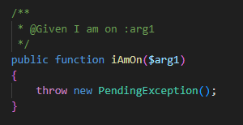

## Using Mink

Now that Mink has been installed, go to your editor, open the file `features/bootsrap/FeatureContext.php` and replace the line `class FeatureContext implements Context` like this `class FeatureContext extends \Behat\MinkExtension\Context\MinkContext`.

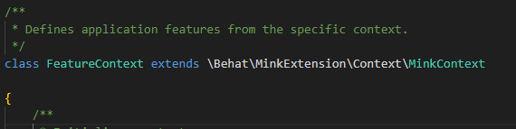

This small changes will empower us because Mink will comes with a lot of already written steps.

To get the list, run `clear ; vendor/bin/behat -di` in your console:


Did you see? We've our three steps (the first three displayed) then we got extra steps coming from Mink. And you can scroll a lot, there are already many steps that Mink allows you to reuse.

Run `clear ; vendor/bin/behat` in the console again:

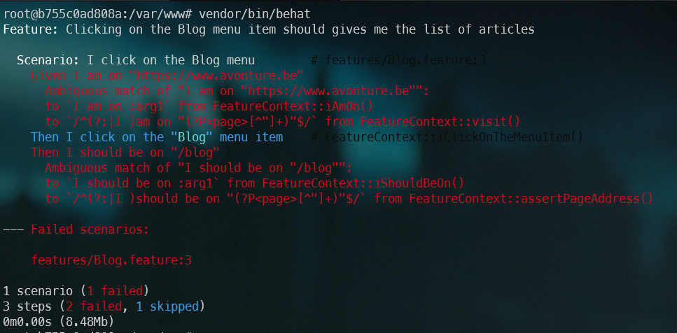

We got the *Ambiguous match of ...* error on the very first step, our *I am on "https://www.avonture.be"* step. Ambiguous means that we're trying to add some PHP code in our context while that step is already defined (by Mink). So, just drop it by editing your `FeatureContext.php` file, select the `public function iAmOn` and remove the entire function.

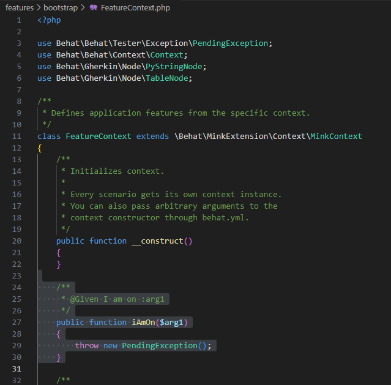

By running `clear ; vendor/bin/behat` again and you'll have the same error for `iShouldBeOn` so remove that function too.

Run `clear ; vendor/bin/behat` once more and now we'll got a new error:

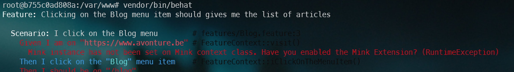

## Installing the Mink extension

We'll now need to reference the `behat-chrome-extension` in a such called `behat.yml` file.

Please create the file called `behat.yml` in your project's root directory; with this content:

```yaml
default:
    extensions:
        DMore\ChromeExtension\Behat\ServiceContainer\ChromeExtension: ~
        Behat\MinkExtension:
            browser_name: chrome
            base_url: https://www.avonture.be
            sessions:
                default:
                    chrome:
                      api_url: http://0.0.0.0:9222
```

Also, please edit the file `features/bootsrap/FeatureContext.php` and replace the existing content below.

We've changes a few `use` to add Mink libraries (and remove unneded ones). We've also added a `$mink` private property and put some lines in the `__constructor`.

:::warning Please update the url `https://www.avonture.be` to match your site
:::

```php
<?php

use Behat\Mink\Mink;
use Behat\Mink\Session;
use DMore\ChromeDriver\ChromeDriver;
use Behat\Behat\Tester\Exception\PendingException;

/**
 * Defines application features from the specific context.
 */
class FeatureContext extends \Behat\MinkExtension\Context\MinkContext
{

    private Behat\Mink\Mink $mink;

    /**
     * Initializes context.
     *
     * Every scenario gets its own context instance.
     * You can also pass arbitrary arguments to the
     * context constructor through behat.yml.
     */
    public function __construct()
    {
        $this->mink = new Mink(
            [
                'browser' => new Session(
                    new ChromeDriver(
                        'http://0.0.0.0:9222',
                        null,
                        "https://www.avonture.be"  // <-- Think to update to the site you wish to test
                    )
                )
            ]
        );
        
    }

    /**
     * @Then I click on the :arg1 menu item
     */
    public function iClickOnTheMenuItem($arg1)
    {
        throw new PendingException();
    }
}
```

By running `vendor/bin/behat` again, we've now another error:

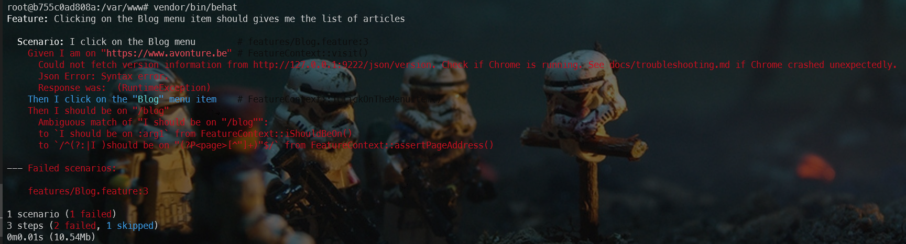

## Time to run Chrome

Create a file called `run.sh` with this content:

```bash
#!/usr/bin/env bash

clear

# We'll start Chrome on URL http://0.0.0.0:9222
# If this URL has to be modified, think to update the constructor of /opt/behatFeatureContext.php too
# Note: /usr/bin/google-chrome-stable has been installed in our Dockerfile
nohup /usr/local/bin/chrome/chrome --headless --remote-debugging-address=0.0.0.0 \
    --remote-debugging-port=9222 --no-sandbox --window-size="1920,1080" --disable-dev-shm-usage \
    --disable-extensions --no-startup-window --no-first-run --no-pings > /dev/null 2>&1 &

# Get the process ID of chrome so we can kill the process when we've finished
chromePID=$!

# shellcheck disable=SC2048,SC2086
php -d memory_limit=-1 "vendor/bin/behat" ${flags}

if ((chromePID > 0)); then
    kill ${chromePID} > /dev/null 2>&1
fi
```

Then make the file executable by running `chmod +x ./run.sh`.

Now, you can start Behat by starting `./run.sh` in your console.

If everything is going fine, you'll get this:

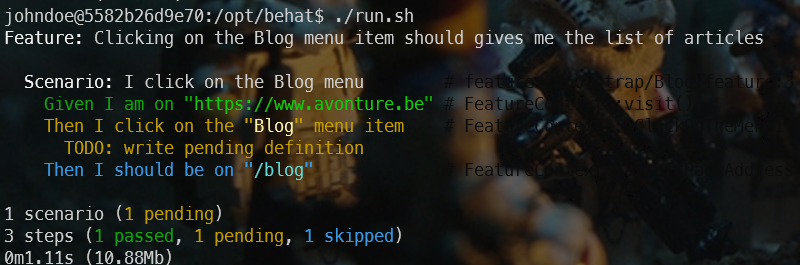

As you can see, the `Given I am on...` line is in green: Behat, thanks to our Chrome driver, has been able to reach the page.

Then the line `Then I click on the "Blog" menu item` is in yellow and this is normal since we haven't yet create the function and, logically, `Then I should be on "/blog"` is in blue because that sentence wasn't executed yet (skipped).

## Appendix - List of files and their contents

During this tutorial, we've manipulate a lot of files. To allow you to check if your version is well the one used at the end of this article, you'll find every files here below with their content at the end of the tutorial.

### behat.yaml

```yml
default:
    extensions:
        DMore\ChromeExtension\Behat\ServiceContainer\ChromeExtension: ~
        Behat\MinkExtension:
            browser_name: chrome
            base_url: https://www.avonture.be
            sessions:
                default:
                    chrome:
                      api_url: http://0.0.0.0:9222
```

### Blog.feature

The relative filename is `features/Blog.feature`.

```gherkin
Feature: Clicking on the Blog menu item should gives me the list of articles

  Scenario: I click on the Blog menu
    Given I am on "https://www.avonture.be"
    Then I click on the "Blog" menu item
    Then I should be on "/blog"
```

### composer.json

```json
{
    "name": "johndoe/behat",
    "description": "Introduction to behat",
    "type": "project",
    "autoload": {
        "psr-4": {
            "Johndoe\\Behat\\": "src/"
        }
    },
    "authors": [
        {
            "name": "John Doe"
        }
    ],
    "require-dev": {
        "behat/behat": "^3",
        "dmore/behat-chrome-extension": "^1.4",
        "friends-of-behat/mink": "^1.11"
    }
}
```

### docker-compose.yml

```yml
services:
  app:
    build: 
      context: .
      args:
        - DOCKER_UID=1000
        - DOCKER_GID=1000
        - USERNAME=johndoe
    container_name: php-app
    working_dir: /opt/behat
    volumes:
      - ./:/opt/behat
```

### Dockerfile

```Dockerfile
# The user and group ID of the user to create
ARG DOCKER_UID=1000
ARG DOCKER_GID=1000
ARG USERNAME=johndoe
ARG CHROME_VERSION=115.0.5763.0

FROM php:8.2-fpm

# Install system dependencies
RUN apt-get update && apt-get install -y git jq zip unzip wget gnupg \
    && apt-get clean \
    && rm -rf /tmp/* /var/list/apt/*

# We'll create a new user with the same uid/gid than ours, on our host machine.
ARG DOCKER_UID
ARG DOCKER_GID
ARG USERNAME

RUN groupadd --gid ${DOCKER_GID} "${USERNAME}" \
    && useradd --home-dir /home/"${USERNAME}" --create-home --uid ${DOCKER_UID} \
        --gid ${DOCKER_GID} --shell /bin/sh --skel /dev/null "${USERNAME}"

ARG CHROME_VERSION
ARG DOWNLOAD_URL="https://googlechromelabs.github.io/chrome-for-testing/known-good-versions-with-downloads.json"
    
# Download Chrome (the browser and the driver)
RUN wget --no-check-certificate --no-verbose -O - https://dl-ssl.google.com/linux/linux_signing_key.pub | apt-key add - \
    && sh -c 'echo "deb https://dl.google.com/linux/chrome/deb/ stable main" >> /etc/apt/sources.list.d/google.list' \
    && apt-get update -yqq \
    && apt-get install -y --no-install-recommends -yq gconf-service libasound2 libatk1.0-0 libc6 libcairo2 \
        libcups2 libdbus-1-3 libexpat1 libfontconfig1 libgbm1 libgcc1 libgconf-2-4 \
        libgdk-pixbuf2.0-0 libglib2.0-0 libgtk-3-0 libnspr4 libpango-1.0-0 \
        libpangocairo-1.0-0 libstdc++6 libx11-6 libx11-xcb1 libxcb1 libxcomposite1 \
        libxcursor1 libxdamage1 libxext6 libxfixes3 libxi6 libxrandr2 libxrender1 \
        libxss1 libxtst6 ca-certificates fonts-liberation libnss3 lsb-release \
        xdg-utils \
    && apt-get clean \
    && rm -rf /tmp/* /var/list/apt/* \
    # --- Download the browser ---
    && ZIP_URL=$(curl $DOWNLOAD_URL | jq -r ".versions[] | select(.version==\""$CHROME_VERSION"\").downloads.chrome[] | select(.platform==\""linux64"\") .url") \
    && wget --no-check-certificate --no-verbose -O /tmp/chrome_browser.zip $ZIP_URL \
    && printf "\e[0;105m%s\e[0;0m\n" "Using chromedriver $(/usr/local/bin/chrome/chromedriver --version)" \
    #  Unzip and create the /usr/local/bin/chromedriver executable  (-j means don't create a subfolder with the name of the archive; unzip in the folder directly)
    && unzip -j /tmp/chrome_browser.zip -d /usr/local/bin/chrome \
    && rm -f /tmp/chrome_browser.zip \
    && ls -alh /usr/local/bin/chrome \
    && chmod +x /usr/local/bin/chrome/chrome \
    # --- Download the driver ---
    && ZIP_URL=$(curl $DOWNLOAD_URL | jq -r ".versions[] | select(.version==\""$CHROME_VERSION"\").downloads.chromedriver[] | select(.platform==\""linux64"\") .url") \
    && wget --no-check-certificate --no-verbose -O /tmp/chrome_driver.zip $ZIP_URL \
    #  Unzip and create the /usr/local/bin/chromedriver executable  (-j means don't create a subfolder with the name of the archive; unzip in the folder directly)
    && unzip -j /tmp/chrome_driver.zip -d /usr/local/bin/chrome \
    && rm -f /tmp/chrome_driver.zip \
    && chmod +x /usr/local/bin/chrome/chrome \
    # Make some cleanup
    && apt-get clean \
    && rm -rf /tmp/* /var/list/apt/*

# Get latest Composer
COPY --from=composer:latest /usr/bin/composer /usr/bin/composer

RUN mkdir /opt/behat

# Set working directory
WORKDIR /opt/behat
```

### FeatureContext.php

The relative filename is `features/bootstrap/FeatureContext.php`.

```php
<?php

use Behat\Mink\Mink;
use Behat\Mink\Session;
use DMore\ChromeDriver\ChromeDriver;
use Behat\Behat\Tester\Exception\PendingException;

/**
 * Defines application features from the specific context.
 */
class FeatureContext extends \Behat\MinkExtension\Context\MinkContext
{

    private Behat\Mink\Mink $mink;

    /**
     * Initializes context.
     *
     * Every scenario gets its own context instance.
     * You can also pass arbitrary arguments to the
     * context constructor through behat.yml.
     */
    public function __construct()
    {
        $this->mink = new Mink(
            [
                'browser' => new Session(
                    new ChromeDriver(
                        'http://0.0.0.0:9222',
                        null,
                        "https://www.avonture.be"  // <-- Think to update to the site you wish to test
                    )
                )
            ]
        );
        
    }

    /**
     * @Then I click on the :arg1 menu item
     */
    public function iClickOnTheMenuItem($arg1)
    {
        throw new PendingException();
    }
}
```

### run.sh

```bash
#!/usr/bin/env bash

clear

# We'll start Chrome on URL http://0.0.0.0:9222
# If this URL has to be modified, think to update the constructor of FeatureContext.php too
# Note: /usr/bin/google-chrome-stable has been installed in our Dockerfile
nohup /usr/local/bin/chrome/chrome --headless --remote-debugging-address=0.0.0.0 \
    --remote-debugging-port=9222 --no-sandbox --window-size="1920,1080" --disable-dev-shm-usage \
    --disable-extensions --no-startup-window --no-first-run --no-pings > /dev/null 2>&1 &

# Get the process ID of chrome so we can kill the process when we've finished
chromePID=$!

# shellcheck disable=SC2048,SC2086
php -d memory_limit=-1 "vendor/bin/behat" ${flags}

if ((chromePID > 0)); then
    kill ${chromePID} > /dev/null 2>&1
fi
```