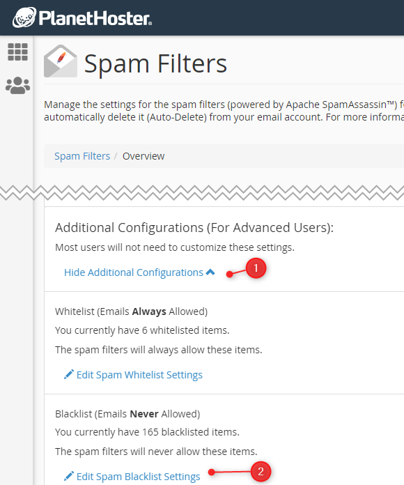

# Kill spam on your host before getting it in your mail client


How to configure **SpamAssassin** in your cpanel so spam are immediately deleted by your hosting company and stay away from your mail clients.

<!-- truncate -->

> [https://forums.cpanel.net/threads/import-and-export-spamassassin-entries.612223/](https://forums.cpanel.net/threads/import-and-export-spamassassin-entries.612223/)

Using your FTP client, go to your user's home directory. If your host has SpamAssassin enabled, you'll see a folder called `.spamassassin` and, in that folder, a file called `user_prefs`.

That file can looks like this:

```text
blacklist_from *.hr
blacklist_from *.rest
blacklist_from *.ru
blacklist_from *.su

whitelist_from *@avonture.be
whitelist_from *@my-own-company.com
```

As you can expect, you'll find two rules: `blacklist_from` and `whitelist_from` with the pattern you've filled in the SpamAssassin web interface of your hosting company:



:::tip Spam Filters location
You can manipulate entries one by one using the web interface too. Go to your cPanel, search for `Spam Filters` and click on `Additional Configurations (For Advanced Users)`.
:::

You can now manipulate the list with f.i. vscode and sort it alphabetically, simplify rules, remove duplicated entries (after refactoring), ...

The big advantage here is that emails are automatically deleted by your host. This is a real plus, because otherwise, if you use several mail clients (e.g. on your computer and smartphone and a webmail), spam, if it reaches you, will be visible in all three interfaces. This makes it difficult to create rules, since the mail client is different each time.
