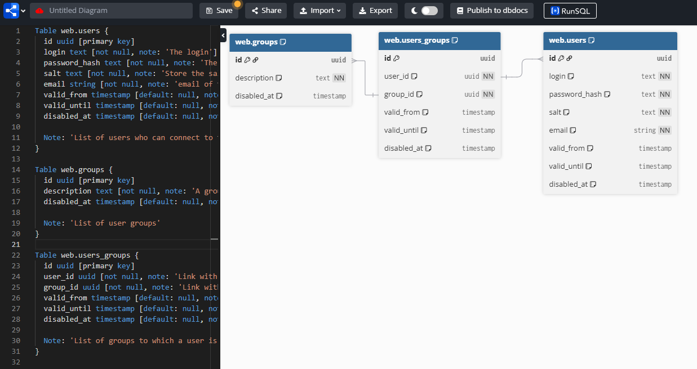
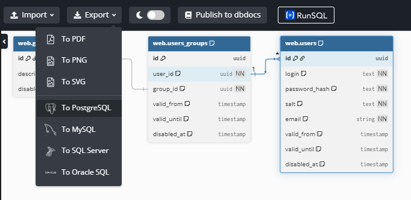
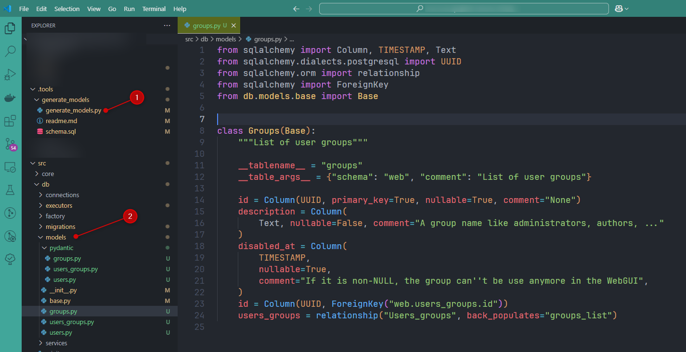

<!-- cspell:ignore dbdiagram,drawdb,pydantic,hocus,pocus,sqlalchemy -->


Over the last few days, I've needed to propose a database schema, and a colleague showed me [dbdiagram.io](https://dbdiagram.io/) with a proposal of his own. It's a really cool and easy tool.

In the free version we were not able to collaborate, but all you have to do is create a new project, copy/paste the pseudo-code from the colleague and you're off.

The aim of this article is to share a personal experience which, thanks to AI, has enabled me to create even the Python code for my tables.

<!-- truncate -->

## Create the database schema

Jump to [https://dbdiagram.io/d](https://dbdiagram.io/d) and unfold the left pane: the one where you can describe your tables.

By just opening the website, you'll immediately get an example. It's a very easy language.

In the example below, let's create three tables: we'll create a web interface and we need a `users` table, a `groups` one and a `users_groups`. We'll define fields for sure but also constraints, relations and foresee a comment for each field:

<Snippets filename="dbdiagram.txt">

```text
Table users {
  id uuid [primary key]
  login text [not null, note: 'The login']
  password_hash text [not null, note: 'The encrypted password' ]
  salt text [not null, note: 'Store the salt used for hashing' ]
  email string [not null, note: 'email of the user']
  valid_from timestamp [default: null, note: 'If not NULL, the web user will only be authorized from a specific date.']
  valid_until timestamp [default: null, note: 'If not NULL, the web user will no longer be authorized from a specific date. They will no longer be able to connect to the interface.']
  disabled_at timestamp [default: null, note: 'If it is non-NULL, the user can\'t connect anymore to the WebGUI.']

  Note: 'List of users who can connect to the WebGUI and access to some administrative features.'
}

Table groups {
  id uuid [primary key]
  description text [not null, note: 'A group name like administrators, authors, ...']
  disabled_at timestamp [default: null, note: 'If it is non-NULL, the group can\'t be use anymore in the WebGUI']

  Note: 'List of user groups'
}

Table users_groups {
  id uuid [primary key]
  user_id uuid [not null, note: 'Link with users', ref: < users.id ]
  group_id uuid [not null, note: 'Link with groups', ref: < groups.id ]
  valid_from timestamp [default: null, note: 'If not NULL, the web user will only be a member of the group from a specific date.']
  valid_until timestamp [default: null, note: 'If not NULL, the web user will no longer be a member of the group from a specific date.']
  disabled_at timestamp [default: null, note: 'If it is non-NULL, the user is no more part of the group']

  Note: 'List of groups to which a user is attached. The same user can belong to several groups.'
}

```

</Snippets>



One of the nice thing: you can send the URL to this schema to anyone and ask him to review your schema.

## Let's get the SQL statements behind

As you can see, there is an `Export` button. To be able to use it, you should create a free account. Once done, you can export to multiple formats.



<Snippets filename="schema.sql">

```sql
CREATE SCHEMA "web";

CREATE TABLE "web"."users" (
  "id" uuid PRIMARY KEY,
  "login" text NOT NULL,
  "password_hash" text NOT NULL,
  "salt" text NOT NULL,
  "email" string NOT NULL,
  "valid_from" timestamp DEFAULT null,
  "valid_until" timestamp DEFAULT null,
  "disabled_at" timestamp DEFAULT null
);

CREATE TABLE "web"."groups" (
  "id" uuid PRIMARY KEY,
  "description" text NOT NULL,
  "disabled_at" timestamp DEFAULT null
);

CREATE TABLE "web"."users_groups" (
  "id" uuid PRIMARY KEY,
  "user_id" uuid NOT NULL,
  "group_id" uuid NOT NULL,
  "valid_from" timestamp DEFAULT null,
  "valid_until" timestamp DEFAULT null,
  "disabled_at" timestamp DEFAULT null
);

COMMENT ON TABLE "web"."users" IS 'List of users who can connect to the WebGUI and access to some administrative features.';

COMMENT ON COLUMN "web"."users"."login" IS 'The login';

COMMENT ON COLUMN "web"."users"."password_hash" IS 'The encrypted password';

COMMENT ON COLUMN "web"."users"."salt" IS 'Store the salt used for hashing';

COMMENT ON COLUMN "web"."users"."email" IS 'email of the user';

COMMENT ON COLUMN "web"."users"."valid_from" IS 'If not NULL, the web user will only be authorized from a specific date.';

COMMENT ON COLUMN "web"."users"."valid_until" IS 'If not NULL, the web user will no longer be authorized from a specific date. They will no longer be able to connect to the interface.';

COMMENT ON COLUMN "web"."users"."disabled_at" IS 'If it is non-NULL, the user can''t connect anymore to the WebGUI.';

COMMENT ON TABLE "web"."groups" IS 'List of user groups';

COMMENT ON COLUMN "web"."groups"."description" IS 'A group name like administrators, authors, ...';

COMMENT ON COLUMN "web"."groups"."disabled_at" IS 'If it is non-NULL, the group can''t be use anymore in the WebGUI';

COMMENT ON TABLE "web"."users_groups" IS 'List of groups to which a user is attached. The same user can belong to several groups.';

COMMENT ON COLUMN "web"."users_groups"."user_id" IS 'Link with users';

COMMENT ON COLUMN "web"."users_groups"."group_id" IS 'Link with groups';

COMMENT ON COLUMN "web"."users_groups"."valid_from" IS 'If not NULL, the web user will only be a member of the group from a specific date.';

COMMENT ON COLUMN "web"."users_groups"."valid_until" IS 'If not NULL, the web user will no longer be a member of the group from a specific date.';

COMMENT ON COLUMN "web"."users_groups"."disabled_at" IS 'If it is non-NULL, the user is no more part of the group';

ALTER TABLE "web"."users" ADD FOREIGN KEY ("id") REFERENCES "web"."users_groups" ("user_id");

ALTER TABLE "web"."groups" ADD FOREIGN KEY ("id") REFERENCES "web"."users_groups" ("group_id");
```

</Snippets>

## Generate the Python code

When we all agree about the schema (my colleagues and I), time to start the real database creation. I need to create tables (this process is called **migration**) and feed them (**seeding**).

Since I'm using [SqlAlchemy](https://www.sqlalchemy.org/), I should do this:

* For each table in my database, I need to create a [model](https://docs.sqlalchemy.org/en/20/orm/quickstart.html#declare-models)
* For each table I also need to create a [Pydantic](https://docs.pydantic.dev/latest/) file to make data validation easier.

What I want: since it's a one-shot and not a core feature of my project, I would appreciate to not lose time here. I would like to, by some magic hand, my generated `.sql` file can be processed and *translated* in Python code. I want to be able to work on dbdiagram.io again to make some fine-tuning and hocus pocus, generate the Python files again ... and again.

In short: I would appreciate that some IA will generate a helper for this single task. I would like to get a Python script f.i. that I can run on my dev machine (only; not on the server!).

The script below was generated by ChatGPT in just a few prompts (that's just incredible!).

I'll save it in my project's structure in folder `.tools/generate_models` (I'll not deploy the `.tools` folder on the server; it'll stay on my machine).

<!-- cspell:disable -->

<Snippets filename=".tools/generate_models/generate_models.py">

```python
import re
from pathlib import Path
from typing import Dict, List, Set, Tuple

# --- Configuration ---
SCHEMA_FILE = "schema.sql"
OUTPUT_DIR = Path("/app/src/db/models")
PYDANTIC_DIR = OUTPUT_DIR / "pydantic"
SCHEMA_VAR_NAME = "core_api"

# Ensure output directories exist
OUTPUT_DIR.mkdir(parents=True, exist_ok=True)
PYDANTIC_DIR.mkdir(parents=True, exist_ok=True)

# Write base.py (DeclarativeBase)
(OUTPUT_DIR / "base.py").write_text(
    """from sqlalchemy.orm import DeclarativeBase

class Base(DeclarativeBase):
    pass
""",
    encoding="utf-8",
)

# --- Regex Patterns ---
table_re = re.compile(r'CREATE TABLE "(?P<schema>\w+)"\."(?P<table>\w+)" \((?P<columns>.*?)\);', re.S)
column_re = re.compile(r'"(?P<name>\w+)" (?P<type>\w+)(?: NOT NULL)?(?: DEFAULT (?P<default>[^\s,]+))?', re.S)
comment_table_re = re.compile(r'COMMENT ON TABLE "(?P<schema>\w+)"\."(?P<table>\w+)" IS \'(?P<comment>.*?)\';', re.S)
comment_column_re = re.compile(r'COMMENT ON COLUMN "(?P<schema>\w+)"\."(?P<table>\w+)"\."(?P<column>\w+)" IS \'(?P<comment>.*?)\';', re.S)
fk_re = re.compile(
    r'ALTER TABLE "(?P<schema>\w+)"\."(?P<table>\w+)" ADD FOREIGN KEY \("(?P<column>\w+)"\) REFERENCES "(?P<ref_schema>\w+)"\."(?P<ref_table>\w+)" \("(?P<ref_column>\w+)"\);'
)

# Type mapping (PostgreSQL → SQLAlchemy, Pydantic)
TYPE_MAP = {
    "uuid": ("UUID", "UUID"),
    "string": ("String", "str"),
    "text": ("Text", "str"),
    "timestamp": ("TIMESTAMP", "datetime"),
    "date": ("Date", "date"),
    "json": ("JSON", "dict"),
}

# --- Load SQL File ---
with open(SCHEMA_FILE, "r", encoding="utf-8") as f:
    sql = f.read()

# --- Extract Comments ---
table_comments: Dict[str, str] = {}
column_comments: Dict[str, Dict[str, str]] = {}
for m in comment_table_re.finditer(sql):
    key = f"{m['schema']}.{m['table']}"
    table_comments[key] = m["comment"]
for m in comment_column_re.finditer(sql):
    key = f"{m['schema']}.{m['table']}"
    column_comments.setdefault(key, {})[m["column"]] = m["comment"]

# --- Extract Foreign Keys ---
foreign_keys: Dict[str, List[Tuple[str, str, str]]] = {}
reverse_rels: Dict[str, List[str]] = {}

for m in fk_re.finditer(sql):
    table = m["table"]
    ref_table = m["ref_table"]
    foreign_keys.setdefault(table, []).append((m["column"], ref_table, m["ref_column"]))
    reverse_rels.setdefault(ref_table, []).append(table)

# --- Process Tables ---
all_tables: Set[str] = set()

for m in table_re.finditer(sql):
    schema = m["schema"]
    table = m["table"]
    key = f"{schema}.{table}"
    all_tables.add(table)
    table_doc = table_comments.get(key, "")
    col_lines = m["columns"].strip().split(",\n")

    imports = {"Column"}
    types = set()
    pg_types = set()
    use_relationship = False

    column_code = []
    relationship_code = []
    pydantic_fields = []

    # Process each column
    for line in col_lines:
        cm = column_re.search(line.strip())
        if not cm:
            continue
        col = cm["name"]
        col_type_raw = cm["type"]
        default = cm["default"]
        nullable = "NOT NULL" not in line
        comment = str(column_comments.get(key, {}).get(col)).replace('"', "'")

        col_type, pyd_type = TYPE_MAP.get(col_type_raw, ("String", "str"))
        if col_type in {"UUID", "JSON"}:
            pg_types.add(col_type)
        else:
            types.add(col_type)

        col_def = f"    {col} = Column({col_type}"
        if "PRIMARY KEY" in line:
            col_def += ", primary_key=True"
        col_def += f", nullable={str(nullable)}"

        if default and default.lower() != "null":
            if default == "(now())":
                default = "(func.now())"

            col_def += f", default={default}"

        if comment:
            col_def += f', comment="{comment}"'
        col_def += ")"
        column_code.append(col_def)

        # Pydantic
        pydantic_fields.append(f"    {col}: Optional[{pyd_type}]")

    # Foreign keys
    for col, ref_table, _ in foreign_keys.get(table, []):
        column_code.append(f'    {col} = Column(UUID, ForeignKey("{SCHEMA_VAR_NAME}.{ref_table}.id"))')
        relationship_code.append(f'    {ref_table} = relationship("{ref_table.capitalize()}", back_populates="{table}_list")')
        use_relationship = True

    # Reverse relationships
    for ref_by in reverse_rels.get(table, []):
        relationship_code.append(f'    {ref_by}_list = relationship("{ref_by.capitalize()}", back_populates="{table}")')
        use_relationship = True

    # --- Write Model ---
    model_lines = (
        [
            f"from sqlalchemy import {', '.join(sorted(imports | types))}",
            f"from sqlalchemy.dialects.postgresql import {', '.join(sorted(pg_types))}" if pg_types else "",
            "from sqlalchemy.orm import relationship" if use_relationship else "",
            "from sqlalchemy import ForeignKey",
            "from sqlalchemy.sql import func",
            "from db.models.base import Base\n",
            "# cspell:ignore façade,facade\n",
            f"class {table.capitalize()}(Base):",
            f'    """{table_doc}"""\n',
            f'    __tablename__ = "{table}"',
            f"    __table_args__ = {{'schema': '{SCHEMA_VAR_NAME}', 'comment': '{table_doc}'}}\n",
            "",
        ]
        + column_code
        + relationship_code
    )

    (OUTPUT_DIR / f"{table}.py").write_text("\n".join(line for line in model_lines if line) + "\n", encoding="utf-8")

    # --- Write Pydantic Models ---
    pyd_code = f"""from pydantic import BaseModel
from typing import Optional
from uuid import UUID
from datetime import datetime, date

class {table.capitalize()}Base(BaseModel):
{chr(10).join(pydantic_fields)}

class {table.capitalize()}Create({table.capitalize()}Base):
    pass

class {table.capitalize()}Read({table.capitalize()}Base):
    id: UUID
"""
    (PYDANTIC_DIR / f"{table}.py").write_text(pyd_code, encoding="utf-8")

# --- Create models/__init__.py ---
init_lines = ["# ruff: noqa: F401\nfrom .base import Base"] + [f"from .{table} import {table.capitalize()}" for table in sorted(all_tables)]
(OUTPUT_DIR / "__init__.py").write_text("\n".join(init_lines) + "\n", encoding="utf-8")

print("✅ All models and Pydantic classes generated successfully.")
```

</Snippets>

The script will process the `schema.sql` file located in the same folder so let's copy/paste the SQL provided in the previous chapter into file `.tools/generate_models/schema.sql`.

Time to run the script: start a console, go to the `.tools/generate_models` folder and just run `python generate_models.py`.

You'll almost immediately see **✅ All models and Pydantic classes generated successfully.**.

Now, if you look into your `src/db/models` folder, you'll see a lot of new files:

* A `pydantic` folder where you'll have your tables (as a reminder, it's for data validation),
* A `__init__.py` file where all your table classes will be defined,
* A `base.py` ancestor class so you can add some reusable code for all your tables and
* One file by table.



The `generate_models.py` utility created by ChatGPT has thus converted

<Snippets filename="create_db.sql">

```sql
CREATE TABLE "web"."groups" (
  "id" uuid PRIMARY KEY,
  "description" text NOT NULL,
  "disabled_at" timestamp DEFAULT null
);

COMMENT ON TABLE "web"."groups" IS 'List of user groups';

COMMENT ON COLUMN "web"."groups"."description" IS 'A group name like administrators, authors, ...';

COMMENT ON COLUMN "web"."groups"."disabled_at" IS 'If it is non-NULL, the group can''t be use anymore in the WebGUI';

ALTER TABLE "web"."groups" ADD FOREIGN KEY ("id") REFERENCES "web"."users_groups" ("group_id");
```

</Snippets>

into this Python code:

<Snippets filename="create_db.py">

```python
from sqlalchemy import Column, TIMESTAMP, Text
from sqlalchemy.dialects.postgresql import UUID
from sqlalchemy.orm import relationship
from sqlalchemy import ForeignKey
from db.models.base import Base


class Groups(Base):
    """List of user groups"""

    __tablename__ = "groups"
    __table_args__ = {"schema": "web", "comment": "List of user groups"}

    id = Column(UUID, primary_key=True, nullable=True, comment="None")
    description = Column(
        Text, nullable=False, comment="A group name like administrators, authors, ..."
    )
    disabled_at = Column(
        TIMESTAMP,
        nullable=True,
        comment="If it is non-NULL, the group can''t be use anymore in the WebGUI",
    )
    id = Column(UUID, ForeignKey("web.users_groups.id"))
    users_groups = relationship("Users_groups", back_populates="groups_list")
```

</Snippets>

Crazy no?

:::info
The generated Python code isn't compliant with Python formatting standards but it's really not a problem. Just install the [Ruff](https://marketplace.visualstudio.com/items?itemName=charliermarsh.ruff) extension and once installed, press <kbd>CTRL</kbd>+<kbd>P</kbd> then run the *Ruff: format document* command.
:::

<!-- cspell:enable -->

## Drawdb-app

Last year I wrote [Drawdb-app - Render your database model as png, markdown, mermaid, ...](/blog/drawdb-app) which is another tool but not for the same use.  With Drawdb-app, you'll be able to upload an existing `.sql` file and get a visual representation of tables and their relationships.
