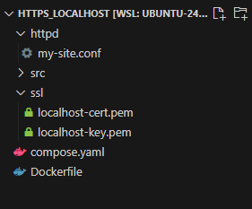
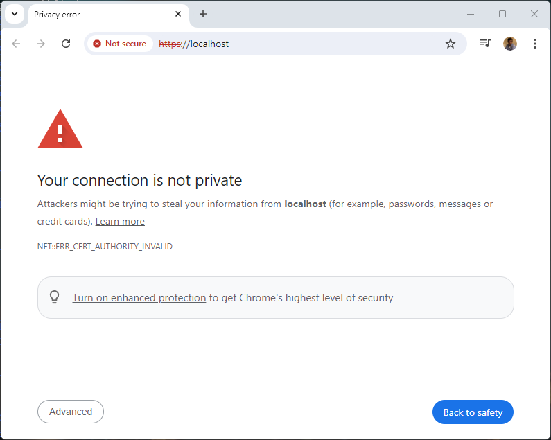
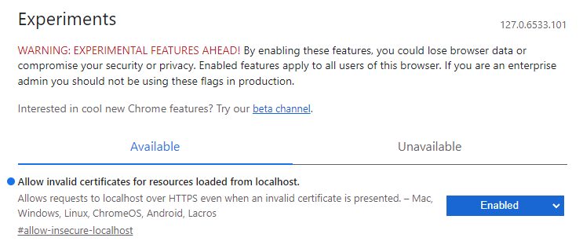

<!-- cspell:ignore htdocs,newkey,keyout,a2enmod,libapache2,unexpire,badaboum -->


In a [previous article](/blog/docker-html-site), I've explained how to run a static HTML site in seconds.

The result was a site running on your computer; using `http`. Let's go one step further and learn how to configure Docker to use `https` i.e. SSL and encryption.

<!-- truncate -->

First things first, let's create our sandbox. After a quick search on github.com, I've found a nice free one page html5/css3 template: [https://github.com/peterfinlan/Sedna](https://github.com/peterfinlan/Sedna).

Let's download it in a temporary folder on our hard disk, unzip the file, rename the default folder name (`Sedna-master`) to `src` and run the website using Docker:

```bash
mkdir -p /tmp/https_localhost && cd $_
wget https://github.com/peterfinlan/Sedna/archive/refs/heads/master.zip
unzip master.zip && rm master.zip && mv Sedna-master src
docker run -d --name static-site -p 8080:80 -v src:/usr/local/apache2/htdocs/ httpd:alpine  
```

Once these commands have been fired, please jump to `http://locahost:8080` and you'll get this:


The site is running using the http protocol. The objective of this article is to configure Docker to use SSL so we can use `https://locahost:8080` (you can try, actually, it's not working).

Please remove the running container; we'll create it back later on:

```bash
docker container rm static-site --force
```

## Create the SSL certificate

Still in our `/tmp/https_localhost` folder, please create a directory called `ssl` and we'll create our certificate there.

To do this, just copy/paste the code below

```bash
mkdir -p ssl
(
    cd ssl
    openssl req -x509 -nodes -days 365 -newkey rsa:2048 -keyout localhost-key.pem -out localhost-cert.pem -subj "/C=US/ST=MyCountry/L=MyCity/O=MyOrganization/CN=localhost"
)
```

The console will display a list of characters but you'll get two new files in the current directory: `localhost-key.pem` and `localhost-cert.pem`. 

:::info Valid for one year
The certificate (the `cert` file) and the private key (the `key` file) will be valid for one year.
:::

## Create our Apache configuration file

We need to configure Apache to use SSL. To do this, we need to create an Apache configuration file.

Please create a file called f.i. `my-site.conf` with the content. To do this, just copy/paste the code below:

```bash
mkdir -p httpd
(
    cd httpd

    touch my-site.conf

    cat <<EOT >> my-site.conf
ServerName localhost

<VirtualHost *:80>

    ServerName localhost
    ServerAlias localhost

    DocumentRoot /var/www/html

    <Directory /var/www/html>
        AllowOverride All
        RewriteEngine On
        RewriteCond %{REQUEST_FILENAME} !-f
        RewriteRule ^(.*)$ index.html [QSA,L]
    </Directory>

    ErrorLog /usr/local/apache2/logs/error.log
    CustomLog /usr/local/apache2/logs/access.log combined

</VirtualHost>

<VirtualHost *:443>

    ServerName localhost
    ServerAlias localhost

    DocumentRoot /var/www/html
    
    SSLEngine on
    SSLCertificateFile "/etc/apache2/ssl/localhost-cert.pem"
    SSLCertificateKeyFile "/etc/apache2/ssl/localhost-key.pem"

    <Directory /var/www/html>
        AllowOverride All
        RewriteEngine On
        RewriteCond %{REQUEST_FILENAME} !-f
        RewriteRule ^(.*)$ index.html [QSA,L]
    </Directory>

    ErrorLog /usr/local/apache2/logs/error.log
    CustomLog /usr/local/apache2/logs/access.log combined
    
</VirtualHost>
EOT
)
```

## Create the Dockerfile

Now, please create a file called `Dockerfile` with the content below

```Dockerfile
# Use the official Apache image
FROM httpd:2.4

# We don't care about the default index.html; we'll use ours
RUN rm -f /var/www/html/index.html

# Install required dependencies
RUN apt-get update \
    && apt-get install -y \
        apache2-utils \
        libapache2-mod-php \
        openssl \
    && rm -rf /var/lib/apt/lists/*

# Enable mod_ssl & mod_rewrite 
RUN a2enmod ssl \
    && a2enmod rewrite 

# Copy our SSL certificate and key to the container
COPY ssl/localhost-cert.pem /etc/apache2/ssl/localhost-cert.pem
COPY ssl/localhost-key.pem /etc/apache2/ssl/localhost-key.pem

# Create a virtual host configuration for HTTPS
ARG HTTP_CONF="${HTTPD_PREFIX}/conf"

COPY httpd/my-site.conf ${HTTP_CONF}/my-site.conf

RUN echo "LoadModule rewrite_module modules/mod_rewrite.so" >> ${HTTP_CONF}/httpd.conf
RUN echo "LoadModule ssl_module modules/mod_ssl.so" >> ${HTTP_CONF}/httpd.conf
RUN echo "Include ${HTTP_CONF}/my-site.conf" >> ${HTTP_CONF}/httpd.conf
```

## Create a compose.yaml file

The last file we need is `compose.yaml` with this content:

```yaml
services:
  apache:
    build:
      context: .
    ports:
      - "8080:80"
      - "443:443"
    volumes:
      - ./src:/var/www/html
```

## Ready to run the site using both http and https

At this stage, you should have this:



## Run the site

Since we've defined a `compose.yaml` we just need to run `docker compose up -d --build` to build the image and create the container.

Now, everything is in place, just go to `https://localhost/` and badaboum... It's not working.

:::danger Connection is not private
You'll most probably see the error below with the majority of browsers.



The reason is we're using a **self-signed** certificate and browsers didn't like this.
:::

To make it working, you'll need to create an exception for such certificates.

First follow this link: [chrome://flags/#temporary-unexpire-flags-m118](chrome://flags/#temporary-unexpire-flags-m118)

Press <kbd>CTRL</kbd>+<kbd>F</kbd> and search for **localhost** then switch the feature to `Enabled`:

