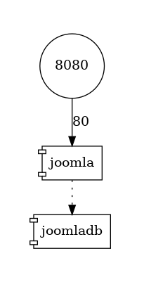
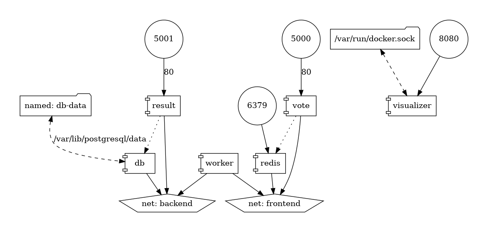

# How to generate a graph from docker-compose.yml


Imagine you've a very big `docker-compose.yml` file with a lot of services and dependencies.

You've too multiple exposed port.

You'd like to have an at-a-glance view of services, dependencies and open ports. Is this possible? Yes! [https://github.com/compose-viz/compose-viz](https://github.com/compose-viz/compose-viz) do the magic for us.

<!-- truncate -->

For the demo, please start a Linux shell and run `mkdir -p /tmp/compose-viz && cd $_` to create a folder called `java` in your Linux temporary folder and jump in it.

Please create a new file called `docker-compose.yml` with this **simplified** content:

```yml
version: '3.9'

services:
  joomla:
    image: joomla
    ports:
      - 8080:80
    depends_on:
      - joomladb

  joomladb:
    image: postgres:16.0-alpine
```

Let the magic happens and run `docker run --rm -it --name dcv -v ${PWD}:/input pmsipilot/docker-compose-viz render -m image docker-compose.yml --force`.

And the image here below will be generated by the tool:



:::info How to interpret the image?
We can see that the port `8080` is exposed to the computer. That port is, in fact, port `80` of the `joomla` container. And, too, we see that `joomla` has a dependency with the `joomladb` container. Easy no?
:::

## Much complex example

Replace the content of the `docker-compose.yml` with this one:

```yml
version: '3.9'

services:

  redis:
    image: redis:alpine
    ports:
      - "6379"
    networks:
      - frontend
    deploy:
      replicas: 2
      update_config:
        parallelism: 2
        delay: 10s
      restart_policy:
        condition: on-failure

  db:
    image: postgres:9.4
    volumes:
      - db-data:/var/lib/postgresql/data
    networks:
      - backend
    deploy:
      placement:
        constraints: [ node.role == manager ]
  vote:
    image: dockersamples/examplevotingapp_vote:before
    ports:
      - 5000:80
    networks:
      - frontend
    depends_on:
      - redis
    deploy:
      replicas: 2
      update_config:
        parallelism: 2
      restart_policy:
        condition: on-failure
  result:
    image: dockersamples/examplevotingapp_result:before
    ports:
      - 5001:80
    networks:
      - backend
    depends_on:
      - db
    deploy:
      replicas: 1
      update_config:
        parallelism: 2
        delay: 10s
      restart_policy:
        condition: on-failure

  worker:
    image: dockersamples/examplevotingapp_worker
    networks:
      - frontend
      - backend
    deploy:
      mode: replicated
      replicas: 1
      labels: [ APP=VOTING ]
      restart_policy:
        condition: on-failure
        delay: 10s
        max_attempts: 3
        window: 120s
      placement:
        constraints: [ node.role == manager ]

  visualizer:
    image: dockersamples/visualizer
    ports:
      - "8080:8080"
    stop_grace_period: 1m30s
    volumes:
      - /var/run/docker.sock:/var/run/docker.sock
    deploy:
      placement:
        constraints: [ node.role == manager ]

networks:
  frontend:
  backend:

volumes:
  db-data:
```

And the image here below will be generated by the tool:



Here, we can see:

* We've four exposed ports: `5001`, `5000`, `6379` and `8080`.
* Port `8080` is linked to a `visualizer` web service; that service is using a volume pointing to `/var/run/docker.sock`
* Ports `5000` and `5001` are refering to services called `vote` and `result`. Since the internal port is port `80`, we know that these ports are web interfaces.
* The `vote` service (port `5000`) is using a `redis` service; accessible using port `6379`.
* The `result` service (port `5001`) is linked to a Postgres service called `db` and having persistant data (since we have a Docker volume called `db-data`).
* and so on.

Such a visualization tool greatly simplifies the understanding of a Docker architecture.