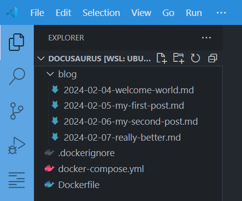
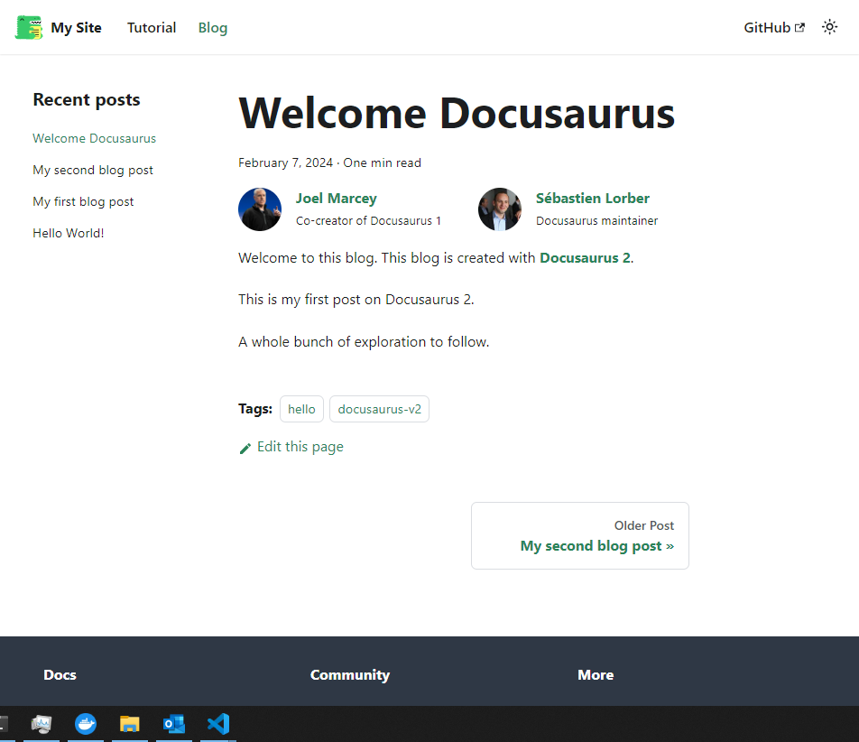
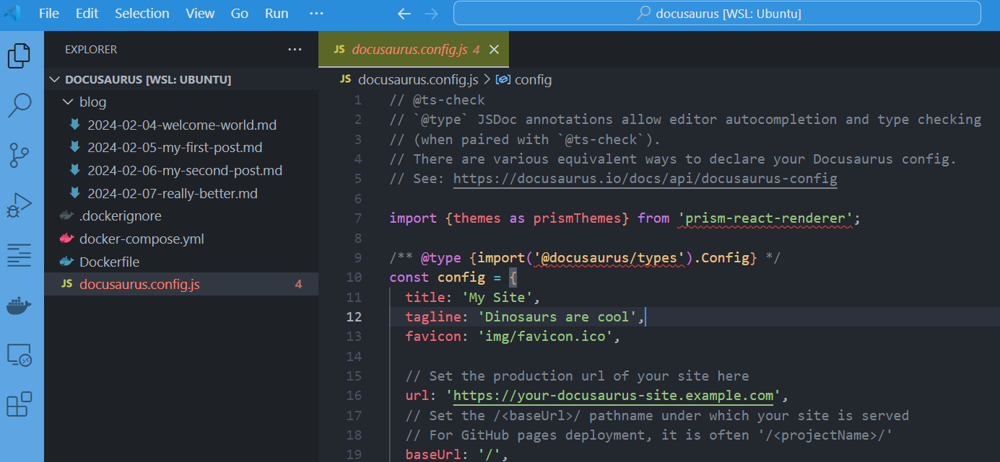
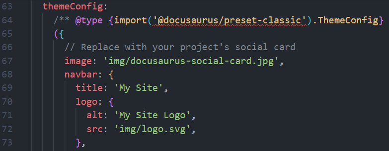
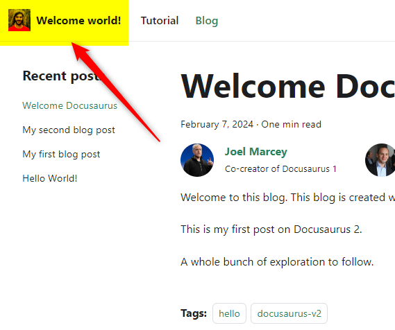

# Running your own blog with Docusaurus and Docker


:::caution Make sure to first read [Running Docusaurus with Docker](/blog/docusaurus-docker/)
This article is a continuation of [Running Docusaurus with Docker](/blog/docusaurus-docker/) so make sure to first read it.
:::

So you've create your own blog using Docker and Docusaurus. By following steps explained in the [Running Docusaurus with Docker](/blog/docusaurus-docker/) article, now, you've a blog with the list of articles stored on your machine; in a `blog` folder.

Let's go further.

<!-- truncate -->

In the previous article, we've created a folder on your disk; we'll reuse it.

Please run `cd /tmp/docusaurus` to jump in it, then open the folder using your editor (I'll run `code .` on my side).

In Visual Studio Code, I see this:



And by running `docker compose up --detach --build` to start the blog, I see this:



## Customize the name of the site

Right now, we can see "My Site" in the top left of the screen.

There is a very important file in Docusaurus, i.e. `docusaurus.config.js` ([https://docusaurus.io/docs/api/docusaurus-config](https://docusaurus.io/docs/api/docusaurus-config)).

We need to adjust the file to met our wishes.

:::caution We need the file on our computer
Ok, now, a very important concept: we need to keep a copy of everything we've to update on our computer.

To copy a file from our container on our disk, the command to use is `docker compose cp <containername>:/file/path/within/container /host/path/to/copy/file/to`
:::

So, to copy the `docusaurus.config.js` file on your disk, you've to run `docker compose cp blog:/docusaurus/docusaurus.config.js docusaurus.config.js`.

Once the copy has been done, you can retrieve the file in your editor:



And, the second thing we need to do to allow us to update the file and reflect changes in our Docker container is to mount the file.

Please edit your `docker-compose.yml` file and add the line below highlighted:

```yaml
version: "3.9"

name: my_docusaurus_blog

services:
  blog:
    build: .
    ports:
      - 3000:3000
    user: 1000:1000
    volumes:
      - ./blog:/docusaurus/blog
      //highlight-next-line
      - ./docusaurus.config.js:/docusaurus/docusaurus.config.js
```

We're almost done, we need to recreate our container so we'll run `docker compose up --detach` again.

By refreshing the web page, we'll not see any change but ... please update the `docusaurus.config.js` file now.

So, open `docusaurus.config.js` and search for `themeConfig` then, there, for the `navbar` node.

You'll find something like this:



Change the tex to what you wish, f.i. 

```js
navbar: {
  title: 'Welcome world!',
  logo: {
    alt: 'It\'s a photo of me ... or not',
    src: 'https://i.pravatar.cc/300',
  },
}
```

Just save and refresh your browser and you'll get:



:::tip You've learned a very important concept!
When you wish to be able to update a file present in a container; you need to get the file on your disk (1) and, then, synchronize the file bewteen your computer and the container (2).

For the first thing, the command to use is `docker compose cp` followed by the name of the container (just look at your `docker-compose.yml` file, it's the name of the service) then you need to say where the file is stored in the container and where to copy it on your disk. That's why we've used `docker compose cp blog:/docusaurus/docusaurus.config.js docusaurus.config.js` to do this.

The second thing is to allow changes done in that copied file to be reflected between your host and the container and this is why we've updated the list of `volumes` in the `docker-compose.yml` file. So, now, changes done on your disk or done by the container will be synchronized both sides.
:::

Read the official documentation to learn how to update the `docusaurus.config.js` file: [https://docusaurus.io/docs/api/docusaurus-config](https://docusaurus.io/docs/api/docusaurus-config).