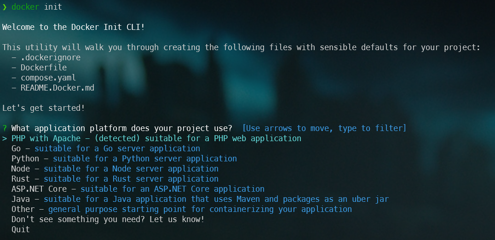
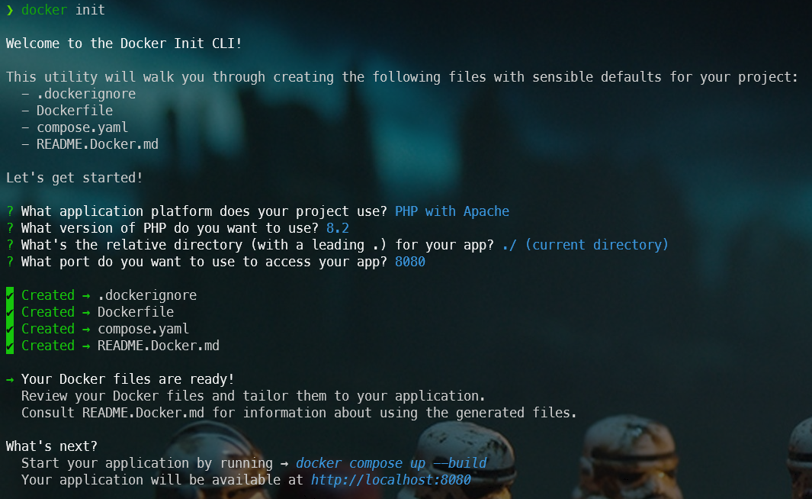
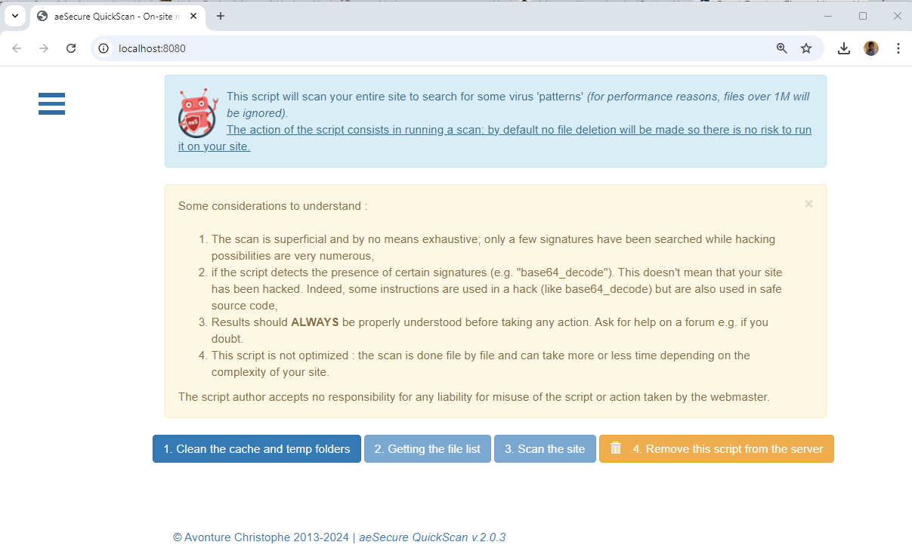

<!-- cspell:ignore dbmdl -->


How about asking Docker to create the files it needs itself?

If you're a regular reader of this blog, you'll know by now that you need a `Dockerfile` to describe how the Docker image should be created and what should be included in it, and very often you'll also need a `composer.yaml` file to explain how the container should be created, e.g. which port to map to, which volumes to use, and so on.

Imagine you've an existing PHP application and you don't want to create the files needed for the dockerization by hand.

You just want to very quickly and using a wizard, to be able to answer to some questions and hop, it's ready.

The `docker init` command is the one you're looking for.

<!-- truncate -->

As an illustration, I'll use my [aeSecure Quickscan](https://github.com/cavo789/aesecure_quickscan) project already introduced in my blog (see my [aeSecure - QuickScan - Free viruses scanner](/blog/aesecure-quickscan) post).

This is a Web application that scans files (a local website) for patterns that might indicate the presence of a virus.

So, to run aeSecure QuickScan, we need PHP and Apache.

Let's play...

First, we'll create a temporary folder and grab a copy of the script:

```bash
mkdir -p /tmp/aesecure_quickscan && cd $_
curl https://raw.githubusercontent.com/cavo789/aesecure_quickscan/master/aesecure_quickscan.php -o index.php
```

You've now a local version of the script.

Just start `docker init` in the console:



As we can see, Docker init has already detected the presence of a PHP file so he's suggesting **PHP with Apache**. Great, just press <kbd>Enter</kbd>.

The next question will be about the version of PHP, you can press <kbd>Enter</kbd> to use the latest one or just type the desired version (f.i. `8.2`).

The third question will be about the relative path to use for the project. In our case, our PHP script is located in the root folder of our project (not in f.i.`/app`) so just press <kbd>Enter</kbd>.

Now, you'll need to specify which port should be used for the application, I'll use the port `8080` but you can use the one you wish (as soon as not yet used).

And that's it.



It's too simple, isn't it? Let's try the suggested commands and see if the site actually works.

First, create the container by running the `docker compose up --build` command then, once finished, just open your browser and surf to your local site (in my case `http://localhost:8080`) and ...



## Let's take a look on created files

### .dockerignore

The `.dockerignore` file specifies files and directories that should be excluded from Docker builds. So, by creating a Docker image you'll certainly don't want that f.i. the `.git` folder is copied into the image. That folder (and many others) should stay on the computer.

By opening that file with a code editor, you'll then see that line:

```text
**/.git
```

Refers to [https://docs.docker.com/go/build-context-dockerignore/](https://docs.docker.com/go/build-context-dockerignore/) for more explanations.

### compose.yaml

:::note
Previously, the file was named `docker-compose.yml` (or `docker-compose.yaml`).
:::

The file will teach Docker how to make more than one container work together, f.i. our PHP application and a database service.

By opening the file, you'll see that right now, the only un-commented lines are those:

```yaml
services:
  server:
    build:
      context: .
    ports:
      - 8080:80
```

The rest is just for illustration.

Refers to [https://docs.docker.com/go/compose-spec-reference/](https://docs.docker.com/go/compose-spec-reference/) for more explanation.

### Dockerfile

There are a lot of commented lines, if we look at un-commented ones, we can see this:

```Dockerfile
FROM php:8.2-apache

COPY . /var/www/html

RUN mv "$PHP_INI_DIR/php.ini-production" "$PHP_INI_DIR/php.ini"

USER www-data
```

So, we'll use the PHP 8.2 Docker image shipped with apache in it (one image with both PHP and Apache).

We'll copy all files from our project (remember, our project is stored in folder `/tmp/aesecure_quickscan`) into the `/var/www/html` folder of the image. All files? Not, that's incorrect. Remember the `.dockerignore` file: we'll copy all files that are not mentioned in `.dockerignore`.

Docker has also foreseen to rename the standard `php.ini-production` file as `php.ini`.

The last command is to switch to the `www-data` user (so the container will not be running as `root`).

Refers to [https://docs.docker.com/go/dockerfile-reference/](https://docs.docker.com/go/dockerfile-reference/) for more explanation.

## Generated files are yours

The generated files won't be modified by Docker while you'll not run `docker init` again. This means you can make any changes you like to the files, but your changes won't be lost. It's a great way to quickly dockerized an application.

The example given in this blog post is a stand-alone project so `docker init` does all the magic. Assuming we'd needed a database, all we have to do is return to the `compose.yaml´ file and un-comment the lines like below:

```yaml
services:
  server:
    build:
      context: .
    ports:
      - 8080:80
    depends_on:
      db:
        condition: service_healthy
  db:
    image: postgres
    restart: always
    user: postgres
    secrets:
      - db-password
    volumes:
      - db-data:/var/lib/postgresql/data
    environment:
      - POSTGRES_DB=example
      - POSTGRES_PASSWORD_FILE=/run/secrets/db-password
    expose:
      - 5432
    healthcheck:
      test: [ "CMD", "pg_isready" ]
      interval: 10s
      timeout: 5s
      retries: 5
volumes:
  db-data:
secrets:
  db-password:
    file: db/password.txt
```

:::info Docker secrets is used here
Hey! Did you see? Instead of hardcoding the password in the file, `docker init` has used a secret. This is smart.
:::

:::tip Read my [Docker secrets - Using your SSH key during the build process](/blog/docker-use-ssh-during-build) article if you don't know what is a secret
:::

To make the example here above working, just create a folder called `db` with a file called `password.txt` there and paste it your database password.

Of course, files generated by `docker init` are just skeletons: you can change what you want, so if you don't want to use secrets, no problem, you can hardcode the password; it's up to you.
