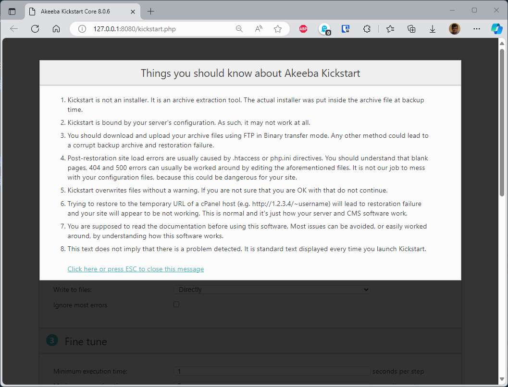
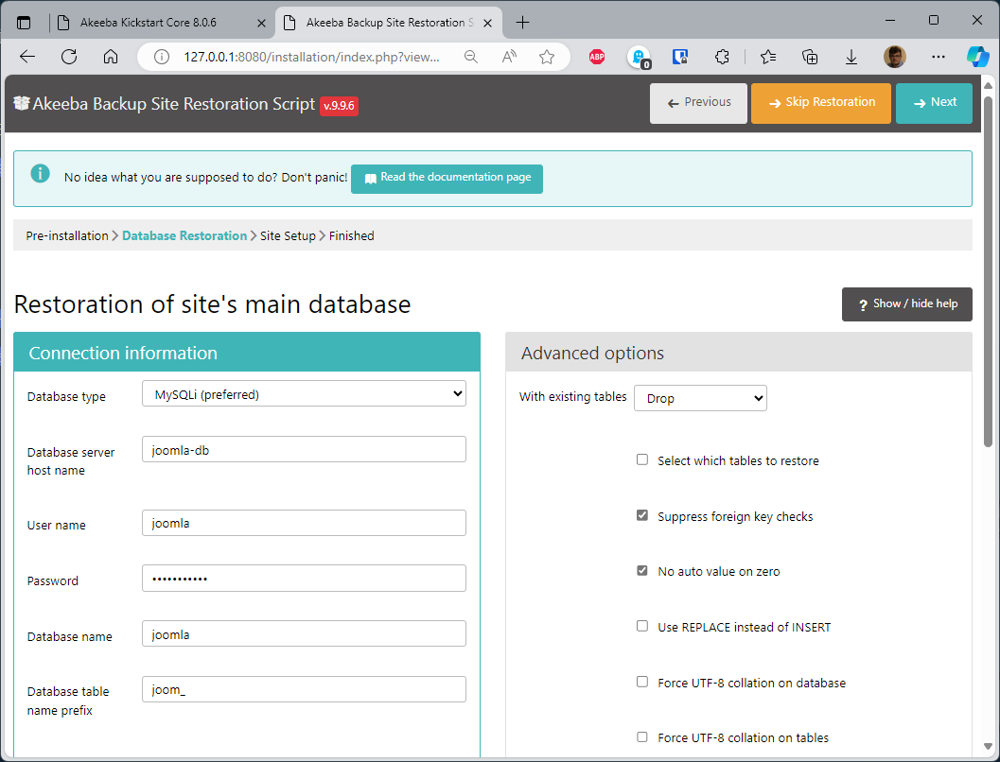
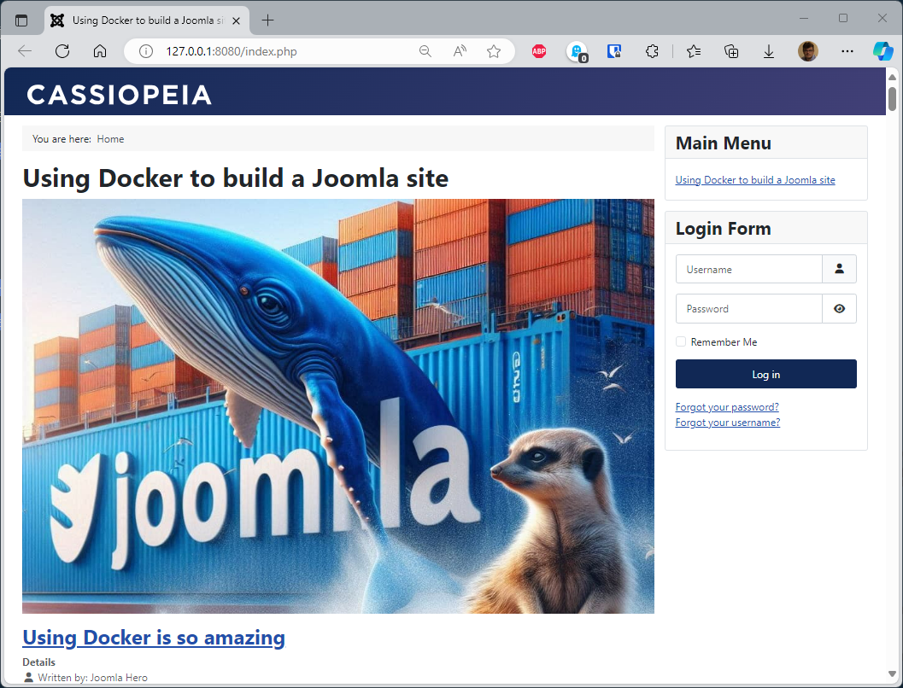

<!--cspell:ignore akeeba,mysqli -->
<!-- markdownlint-disable-file MD010 MD026 -->


In previous articles ([Part 1](/blog/docker-joomla) and [Part 2](/blog/docker-joomla-part-2)), we've seen how to create fresh Joomla sites using Docker.

This time, we'll see how to restore on our machine, a backup created using **[Akeeba Backup](https://www.akeeba.com/products/akeeba-backup.html)** .

We'll reuse some files from [Part 2](/blog/docker-joomla-part-2) and make some changes to them.

At the end, we'll have a `make import` command that will start **[Akeeba Kickstart](https://www.akeeba.com/download.html#kickstart)**.

<!-- truncate -->

## Prerequisites

Please create a new folder on your computer like f.i. `mkdir /tmp/joomla_restore && cd $_`.

In that folder, please create three files (please refer to [Part 2](/blog/docker-joomla-part-2)) if you need more explanations about these files.

### The orchestration file: compose.yaml

Below, highlighted, small differences from the `compose.yaml` file we saw in [Part 2](/blog/docker-joomla-part-2).

Here is why: this time we don't need to download a fresh copy of Joomla since **we already have a Joomla site**. What we need is **PHP** and **Apache**. We don't need Joomla so, this time, we'll use a custom Docker image; not a already existing one.

Except highlighted lines, all the rest is the same that in [Part 2](/blog/docker-joomla-part-2).

```yaml
name: ${PROJECT_NAME:-your-project-name}

services:
  joomla:
    # highlight-next-line
    build:
      # highlight-next-line
      context: .
      # highlight-next-line
      args:
        # highlight-next-line
        - PHP_VERSION=${PHP_VERSION:-8.3-apache}
    container_name: ${CONTAINER_PREFIX:-joomla}-app
    restart: always
    ports:
      - ${WEB_PORT-:8080}:80
    environment:
      - JOOMLA_DB_HOST=joomladb
      - JOOMLA_DB_NAME=${DB_NAME:-joomla}
      - JOOMLA_DB_PASSWORD=${DB_PASSWORD:-examplepass}
      - JOOMLA_DB_USER=${DB_USER:-joomla}
    depends_on:
      joomladb:
        condition: service_healthy
    user: ${UID:-1000}:${GID:-1000}
    volumes:
      - ./joomla_data:/var/www/html
    networks:
      - joomla_network

  joomladb:
    image: mysql:${MYSQL_VERSION:-latest}
    container_name: ${CONTAINER_PREFIX:-joomla}-db
    restart: always
    ports:
      - ${MYSQL_PORT-:3306}:3306
    environment:
      - MYSQL_DATABASE=${DB_NAME:-joomla}
      - MYSQL_PASSWORD=${DB_PASSWORD:-examplepass}
      - MYSQL_RANDOM_ROOT_PASSWORD='1'
      - MYSQL_USER=${DB_USER:-joomla}
    healthcheck:
      test: ["CMD", "mysqladmin" ,"ping", "-h", "localhost"]
      timeout: 20s
      retries: 10
    user: ${UID:-1000}:${GID:-1000}
    volumes:
      - ./db_data:/var/lib/mysql
    networks:
      - joomla_network

networks:
  joomla_network:
```

### The .env file

As introduced above; we don't need Joomla anymore but just PHP and Apache. We'll then define a `PHP_VERSION` variable and initialize it to the desired version.

```.env
CONTAINER_PREFIX=joomla
DB_NAME=joomla
DB_PASSWORD=examplepass
DB_USER=joomla
MYSQL_PORT=3306
MYSQL_VERSION=8.4.2
// highlight-next-line
PHP_VERSION=8.3-apache
PROJECT_NAME=running-joomla-in-docker
WEB_PORT=8080
```

### Our makefile

We'll need a new action called `import`:

```makefile
-include .env

config:
	@UID=$$(id -u) GID=$$(id -g) docker compose config

down: stop
	-@UID=$$(id -u) GID=$$(id -g) docker compose down

log:
	-@UID=$$(id -u) GID=$$(id -g) docker compose logs

reset: down
	-@rm -rf db_data joomla_data

start:
	@clear
	@printf "\033[1;33m%s\033[0m\n\n" "To start your site, please jump to http://127.0.0.1:${WEB_PORT}"
	@printf "\033[1;33m%s\033[0m\n\n" "Go to http://127.0.0.1:${WEB_PORT}/administrator to open your backend."

	@printf "\033[1;104m%s\033[0m\n\n" "Below a summary of your current installation:"

	@printf "\033[1;34m%s\033[0m\n\n" "JOOMLA"
	@printf "\033[1;34m%-30s\033[0m\033[1;104m%s\033[0m\n" "  * Project name" "${PROJECT_NAME}"
	@printf "\033[1;34m%-30s\033[0m\033[1;104m%s\033[0m\n" "  * Version" "${JOOMLA_VERSION}"
	@printf "\033[1;34m%-30s\033[0m\033[1;104m%s\033[0m\n\n" "  * Port" "${WEB_PORT}"

	@printf "\033[1;34m%s\033[0m\n\n" "DATABASE"
	@printf "\033[1;34m%-30s\033[0m\033[1;104m%s\033[0m\n" "  * Host" "joomla-db"
	@printf "\033[1;34m%-30s\033[0m\033[1;104m%s\033[0m\n" "  * User name" "${DB_USER}"
	@printf "\033[1;34m%-30s\033[0m\033[1;104m%s\033[0m\n" "  * Password" "${DB_PASSWORD}"
	@printf "\033[1;34m%-30s\033[0m\033[1;104m%s\033[0m\n" "  * Database name" "${DB_NAME}"
	@printf "\033[1;34m%-30s\033[0m\033[1;104m%s\033[0m\n" "  * Version" "${MYSQL_VERSION}"
	@printf "\033[1;34m%-30s\033[0m\033[1;104m%s\033[0m\n\n" "  * Port" "${MYSQL_PORT}"

stop:
	-@UID=$$(id -u) GID=$$(id -g) docker compose stop

up:
	-@mkdir -p db_data joomla_data
	@UID=$$(id -u) GID=$$(id -g) docker compose up --detach

# highlight-next-line
import: reset
    # highlight-next-line
	-@mkdir -p db_data joomla_data
    # highlight-next-line
	
    # highlight-next-line
	@clear
    # highlight-next-line
	@printf "\033[1;33m%s\033[0m\n" "Copying Akeeba Kickstart to the Docker Joomla container..."
    # highlight-next-line
	@cp en-GB.kickstart.ini ./joomla_data
    # highlight-next-line
	@cp kickstart.php ./joomla_data/kickstart.php
    # highlight-next-line
    
    # highlight-next-line
	@printf "\033[1;33m%s\033[0m\n\n" "Copying your backup to the Docker Joomla container..."    
    # highlight-next-line
	@cp backup.jpa ./joomla_data    
    # highlight-next-line

    # highlight-next-line
	@UID=$$(id -u) GID=$$(id -g) docker compose up --detach
    # highlight-next-line

    # highlight-next-line
	@printf "\n\n\033[1;33m%s\033[0m\n\n" "Please now jump to http://127.0.0.1:${WEB_PORT}/kickstart.php to finalize your site restoration."
    # highlight-next-line

    # highlight-next-line
	@printf "\033[1;104m%s\033[0m\n\n" "Below a summary of your current installation:"
    # highlight-next-line

    # highlight-next-line
	@printf "\033[1;34m%s\033[0m\n\n" "JOOMLA"
    # highlight-next-line
	@printf "\033[1;34m%-30s\033[0m\033[1;104m%s\033[0m\n\n" "  * Port" "${WEB_PORT}"
    # highlight-next-line

    # highlight-next-line
	@printf "\033[1;34m%s\033[0m\n\n" "DATABASE"
    # highlight-next-line
	@printf "\033[1;34m%-30s\033[0m\033[1;104m%s\033[0m\n" "  * Host" "joomla-db"
    # highlight-next-line
	@printf "\033[1;34m%-30s\033[0m\033[1;104m%s\033[0m\n" "  * User name" "${DB_USER}"
    # highlight-next-line
	@printf "\033[1;34m%-30s\033[0m\033[1;104m%s\033[0m\n" "  * Password" "${DB_PASSWORD}"
    # highlight-next-line
	@printf "\033[1;34m%-30s\033[0m\033[1;104m%s\033[0m\n" "  * Database name" "${DB_NAME}"
    # highlight-next-line
	@printf "\033[1;34m%-30s\033[0m\033[1;104m%s\033[0m\n" "  * Version" "${MYSQL_VERSION}"
    # highlight-next-line
	@printf "\033[1;34m%-30s\033[0m\033[1;104m%s\033[0m\n\n" "  * Port" "${MYSQL_PORT}"
```

### We also need a file called Dockerfile

In the very first lines of the `compose.yaml` file we've this portion:

```yaml
name: ${PROJECT_NAME:-your-project-name}

services:
  joomla:
    # highlight-next-line
    build:
      # highlight-next-line
      context: .
      # highlight-next-line
      args:
        # highlight-next-line
        - PHP_VERSION=${PHP_VERSION:-8.3-apache}
```

We don't see here a `image:` statement but a `build:` one. This means that we need a special file called `Dockerfile`.

Please create a new file called `Dockerfile` in your folder with this content:

```dockerfile
ARG PHP_VERSION=8.3-apache

FROM php:${PHP_VERSION:-latest}

RUN set -e -x ; \
    docker-php-ext-install mysqli pdo pdo_mysql && docker-php-ext-enable pdo_mysql
```

That file is quite simple right now: it tells we need a PHP Docker image and we also need to install the `mysqli` drivers.

### We need a backup for sure

Please also download a backup of your existing site and save it in the same folder. For standardization needs, please call that file `backup.jpa`

### And finally, we need Akeeba Kickstart

Finally, we also need to have two files coming from **[Akeeba Kickstart](https://www.akeeba.com/download.html#kickstart)**.

By following the link [Akeeba Kickstart](https://www.akeeba.com/download.html#kickstart), we'll be able to download a ZIP file (called `kickstart-core-xxx.zip` where `xxx` is a version number). Proceed to the download and open the zip file: we'll get two files in it. Please copy these files in your folder.

## Before starting

We're ready. Just before you begin, please check that you have all the required files (please run `ls -alh`):

```txt
> ls -alh

Permissions Size User       Group      Date Modified    Name
drwxr-xr-x     - christophe christophe 2024-10-18 13:30 .
drwxrwxrwt     - root       root       2024-10-18 13:30 ..
.rw-r--r--   151 christophe christophe 2024-10-18 13:30 .env
.rw-r--r--   34M christophe christophe 2024-10-18 13:30 backup.jpa
.rw-r--r--  1.3k christophe christophe 2024-10-18 13:30 compose.yaml
.rw-r--r--   162 christophe christophe 2024-10-18 13:30 Dockerfile
.rw-r--r--   11k christophe christophe 2024-10-18 13:30 en-GB.kickstart.ini
.rw-r--r--  390k christophe christophe 2024-10-18 13:30 kickstart.php
.rw-r--r--  2.9k christophe christophe 2024-10-18 13:30 makefile
```

## Run the importation process

Ok, you've copied a lot of files. Time to start restoring your site.

It may have taken a long time to set up, but thanks to this, everything's super-simple now: just run the xxxx instruction `make import`.

Once `make import` has finished, you'll get this output in the console:

```text
> make import

Copying Akeeba Kickstart to the Docker Joomla container...
Copying your backup to the Docker Joomla container...

[+] Running 3/3
 ✔ Network running-joomla-in-docker_joomla_network  Created       0.0s
 ✔ Container joomla-db                              Healthy      31.0s
 ✔ Container joomla-app                             Started      31.3s 

Please now jump to http://127.0.0.1:8080/kickstart.php to finalize your site restoration.

Below a summary of your current installation:

JOOMLA

  * Port                      8080

DATABASE

  * Host                      joomla-db
  * User name                 joomla
  * Password                  examplepass
  * Database name             joomla
  * Version                   8.4.2
  * Port                      3306
```

Please follow the `http://127.0.0.1:8080/kickstart.php` link to start the **Akeeba Kickstart** wizard.



Once you'll need to fill in the database information's, please refer to what was displayed in your console:



Continue restoration as you always have; close the window, then click on the *Clean Up* site and display your site:


