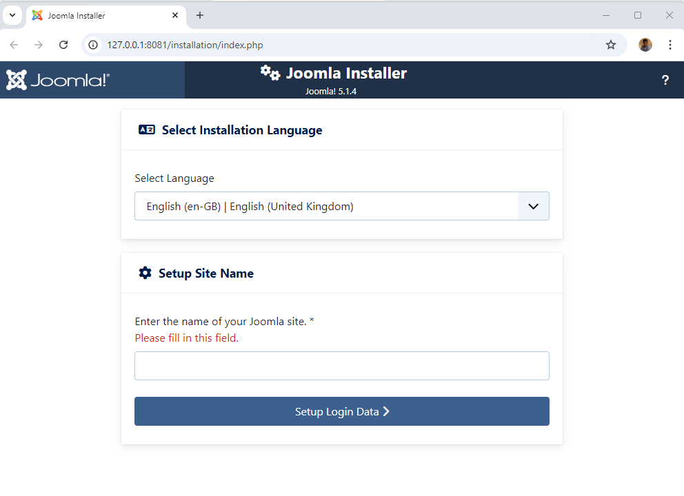
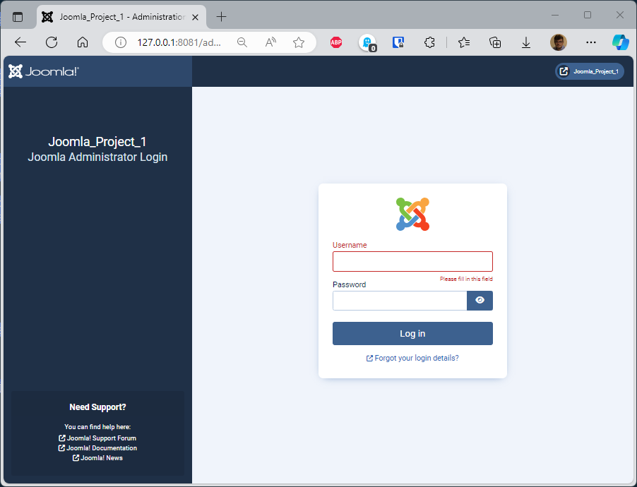
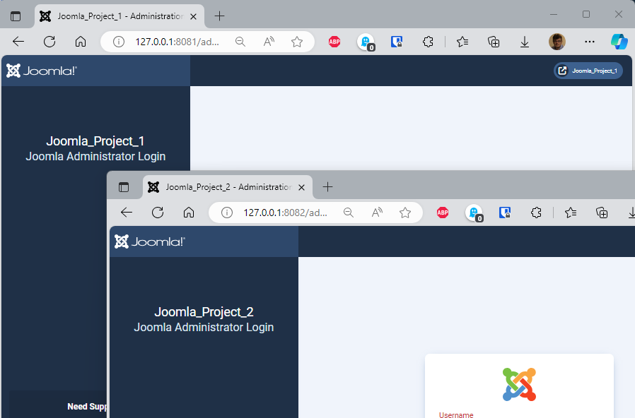
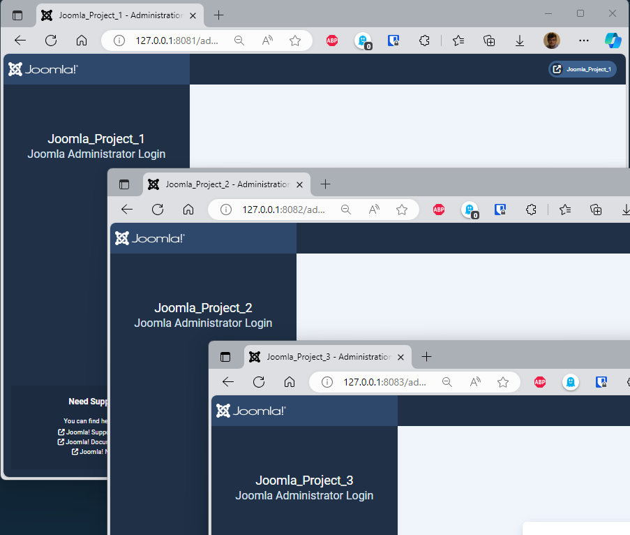
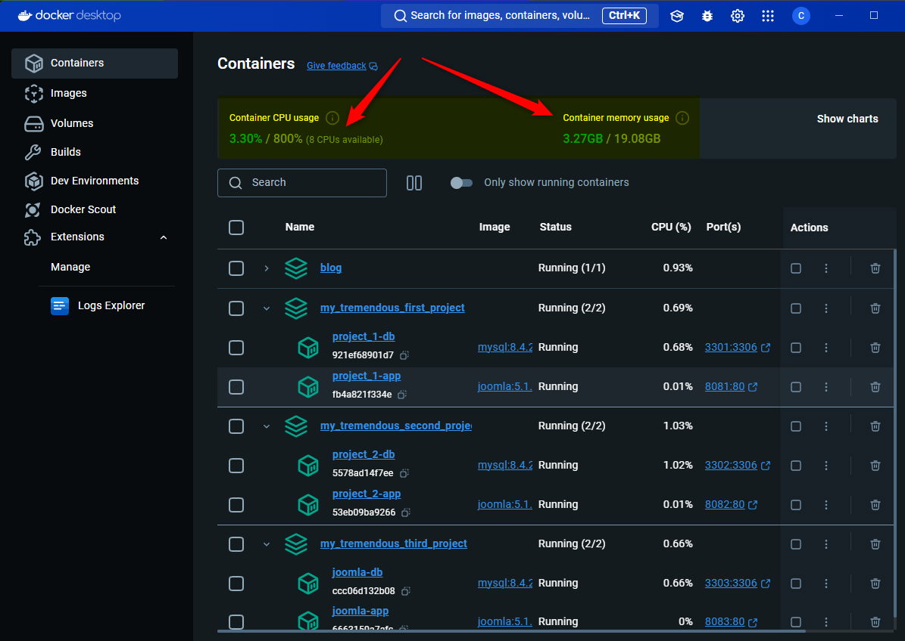
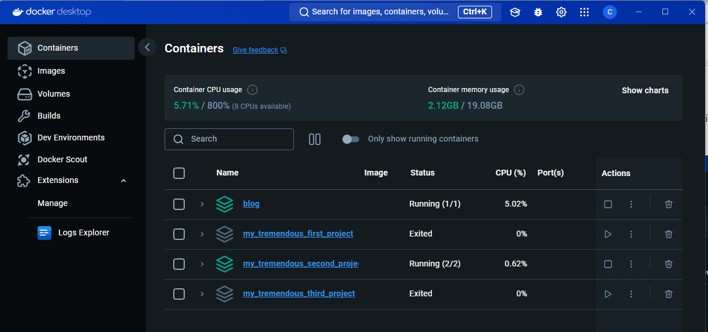

<!--cspell:ignore runningjoomlaindocker, mysqli -->
<!-- markdownlint-disable-file MD010 MD026 -->

At the end of 2023, I wrote a very long post about using Joomla with Docker: [Create your Joomla website using Docker](/blog/docker-joomla).

It was a step-by-step introduction to Docker and the creation of a local Joomla-based website.

I explained, at length, the various steps involved in creating a website, choosing a database engine (MySQL, MariaDB or PostgreSQL), choosing a specific version of Joomla / database manager, the type of volumes (should the site and database be kept in RAM or on the hard disk (i.e. the notion of volumes)) and many other things such as choosing the port for the website, creating an alias (something like `http://my_project.local` instead of `http://127.0.0.1`). I strongly urge you to read or re-read this article before starting this one.

:::important
Here is the link to that article : [Create your Joomla website using Docker](/blog/docker-joomla).
:::

As Docker and Joomla are evolving rapidly, I propose here to start from where we were and see what has changed since then.

We're also going to take automation a step further, making much greater use of the concept of makefile and a configuration file called `.env`.

<!-- truncate -->

## Prerequisites

Contrary to the article [Create your Joomla website using Docker](/blog/docker-joomla), let's opt for laying down from the outset the three files we're going to use to mount our Joomla site locally. I'd ask you not to try too hard to understand the contents of the files; we'll come back to that a little later.

Create the three files in a folder on your hard disk for the time being, so that we can quickly get to the heart of the matter: creating a Joomla site with just one line of commands to run on your computer.

### Our orchestration file: compose.yaml

We need a file that will explain to Docker how we want to configure Joomla and, also, the type of database we want.

Our orchestration file will also inform Docker that we want the Joomla site to be persistent, i.e. the files to be saved on our hard disk. The same applies to the database.

We need to do this so that, if we *kill* the Docker container to release memory f.i., we want that the Joomla website is saved on disk. We want files but the database too.

:::info Persistence
There are two types of persistence, the one managed natively by Docker (*intern volumes*) or the one where we'll see the files in our project (*mounted volumes*). We'll opt for the latter. See my article [Using volumes with Docker, use cases](/blog/docker-volumes) if you want to learn more.
:::

We're also going to define a dependency (based on `depends_on` and `healthcheck`): Joomla must wait for the database server to be ready before starting its installation (in fact, if the Joomla installer tries to access MySQL before the system is even loaded, our project will crash during container loading).

As you can see, our `compose.yaml` file is of tremendous importance for the proper definition of our project.

:::note
In recent months, the name of the file to be used has changed from `docker-compose.yml` to `compose.yaml`; still supported for now, but might as well use the new name. See [docs.docker.com](https://docs.docker.com/compose/intro/compose-application-model/#the-compose-file) if you want more info about this change.
:::

Please create a new folder (f.i. `mkdir /tmp/docker && cd $_`) on your hard disk and create the `compose.yaml` file with this content:

```yaml
name: ${PROJECT_NAME:-your-project-name}

services:
  joomla:
    image: joomla:${JOOMLA_VERSION:-latest}
    container_name: joomla-app
    restart: always
    ports:
      - ${WEB_PORT-:8080}:80
    environment:
      - JOOMLA_DB_HOST=joomladb
      - JOOMLA_DB_NAME=${DB_NAME:-joomla}
      - JOOMLA_DB_PASSWORD=${DB_PASSWORD:-examplepass}
      - JOOMLA_DB_USER=${DB_USER:-joomla}
    depends_on:
      joomladb:
        condition: service_healthy
    user: ${UID:-1000}:${GID:-1000}
    volumes:
      - ./joomla_data:/var/www/html
    networks:
      - joomla_network

  joomladb:
    image: mysql:${MYSQL_VERSION:-latest}
    container_name: joomla-db
    restart: always
    ports:
      - ${MYSQL_PORT-:3306}:3306
    environment:
      - MYSQL_DATABASE=${DB_NAME:-joomla}
      - MYSQL_PASSWORD=${DB_PASSWORD:-examplepass}
      - MYSQL_RANDOM_ROOT_PASSWORD='1'
      - MYSQL_USER=${DB_USER:-joomla}
    healthcheck:
      test: ["CMD", "mysqladmin" ,"ping", "-h", "localhost"]
      timeout: 20s
      retries: 10
    user: ${UID:-1000}:${GID:-1000}
    volumes:
      - ./db_data:/var/lib/mysql
    networks:
      - joomla_network

networks:
  joomla_network:
```

### We'll use a configuration file called .env

We're also going to use a configuration file named `.env` (which is never anything more than a silly dictionary of keys - values) to differentiate our projects.

Please create a second file called `.env` with this content:

```.env
CONTAINER_PREFIX=joomla
DB_NAME=joomla
DB_PASSWORD=examplepass
DB_USER=joomla
JOOMLA_VERSION=5.1.4-php8.3-apache
MYSQL_PORT=3306
MYSQL_VERSION=8.4.2
PROJECT_NAME=running-joomla-in-docker
WEB_PORT=8080
```

Using a `.env` file is really useful to no more do changes to the `compose.yaml` file which can be standard in all your projects.

If you need two or more Joomla websites (you're a web agency with, I hope for you, more than one customer), you'll be able to only do changes to the `.env` file by updating the `WEB_PORT` (each project should have his unique port) and, you'll probably update the `PROJECT_NAME` too to f.i. your customer name.

### Let's make our lives simpler and lazier; using a makefile

The third and last file we'll use is be called `makefile` and that file will contains some *scripts* i.e we'll create a script called `up` for building our website.

:::note
If you don't know if you already have `make` on your computer, just run `which make` in the console. If you see `make not found` then please run `sudo apt-get update && sudo apt-get install make` to proceed the installation.
:::

So, please create a file called `makefile` in your current directory with this content:

```makefile
-include .env

config:
	@UID=$$(id -u) GID=$$(id -g) docker compose config

down:
	-@UID=$$(id -u) GID=$$(id -g) docker compose down

log:
	-@UID=$$(id -u) GID=$$(id -g) docker compose logs

reset: down
	-@rm -rf db_data joomla_data

start:
	@clear
	@printf "\033[1;33m%s\033[0m\n\n" "To start your site, please jump to http://127.0.0.1:${WEB_PORT}"
	@printf "\033[1;33m%s\033[0m\n\n" "Go to http://127.0.0.1:${WEB_PORT}/administrator to open your backend."

	@printf "\033[1;104m%s\033[0m\n\n" "Below a summary of your current installation:"

	@printf "\033[1;34m%s\033[0m\n\n" "JOOMLA"
	@printf "\033[1;34m%-30s\033[0m\033[1;104m%s\033[0m\n" "  * Project name" "${PROJECT_NAME}"
	@printf "\033[1;34m%-30s\033[0m\033[1;104m%s\033[0m\n" "  * Version" "${JOOMLA_VERSION}"
	@printf "\033[1;34m%-30s\033[0m\033[1;104m%s\033[0m\n\n" "  * Port" "${WEB_PORT}"

	@printf "\033[1;34m%s\033[0m\n\n" "DATABASE"
	@printf "\033[1;34m%-30s\033[0m\033[1;104m%s\033[0m\n" "  * Host" "joomla-db"
	@printf "\033[1;34m%-30s\033[0m\033[1;104m%s\033[0m\n" "  * Version" "${MYSQL_VERSION}"
	@printf "\033[1;34m%-30s\033[0m\033[1;104m%s\033[0m\n" "  * DB name" "${DB_NAME}"
	@printf "\033[1;34m%-30s\033[0m\033[1;104m%s\033[0m\n" "  * User" "${DB_USER}"
	@printf "\033[1;34m%-30s\033[0m\033[1;104m%s\033[0m\n" "  * Password" "${DB_PASSWORD}"
	@printf "\033[1;34m%-30s\033[0m\033[1;104m%s\033[0m\n\n" "  * Port" "${MYSQL_PORT}"

stop:
	-@UID=$$(id -u) GID=$$(id -g) docker compose stop

up:
	-@mkdir -p db_data joomla_data
	@UID=$$(id -u) GID=$$(id -g) docker compose up --detach
```

:::caution Indentation should be TAB not spaces
It's terribly vicious because it's totally silent: the indentation in a makefile must be tabs, not spaces. When you copy/paste the above code to create your file, make sure your text editor uses tabs. If it doesn't, the commands defined in the file won't work.
:::

:::note
If you want to learn more about Make, check my [Linux Makefile - When to use a makefile](/blog/makefile-using-make) article
:::

## Before starting

We're ready. Just before you begin, please check that you have the three files below (please run `ls -alh`):

```txt
Permissions Size User       Group      Date Modified    Name
drwxr-xr-x     - christophe christophe 2024-09-29 16:46 .
drwxrwxrwt     - root       root       2024-09-29 15:51 ..
.rw-r--r--   140 christophe christophe 2024-09-29 16:45 .env
.rw-r--r--   838 christophe christophe 2024-09-29 16:44 compose.yaml
.rw-r--r--   327 christophe christophe 2024-09-29 16:45 makefile
```

### Check our configuration

By running `make config` (`config` is an action we've defined in our `makefile`), we can display the configuration of our project on the screen *(just display, nothing is fired)*. We should see a lot of technical information starting with something like:

```yaml
name: running-joomla-in-docker
services:
  joomla:
    container_name: joomla-app
    depends_on:
      joomladb:
        condition: service_healthy
        required: true
    environment:
      JOOMLA_DB_HOST: joomladb
      JOOMLA_DB_NAME: joomla
      JOOMLA_DB_PASSWORD: examplepass
      JOOMLA_DB_USER: joomla
    image: joomla:5.1.4-php8.3-apache
    networks:
      joomla_network: null
    ports:
      - mode: ingress
        target: 80
        published: "8080"
        protocol: tcp
    restart: always
    user: 1002:1002
[...]
```

:::info
The output here above is a partial content and just show the first lines displayed to the console by the `make config` command.
:::

 The objective of `make config` is to make sure that all files are correct (otherwise we'll get error messages) and that variables are well replaced by their values. You can see f.i. that the Joomla version is well the one we've specified in the `.env` file and the user line (the last line here above) is correctly initialized to the **user id:group id** of your current user.

:::info
The **user id:group id** will vary depending on your own configuration. It'll be `1000:1000` in the most of situations but this can be something else when, f.i., you've defined more than one user in your Linux distribution; the first user probably be `1000:1000`, the second `1001:1001` and so on.
:::

## Let's wake up Joomla...

Here we are at the heart of the subject: we would like to see a beautiful, fresh Joomla site. Is it possible to do this in a single command and even without having to install anything by hand?

The answer is: `make up`.

In your console, just run `make up` and let the magic happen. The very first time, you'll get something like this in your console:

```text
UID=$(id -u) GID=$(id -g) docker compose up --detach
[+] Running 33/12
 ✔ joomla Pulled                                         16.1s
 ✔ joomladb Pulled                                       10.7s

[+] Running 3/3
 ✔ Network runningjoomlaindocker_default  Created         0.0s
 ✔ Container joomla-db                    Healthy        31.7s
 ✔ Container joomla-app                   Started        31.1s
```

What does that means? Docker has retrieved (*pulled*) from the Internet our `joomla` and `joomladb` services (in other terms, has downloaded the Joomla CMS (including PHP and Apache) and MySQL).

By running `docker container list --all --format "table {{.Image}}\t{{.Names}}\t{{.Status}}\t{{.Ports}}"` (or just `docker container list` to get all the columns), you'll get the list of running containers:

```text
IMAGE                        NAMES        STATUS                   PORTS
joomla:5.1.4-php8.3-apache   joomla-app   Up 6 minutes             0.0.0.0:8080->80/tcp
mysql:8.4.2                  joomla-db    Up 7 minutes (healthy)   3306/tcp, 33060/tcp
```

As we can see, yay!, we have our two services (named containers) which are Joomla and MySQL and they are both *Up*. We see that Joomla uses port `8080` and MySQL uses port `3306`.

:::tip
The port `8080` is the one we've specified in our `.env` (variable `WEB_PORT`) and, the same for MySQL, it uses port `3006` because that's the one we defined (`MYSQL_PORT`).

Note that `3306` is the standard port for MySQL.
:::

:::success Hey! did you notice?
We've created our Joomla website by **just running one command**. Don't trust? Open your browser and surf to `http://127.0.0.1:8080`.
:::

### ... or let's ask him to fall asleep

The opposite command to `make up` is `make down`. Down will remove our Joomla and MySQL containers (read `kill them`) but without removing files (your site and your database) from your hard drive. By running `make up` again, you'll retrieve them.

### ... or let's ask him to suicide

The `make reset` command will stop the containers as here above but, too, will remove files on your disk.

:::danger
By running `make reset`, you'll the remove both containers and files.
:::

## Getting access to Docker logs

Sometimes, if something goes wrong, it's nice to have access to the Docker logs. Simply run `make log` to achieve this.

## Starting the website

Once `make up` has been fired, our Joomla site is ready. Just run `make start` and read the console's log:

```text
To start your site, please jump to http://127.0.0.1:8080
```

As you can see, the port number is `8080`; the one we've specified in our `.env` file. Simply CTRL-click on the URL if your terminal support this option (otherwise, manually start your preferred web browser and navigate to the specified URL).



**Congratulations, you have successfully installed a fresh Joomla website using Docker!**

## Time for a break

What have we seen so far?

* Without having anything other than Docker you can install Joomla and MySQL from the command line;
* That with an `.env` file we can vary certain values ​​to allow us to have several projects on our hard drive (several Joomla sites);
* That with the `compose.yaml` file we tell Docker what to do to make Joomla and MySQL talk and
* but also that the `compose.yaml` file is valuable since it allows you to define a number of configuration variables.

Let's go a little further.

## Advanced configuration for Joomla

The official Joomla Docker image is maintained by the Joomla community on Docker Hub: [https://hub.docker.com/_/joomla](https://hub.docker.com/_/joomla).

You'll retrieve there a list of *tags* i.e. a list of versions you can installed using Docker but you'll also find a **How to use this image** section and that one is really useful.

Below the list of variables supported by Joomla by the end of September 2024:

| Variable name | Description |
| --- | --- |
| `JOOMLA_DB_HOST` | defaults to the IP and port of the linked mysql container |
| `JOOMLA_DB_USER` | defaults to `root` |
| `JOOMLA_DB_PASSWORD` | defaults to the value of the `MYSQL_ROOT_PASSWORD` environment variable from the linked mysql container |
| `JOOMLA_DB_PASSWORD_FILE` | path to a file containing the database password |
| `JOOMLA_DB_NAME` | defaults to `joomla` |
| `JOOMLA_DB_TYPE` | defaults to `mysqli`; options: `mysqli`, `pgsql` |

The following environment variables are also honored for configuring auto deployment (skip the browser setup) for your Joomla instance:

| Variable name | Description |
| --- | --- |
| `JOOMLA_SITE_NAME` | name of the Joomla site |
| `JOOMLA_ADMIN_USER` | full name of the Joomla administrator |
| `JOOMLA_ADMIN_USERNAME` | username of the Joomla administrator |
| `JOOMLA_ADMIN_PASSWORD` | password of the Joomla administrator |
| `JOOMLA_ADMIN_EMAIL` | email address of the Joomla administrator |
| `JOOMLA_EXTENSIONS_URLS` | semicolon-separated list of URLs to install Joomla extensions from |
| `JOOMLA_EXTENSIONS_PATHS` | semicolon-separated list of file paths to install Joomla extensions from |
| `JOOMLA_SMTP_HOST` | SMTP host for outgoing email |
| `JOOMLA_SMTP_HOST_PORT` | SMTP port for outgoing email |

Pay attention to the last table here above.

We could therefore completely ignore the Joomla configuration screens!!! By specifying certain values, we could therefore install a beautiful, fresh Joomla and already display a functional website.

Let's try.

We'll update our three files to skip the installation process by predefining values like the name and the password for our administrator.

### Updated compose.yaml

We'll edit our `compose.yaml` file and add new entries:

```yaml
name: ${PROJECT_NAME:-your-project-name}

services:
  joomla:
    image: joomla:${JOOMLA_VERSION:-latest}
    container_name: joomla-app
    restart: always
    ports:
      - ${WEB_PORT-:8080}:80
    environment:
      - JOOMLA_DB_HOST=joomladb
      - JOOMLA_DB_NAME=${DB_NAME:-joomla}
      - JOOMLA_DB_PASSWORD=${DB_PASSWORD:-examplepass}
      - JOOMLA_DB_USER=${DB_USER:-joomla}
      # highlight-next-line
      - JOOMLA_SITE_NAME=${JOOMLA_SITE_NAME:-Joomla}
      # highlight-next-line
      - JOOMLA_ADMIN_USER=${JOOMLA_ADMIN_USER:-Joomla Hero}
      # highlight-next-line
      - JOOMLA_ADMIN_USERNAME=${JOOMLA_ADMIN_USERNAME:-joomla}
      # highlight-next-line
      - JOOMLA_ADMIN_PASSWORD=${JOOMLA_ADMIN_PASSWORD:-joomla@secured}
      # highlight-next-line
      - JOOMLA_ADMIN_EMAIL=${JOOMLA_ADMIN_EMAIL:-joomla@example.com}
    depends_on:
      joomladb:
        condition: service_healthy
    user: ${UID:-1000}:${GID:-1000}
    volumes:
      - ./joomla_data:/var/www/html
    networks:
      - joomla_network

  joomladb:
    image: mysql:${MYSQL_VERSION:-latest}
    container_name: joomla-db
    restart: always
    ports:
      - ${MYSQL_PORT-:3306}:3306
    environment:
      - MYSQL_DATABASE=${DB_NAME:-joomla}
      - MYSQL_PASSWORD=${DB_PASSWORD:-examplepass}
      - MYSQL_RANDOM_ROOT_PASSWORD='1'
      - MYSQL_USER=${DB_USER:-joomla}
    healthcheck:
      test: ["CMD", "mysqladmin" ,"ping", "-h", "localhost"]
      timeout: 20s
      retries: 10
    user: ${UID:-1000}:${GID:-1000}
    volumes:
      - ./db_data:/var/lib/mysql
    networks:
      - joomla_network

networks:
  joomla_network:
```

### Updated .env

And we'll also update our `.env` file like this:

```.env
CONTAINER_PREFIX=joomla
DB_NAME=joomla
DB_PASSWORD=examplepass
DB_USER=joomla
// highlight-next-line
JOOMLA_ADMIN_EMAIL=joomla@example.com
// highlight-next-line
JOOMLA_ADMIN_PASSWORD=joomla@secured
// highlight-next-line
JOOMLA_ADMIN_USER=Joomla Hero
// highlight-next-line
JOOMLA_ADMIN_USERNAME=joomla
// highlight-next-line
JOOMLA_SITE_NAME=Joomla
JOOMLA_VERSION=5.1.4-php8.3-apache
MYSQL_PORT=3306
MYSQL_VERSION=8.4.2
PROJECT_NAME=running-joomla-in-docker
WEB_PORT=8080
```

### Updated makefile

And, finally, also update the `makefile` like this:

```makefile
-include .env

config:
	@UID=$$(id -u) GID=$$(id -g) docker compose config

down:
	-@UID=$$(id -u) GID=$$(id -g) docker compose down

log:
	-@UID=$$(id -u) GID=$$(id -g) docker compose logs

reset: down
	-@rm -rf db_data joomla_data

start:
	@clear
	@printf "\033[1;33m%s\033[0m\n\n" "To start your site, please jump to http://127.0.0.1:${WEB_PORT}"
	@printf "\033[1;33m%s\033[0m\n\n" "Go to http://127.0.0.1:${WEB_PORT}/administrator to open your backend."

	@printf "\033[1;104m%s\033[0m\n\n" "Below a summary of your current installation:"

	@printf "\033[1;34m%s\033[0m\n\n" "JOOMLA"
	@printf "\033[1;34m%-30s\033[0m\033[1;104m%s\033[0m\n" "  * Project name" "${PROJECT_NAME}"
	@printf "\033[1;34m%-30s\033[0m\033[1;104m%s\033[0m\n" "  * Version" "${JOOMLA_VERSION}"
	@printf "\033[1;34m%-30s\033[0m\033[1;104m%s\033[0m\n" "  * Port" "${WEB_PORT}"

	# highlight-next-line
	@printf "\n\033[1;34m%s\033[0m\n\n" "  Administration"
	# highlight-next-line
	@printf "\033[1;34m%-30s\033[0m\033[1;104m%s\033[0m\n" "  * Site name" "${JOOMLA_SITE_NAME}"
	# highlight-next-line
	@printf "\033[1;34m%-30s\033[0m\033[1;104m%s\033[0m\n" "  * Admin friendly username" "${JOOMLA_ADMIN_USER}"
	# highlight-next-line
	@printf "\033[1;34m%-30s\033[0m\033[1;104m%s\033[0m\n" "  * Admin username" "${JOOMLA_ADMIN_USERNAME}"
	# highlight-next-line
	@printf "\033[1;34m%-30s\033[0m\033[1;104m%s\033[0m\n" "  * Admin password" "${JOOMLA_ADMIN_PASSWORD}"
	# highlight-next-line
	@printf "\033[1;34m%-30s\033[0m\033[1;104m%s\033[0m\n\n" "  * Admin email" "${JOOMLA_ADMIN_EMAIL}"

	@printf "\033[1;34m%s\033[0m\n\n" "DATABASE"
	@printf "\033[1;34m%-30s\033[0m\033[1;104m%s\033[0m\n" "  * Host" "joomla-db"
	@printf "\033[1;34m%-30s\033[0m\033[1;104m%s\033[0m\n" "  * Version" "${MYSQL_VERSION}"
	@printf "\033[1;34m%-30s\033[0m\033[1;104m%s\033[0m\n" "  * Name" "${DB_NAME}"
	@printf "\033[1;34m%-30s\033[0m\033[1;104m%s\033[0m\n" "  * User" "${DB_USER}"
	@printf "\033[1;34m%-30s\033[0m\033[1;104m%s\033[0m\n" "  * Password" "${DB_PASSWORD}"
	@printf "\033[1;34m%-30s\033[0m\033[1;104m%s\033[0m\n\n" "  * Port" "${MYSQL_PORT}"

stop:
	-@UID=$$(id -u) GID=$$(id -g) docker compose stop

up:
	-@mkdir -p db_data joomla_data
	@UID=$$(id -u) GID=$$(id -g) docker compose up --detach
```

As you can see, we've configured some `JOOMLA_ADMIN_xxx` keys and set `JOOMLA_SITE_NAME` to *Joomla*; the name of our website.

Since we've already a running Joomla website, just drop and run a new one. This is simply done using: `make down && make up`. Open the site again (by running `make start`) and see, you don't have the Joomla installation guide again but directly see the frontend.

### Running the website and skip the installation process

Once you've updated the three files; just run `make reset` (to remove our previous site if any) then run `make up` to create a new one. Finally run `make start` to show a list of important variables:

```text
To start your site, please jump to http://127.0.0.1:8080

Go to http://127.0.0.1:8080/administrator to open your backend.

Below a summary of your current installation:

JOOMLA

  * Project name              running-joomla-in-docker
  * Version                   5.1.4-php8.3-apache
  * Port                      8080

  Administration

  * Site name                 Joomla
  * Admin friendly username   Joomla Hero
  * Admin username            joomla
  * Admin password            joomla@secured
  * Admin email               joomla@example.com

DATABASE

  * Host                      joomla-db
  * Version                   8.4.2
  * Name                      joomla
  * User                      joomla
  * Password                  examplepass
  * Port                      3306
```

## Time for a second break

Ok, so right now, we've seen how to create a fresh Joomla website in seconds with just the `make up` command and how to bypass the installation screens by already providing useful information's in our `.env` file.

Let's try a real world example: we are a small web agency and we wish to use Docker for our next projects and we already have three projects in our mind.

## Starting three different projects

Please create a structure like below i.e. `mkdir project_1 project_2 project_3` then create the three files in the first project and copy them in the two other folders.

At the end, you should have this structure:

```bash
├── project_1
│   ├── .env
│   ├── compose.yaml
│   └── makefile
├── project_2
│   ├── .env
│   ├── compose.yaml
│   └── makefile
└── project_3
    ├── .env
    ├── compose.yaml
    └── makefile
```

One directory by project and, again, our three files.

### Project 1

Please configure the `project_1/.env` file with the following content.

As you can see (highlighted lines), that file is the same that the latest `.env` we've used earlier but:

* We'll set the `CONTAINER_PREFIX` to an unique value; in our example `project_1`,
* We need to do the same (i.e. define an unique value) for the MySQL port number; we can use the standard port `3306` for our first project but, let's use `3301` (`1` because it's our first project)
* You've understood; we'll do the same for `JOOMLA_SITE_NAME` and `PROJECT_NAME`; remain humble and opt for `Joomla_Project_1` and `my_tremendous_first_project` and
* Finally, we need to define a web port number; we'll use `8081` (so our site will be available on `http://127.0.0.1:8081`).

Here is the `.env` file for **our first** project:

```.env
// highlight-next-line
CONTAINER_PREFIX=project_1
DB_NAME=joomla
DB_PASSWORD=examplepass
DB_USER=joomla
JOOMLA_ADMIN_EMAIL=joomla@example.com
JOOMLA_ADMIN_PASSWORD=joomla@secured
JOOMLA_ADMIN_USER=Joomla Hero
JOOMLA_ADMIN_USERNAME=joomla
// highlight-next-line
JOOMLA_SITE_NAME=Joomla_Project_1
JOOMLA_VERSION=5.1.4-php8.3-apache
// highlight-next-line
MYSQL_PORT=3301
MYSQL_VERSION=8.4.2
// highlight-next-line
PROJECT_NAME=my_tremendous_first_project
// highlight-next-line
WEB_PORT=8081
```

Go to your console and run `cd project_1` to jump in the first project's folder then `make up && make start` to create Docker containers for project 1 and start the web interface.

By going to `http://127.0.0.1:8081/administrator/` we've our first admin page (as you can see, the site is well called **Joomla_Project_1** as expected).



:::caution
Please really be careful to specify the port number of our project. For project 1, the port number is `8081`. As, in fact, we wished by setting the variable `WEB_PORT`.

So, to access to the first project, our URL is well `http://127.0.0.1:8081`.
:::

### Project 2

Please configure the `project_2/.env` with the following content. As you can see (highlighted lines), that file is the same that the latest `.env` we've used earlier but, just, we'll adjust the name of the project and the web port (so our site will be available on `http://127.0.0.1:8082`).

Do the same changes as for project 1 but just replace `1` by `2`:

```.env
// highlight-next-line
CONTAINER_PREFIX=project_2
DB_NAME=joomla
DB_PASSWORD=examplepass
DB_USER=joomla
JOOMLA_ADMIN_EMAIL=joomla@example.com
JOOMLA_ADMIN_PASSWORD=joomla@secured
JOOMLA_ADMIN_USER=Joomla Hero
JOOMLA_ADMIN_USERNAME=joomla
// highlight-next-line
JOOMLA_SITE_NAME=Joomla_Project_2
JOOMLA_VERSION=5.1.4-php8.3-apache
// highlight-next-line
MYSQL_PORT=3302
MYSQL_VERSION=8.4.2
// highlight-next-line
PROJECT_NAME=my_tremendous_second_project
// highlight-next-line
WEB_PORT=8082
```

Save the file and run `make up && make start` to start the second website. Go to `http://127.0.0.1:8082/administrator` and yes, we've our second site running on our machine.



:::caution
If you're still awake after this long blog post, to get access to our second website, we need to go to `http://127.0.0.1:8082`.
:::

### Project 3

Please now configure the `project_3/.env` with the following content.

This time, we'll use `3` as suffix:

```.env
// highlight-next-line
CONTAINER_PREFIX=project_3
DB_NAME=joomla
DB_PASSWORD=examplepass
DB_USER=joomla
JOOMLA_ADMIN_EMAIL=joomla@example.com
JOOMLA_ADMIN_PASSWORD=joomla@secured
JOOMLA_ADMIN_USER=Joomla Hero
JOOMLA_ADMIN_USERNAME=joomla
// highlight-next-line
JOOMLA_SITE_NAME=Joomla_Project_3
JOOMLA_VERSION=5.1.4-php8.3-apache
// highlight-next-line
MYSQL_PORT=3303
MYSQL_VERSION=8.4.2
// highlight-next-line
PROJECT_NAME=my_tremendous_third_project
// highlight-next-line
WEB_PORT=8083
```

Save the file and run `make up && make start` to start the second website. Go to `http://127.0.0.1:8082/administrator` and yes, we've our second site running on our machine.



### Other projects? How many sites can I have?

As we've just seen here, we can launch several Joomla projects at the same time on our machine and access them as easily as possible by varying the web port number (`8081`, `8082`, `8083`, ...).

But how many can I have? Well, that just depends on your machine.

For information, here's what I'm seeing right now on my Windows computer (I'm using Docker Desktop and WSL2).



As you can see, I've actually four projects: my current blog (running on Docker too) and the three Joomla projects.

If you look at the **CPU (%)**, you can see that the projects are almost asleep. And this is normal: once the web page has been displayed, Joomla and MySQL don't requires CPU anymore. The page is displayed so they are sleeping.

We can see top left on my image that Docker is eating 3.30% of my CPU; nothing thus.

For the memory, I've allocated max. 20GB to WSL/Docker and right now, my four project (my blog too) are eating 3.3 GB. I can thus start a lot more projects.

But? Did I need to be able to work on the three projects at the same time??? Probably not. So why not stopping f.i. the first and the third project?

In the console, just run `make stop` in folder project 1 and 3 by, running `( cd project_1 ; make stop ; cd ../project_3 ; make stop)`. We'll thus stop (not remove; just freeze and release memory) our first and third project.

By looking back to Docker Desktop, we can indeed see we've earned 1GB RAM.



:::note
In our example here we've just kept the second project so we can still work on `http://127.0.0.1:8082/` but the two others projects (`http://127.0.0.1:8081/` and `http://127.0.0.1:8083/`) won't respond anymore. We've stopt them.

Just run `make up` again in f.i. folder `project_1` to make the site back to life. Or, if you prefer the GUI, in Docker Desktop, just click on the `Start` button:


:::
