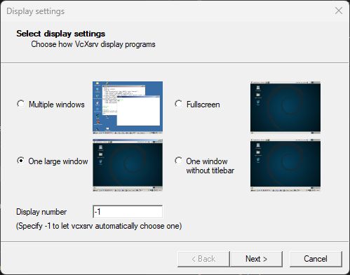
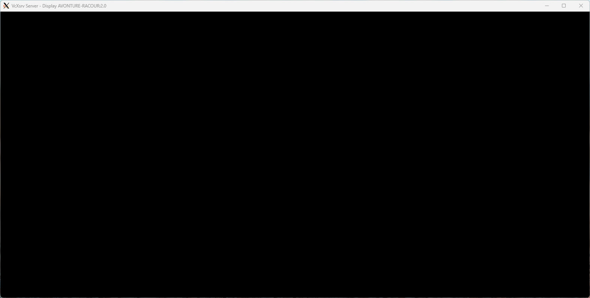

<!-- cspell:ignore lubuntu -->


During my summer holidays, I've watched this video: [Full Ubuntu GUI in a Container Displayed on Windows (XServer)](https://www.youtube.com/watch?v=WutV6n21dys) and, of course, I wanted to play with it.

The idea is to start a Lubuntu Desktop as a Docker container. Lubuntu is a lightweight Ubuntu distribution designed to be more resource-efficient than the standard Ubuntu. 

Using Docker and [Windows X Server](https://sourceforge.net/projects/vcxsrv/), we'll be able to play with Lubuntu just like any other containers i.e. play and drop without any impact on our ghost. Ideal for learning purposes then.

<!-- truncate -->

I encourage you to watch the video [Full Ubuntu GUI in a Container Displayed on Windows (XServer)](https://www.youtube.com/watch?v=WutV6n21dys).

## Step 1 - Create the Dockerfile

There is just one file to create called `Dockerfile` and with this content:

```Dockerfile
FROM ubuntu:latest

RUN apt update && DEBIAN_FRONTEND=noninteractive apt install -y lubuntu-desktop lightdm

RUN rm -f /run/reboot-required*
RUN echo "/usr/sbin/lightdm" > /etc/X11/default-display-manager
RUN echo "\
[LightDM]\n\
[Seat:*]\n\
type=xremote\n\
xserver-hostname=host.docker.internal\n\
xserver-display-number=0\n\
autologin-user=root\n\
autologin-user-timeout=0\n\
autologin-session=Lubuntu\n\
" > /etc/lightdm/lightdm.conf.d/lightdm.conf

ENV DISPLAY=host.docker.internal:0.0

CMD service dbus start ; service lightdm start
```

Build the image by running `docker build --tag cavo789/lubuntu .` (think to replace `cavo789` with your pseudo).

## Step 2 - Install Windows X Server

Building the image will take a few minutes (the final image will be around 3 GB).

During the creation of the image, please install [Windows X Server](https://sourceforge.net/projects/vcxsrv/). It's just a .exe to install on your Windows machine.

Once installed, run it program. On the first screen, as explained on the video, select *One large window*; click on `Next` and keep all default values then click on `Finish´ on the last screen.



By clicking on `Finish` you'll get a black screen. **It's normal.**



## Step 3 - Start the container

Run your container by starting `docker run -t cavo789/lubuntu` and **wait, wait and wait again. If you got warnings on the console, don't worry and still wait**.

After one, two or more minutes, you'll start to see the Linux Lubuntu desktop and then, you'll still need to wait because the operating system is loading and initializing (since it's the first time you start it).

