<!-- cspell:ignore ORCLCDB,ORCLPDB,initdb,sqlplus,oradata,PDBADMIN,USERENV,oracletools,sysdba -->

At work, I had to create an Oracle Enterprise database locally so that I could program scripts in different languages to show how to connect to Oracle using, for example, .Net, Python or PHP.

So the idea was immediately to check whether there was an official image for this. And there is one but, damned, it's not as simple as for PostgreSQL, MySQL, MS SQL Server.

In this article, which is a clean-up of my notes, we're going to install Oracle Enterprise locally in a container, create a database with example data and access the database in several ways.

It's a step-by-step guide to make life easier for anyone who needs to do the same thing - me, for example, in a few months' time when I've forgotten everything.

<!-- truncate -->

## Download a Docker image for OracleDB

So, yes, there is a Docker image called `container-registry.oracle.com/database/enterprise:latest` but before being able to download it, we'll need to do a few things:

1. Create a free account on oracle.com,
2. Generate a token,
3. Accept License terms,
4. Configure your local Docker environment to use that token.

If you miss one step and try to download the image immediately, you'll got this error:

```bash
> docker pull container-registry.oracle.com/database/enterprise:latest

Error response from daemon: Head "https://container-registry.oracle.com/v2/database/enterprise/manifests/21.3.0.0": unauthorized: Auth failed.
```

### Creation of a free account on oracle.com

Please surf on [https://container-registry.oracle.com/ords/ocr/ba/database/enterprise](https://container-registry.oracle.com/ords/ocr/ba/database/enterprise) and create a user by clicking on the `Sign In` button / top right link.

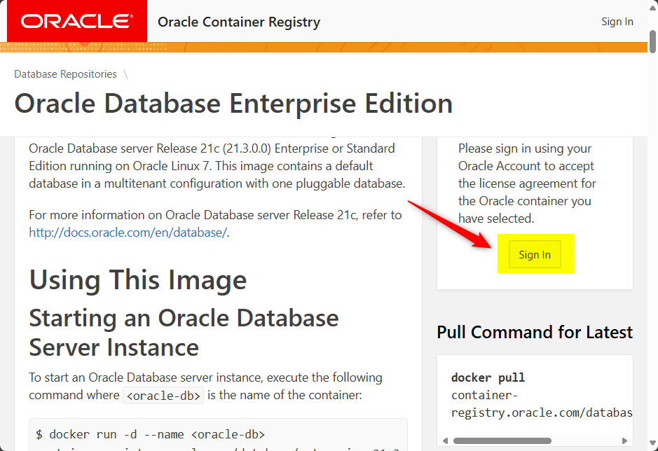

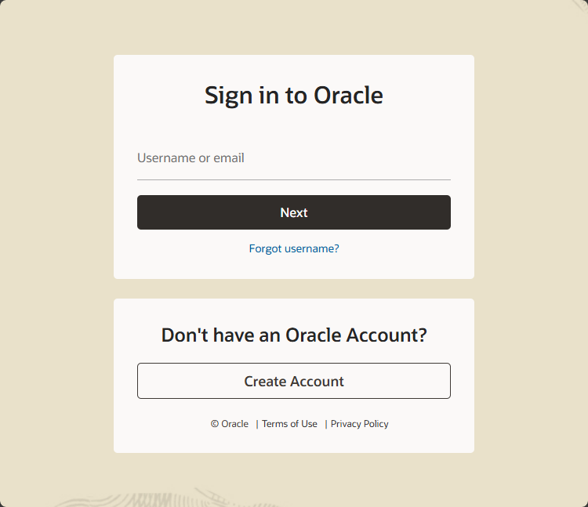

### Generate a token

Once your user has been validated (after reception of an email); go back to the [https://container-registry.oracle.com/ords/ocr/ba/database/enterprise](https://container-registry.oracle.com/ords/ocr/ba/database/enterprise) website; do a login and click on your profile then choice `Auth Token`.

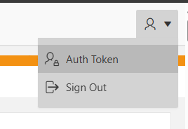

Click on the `Generate Secret Key` button and copy your **SSO Username** and your **Secret Key** somewhere (in your password vault application f.i.).

### Accept License terms

Please go to [https://container-registry.oracle.com/ords/ocr/ba/database](https://container-registry.oracle.com/ords/ocr/ba/database) and search for `enterprise` in the `Repository` column.

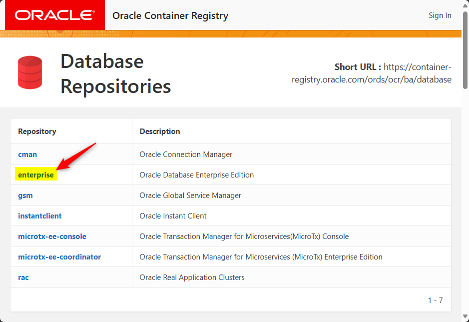

Being logged in, please click on the `Continue` button that appears on the right.

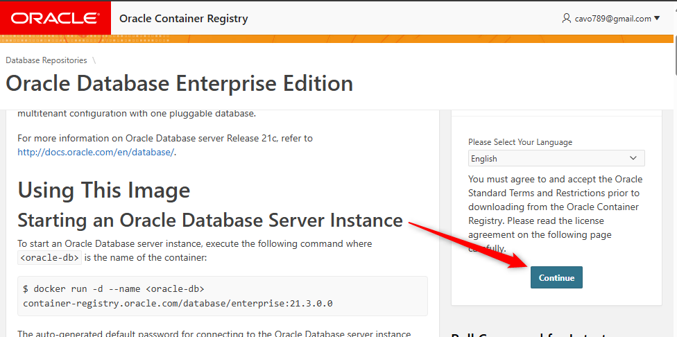

A popup window will be displayed and, at the bottom, you'll need to click on `Accept`.

Optional, by going back to [https://container-registry.oracle.com/ords/ocr/ba/database](https://container-registry.oracle.com/ords/ocr/ba/database) you'll see that Oracle has recorded the fact you've accepted their terms.

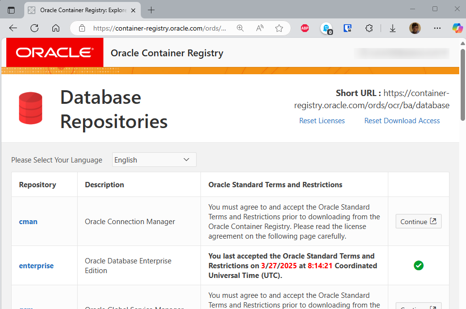

### Configure your local Docker environment

Last part, teach Docker you can download from the Oracle registry.

Go to the command line and type `docker login container-registry.oracle.com`.

Fill in your **SSO Username** and your **Secret Key** (as given by the Auth Token page on oracle.com).

Docker will display *Login Succeeded*.

:::note Optional, here is the disconnect command
If needed, run `docker logout container-registry.oracle.com` to remove the authentication to oracle.com on your computer.
:::

:::info Optional, the authentication is stored in the config.json file
By running `cat ~/.docker/config.json`, you'll see in `auths` the presence of the Oracle registry

```json
{
    "auths": {
        "container-registry.oracle.com": {},
        "https://index.docker.io/v1/": {}
    },
}
```

:::

### Finally, you can pull the image

If all previous steps have been correctly done, now, you should be able to run `docker pull container-registry.oracle.com/database/enterprise:latest` without any error and download the 3.5GB Docker image.

:::note The latest image is huge but the slim one is too old
Theres is a slim image around 1.5GB (`docker pull container-registry.oracle.com/database/enterprise:12.2.0.1-slim`) but it's a very old one (somewhere in 2018).
:::

## Important concepts to consider when working with Oracle v12 and after

### Container database (CDB) versus Pluggable database (PDB)

In Oracle's multi-tenant architecture (introduced since Oracle 12c), the concepts of *Container Database* (`CDB`) and **Pluggable Database** (`PDB`) are fundamental.

In comparison with other database engines, a `PDB` is a database while the `CDB` is the *underlying container infrastructure that manages one or more PDBs, sharing common background processes and memory*.

:::important For this article, we don't work at the CDB level at all
In this article, we're only interested to create tables in a database (PDB) **we always need to make sure to connect to a PDB like when creating tables.** We want that our tables are in a single database; not "shared" at CBD root level.

So, every time we'll need to work on tables; make sure to connect to the `PDB`.
:::

## Create an Oracle database container

Once the image has been pulled, we can create our container i.e. our Oracle database service.

The list of supported command line flags is here: [https://container-registry.oracle.com/ords/ocr/ba/database/enterprise#custom-configurations](https://container-registry.oracle.com/ords/ocr/ba/database/enterprise#custom-configurations)

If we wish, we can run a `docker run` command right now but, before, let's make some configuration.

Why? Because the container generation is terribly slow and can take up to ten minutes.

In order to be as efficient as possible, we'll first create a set of files on our disk so while creating the database, Docker will also automatically create some tables and put records in them.

### Creation of some configuration files

Please create a new folder on your disk and jump in it: `mkdir -p /tmp/oracle && cd $_`.

Please also run this statement to create the folder where we'll put our startup files: `mkdir -p scripts/startup`.

#### Let's create a Human Resources sample database

Oracle provide some sample databases on the [Oracle Database Sample Schemas](https://github.com/oracle-samples/db-sample-schemas/releases) page. You can download from there the `db-sample-schemas-23.3.zip` archive, open it and go to the `human_resources` folder. You'll found there a file called `hr_create.sql` which is a sample of a HR database. There is a second file called `hr_populate.sql` to feed the tables with some data.

:::tip
For easiness, you can retrieve these files by clicking on these two links: [hr_create.sql](./files/hr_create.sql) and [hr_populate.sql](./files/hr_populate.sql).
:::

Please download and copy these two files in the  `scripts/startup/sql/` folder you've previously created.

The second thing to do is to create the file `scripts/startup/populate_db.sh` with the content below so we'll automate the creation of our tables and put some records in our database. As said in a previous chapter, it's important to make sure to connect to the `PDB` so tables are created in a database; not in the container.

<details>

<summary>scripts/startup/populate_db.sh</summary>

```bash
#!/usr/bin/env bash

sqlplus -S sys/admin@localhost:1521/ORCLCDB AS SYSDBA <<EOF
ALTER SESSION SET CONTAINER = ORCLPDB1;
CONNECT system/admin@orclpdb1
@/docker-entrypoint-initdb.d/startup/sql/hr_create.sql
@/docker-entrypoint-initdb.d/startup/sql/hr_populate.sql
COMMIT;
EXIT;
EOF
```

</details>

Now, make the script executable: `chmod +x scripts/startup/populate_db.sh`.

:::info Tables will be owned by the system user
Pay attention to the `CONNECT system/admin@orclpdb1` statement: we'll first connect as the system user before creating the tables. So, tables will be accessible by that user i.e. the `system` user.
:::

If you need the data model, here it is:

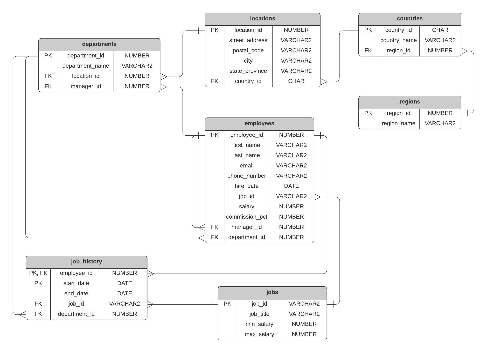

### Create the OracleDBData volume

Because running the container is a very slow process, we'll create a Docker volume to keep the database persistent on the disk.

The volume will keep the database on our disk, in a Docker self-managed volume. Like this, we can stop the Oracle container, start it again and we'll not loose our database. *The DB will be persistent into a self-manager Docker volume.*

Please run `docker volume create OracleDBData` in the console to create a Docker self-managed volume.

### Create the oracle network

And lastly, we'll create a specific network for our Oracle container: `docker network create oracle`.

### Ready to create the container

We're ready to create our container by running this command:

```bash
docker run -d \
    --name oracle-db \
    --network oracle \
    -p 1521:1521 \
    -p 5500:5500 \
    -e ORACLE_SID=ORCLCDB \
    -e ORACLE_PDB=ORCLPDB1 \
    -e ORACLE_PWD=admin \
    -v OracleDBData:/opt/oracle/oradata \
    -v ./scripts/startup/:/docker-entrypoint-initdb.d/startup \
    container-registry.oracle.com/database/enterprise:latest
```

:::note
This is terribly slow... Oracle will need something like 10 minutes before the container can be used.
:::

The `docker run` was terribly complex; here is a breakdown:

* `--name oracle-db`: Our running container will be named `oracle_db` (so we can access to it later on by running `docker exec -it oracle-db [...]`),
* `--network oracle`: We will create our container on the `oracle` network,
* `-p 1521:1521`: Oracle use a port number 1521 (Oracle Listener) and we'll expose that port on our machine,
* `-p 5500:5500`: Optional. Oracle use a second port number 5550 (OEM Express) and we'll expose that port too so we'll be able to access to `http://localhost:5500`,
* `-e ORACLE_SID=ORCLCDB`: The Oracle Database SID (SID stands for *System identifier*) is a very important setting. We'll keep the default value which is `ORCLCDB` (remember; `CDB` stands for `Container database`)
* `-e ORACLE_PDB=ORCLPDB1`: The Oracle Database PDB name. Here too, we'll keep the default value which is `ORCLPDB1`. (remember; `PDB` stands for `pluggable database`).
* `-e ORACLE_PWD=admin`: The Oracle database SYS, SYSTEM and PDBADMIN password. There is no default value since the password is auto generated and should be retrieved from the logs (`docker log`). This parameter modifies the password for the SYS, SYSTEM and PDBADMIN users.
* `-v OracleDBData:/opt/oracle/oradata`: We'll persist the database on our disk but we don't care *where*, we'll let Docker to manage it. We've previously created a Docker volume named `OracleDBData`.
* `-v ./scripts/startup/:/docker-entrypoint-initdb.d/startup`: This will allow to create files locally in the `./scripts/startup` folder (like our SQL files) and run them inside the container once the main Oracle database is ready. And, indeed, we've created previously the script `populate_db.sh`, `sql/hr_create.sql` and `sql/hr_populate.sql` files in our `scripts/startup` folder.

## Important constants to remember

From now on, our Oracle database server is running as a Docker container. We'll use some constants a lot.

Here are the constant to remember:

* `1512` is the port number to use when connecting to the Oracle DB service,
* `oracle-db` is the name of our container,
* `ORCLCDB` is the name of our CDB,
* `ORCLPDB1` is the name of our pluggable database,
* `admin` is the password to use and
* `system` is the user used when we've created the database

If you look back at the `populate_db.sh` script, we had:

```bash
# highlight-next-line
sqlplus -S sys/admin@localhost:1521/ORCLCDB AS SYSDBA <<EOF
# highlight-next-line
ALTER SESSION SET CONTAINER = ORCLPDB1;
# highlight-next-line
CONNECT system/admin@orclpdb1
@/docker-entrypoint-initdb.d/startup/sql/hr_create.sql
@/docker-entrypoint-initdb.d/startup/sql/hr_populate.sql
COMMIT;
EXIT;
EOF
```

And now, you understand why connection strings were:

* `sys/admin@localhost:1521/ORCLCDB`: `sys` is a system user in Oracle, `admin` the associated password, `1521` our exposed port and `ORCLCDB` is the name of our container database,
* `ALTER SESSION SET CONTAINER = ORCLPDB1;`: we need to create our tables and our records in our database (`ORCLPDB1`) and
* `CONNECT system/admin@orclpdb1`: `system` is also a system user in Oracle, it'll be the owner of our tables, `admin` is the same, associated password and `orclpdb1` is the name of what Oracle call the `service`.
  
## Running an interactive console in the DB container

If you need to jump in the container, simply run `docker exec -it oracle-db bash`.

As a fictive example, we can go to the `/docker-entrypoint-initdb.d/startup` folder inside the container and run our `./populate_db.sh` script again (again because was fired by Oracle during the creation of the container):

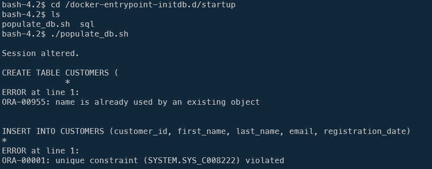

And of course, we'll get a lot of errors illustrating the fact that tables and records were already created/inserted.

Type `exit` to quit the console and go back to your host prompt.

## Working with the Oracle DB container

So the `docker run` command will takes something like 10 minutes to run.

If you've Docker Desktop, switch to its interface, click on the `Containers` link and click on your `oracle-db` container to see the log.  Wait until you see:

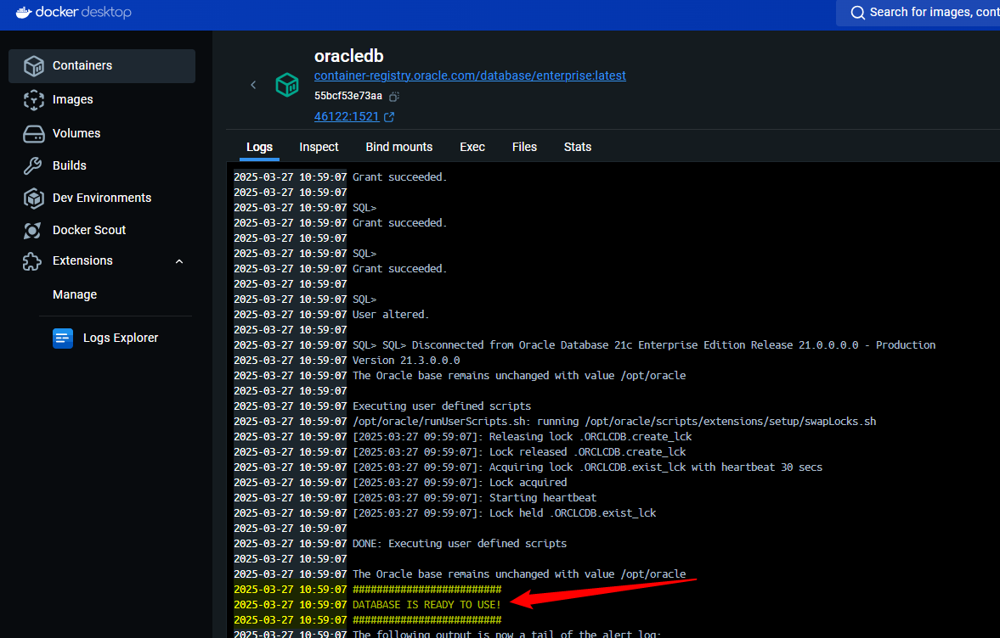

You can also use the command line: `docker logs oracle-db --follow` and wait until we see the `DATABASE IS READY TO USE!` message. Press <kbd>CTRL</kbd>+<kbd>C</kbd> to quit the log.

Now, we can jump in the `oracle-db` container and run SQL*Plus by running `docker exec -it oracle-db sqlplus sys/admin@ORCLPDB1 as sysdba` (remember: we'll connect to the `PDB`; not the `CDB`).

:::tip Am I connected on the container database or in a pluggable database?
Just run, in the SQL*Plus console, the `SHOW CON_NAME;` command.

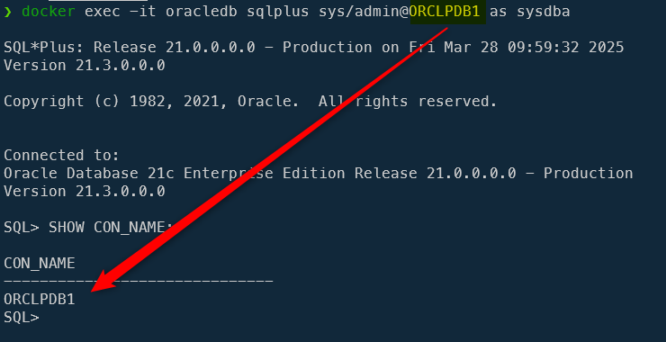

If you're connected to the CDB, you'll get the next answer and it's wrong. Type `exit` and connect to the PDB.

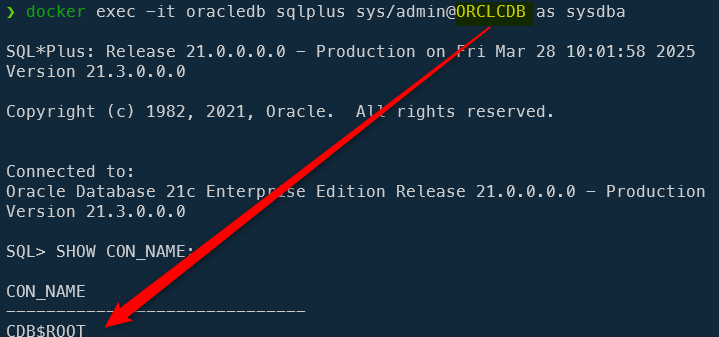
:::

### A word about schema

Previously, we've created our tables using the `scripts/startup/populate_db.sh` script. Here was the script used:

```bash
#!/usr/bin/env bash

sqlplus -S sys/admin@localhost:1521/ORCLCDB AS SYSDBA <<EOF
ALTER SESSION SET CONTAINER = ORCLPDB1;
CONNECT system/admin@orclpdb1
@/docker-entrypoint-initdb.d/startup/sql/hr_create.sql
@/docker-entrypoint-initdb.d/startup/sql/hr_populate.sql
COMMIT;
EXIT;
EOF
```

The `CONNECT` statement will use the `system` Oracle user. Tables that will be created will be created in the `system` schema.

If we run `docker exec -it oracle-db sqlplus sys/admin@ORCLPDB1 as sysdba` and try to display records of the `COUNTRIES` table; it will not work unless we specify the schema:

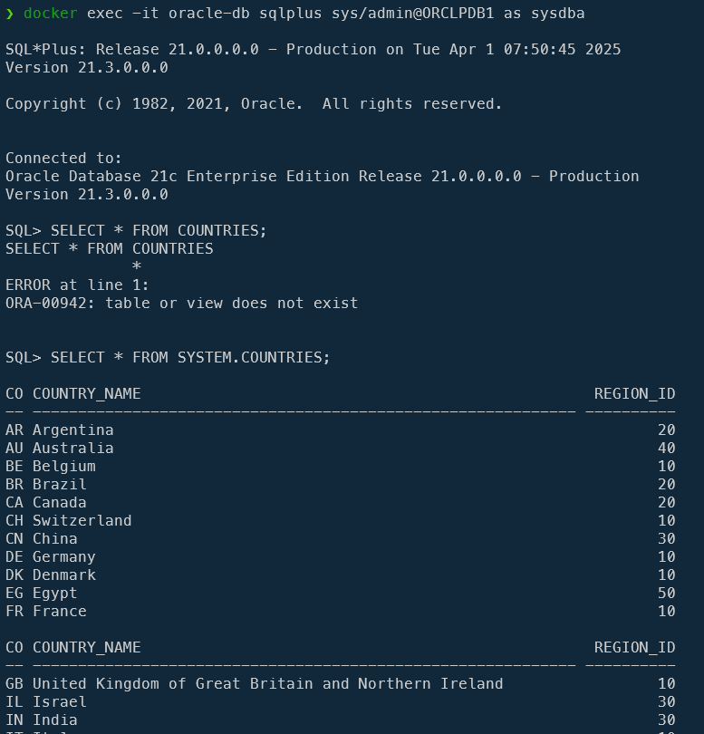

This is because the `sys` user use the `sys` schema by default (we can see this by running `SELECT SYS_CONTEXT('USERENV', 'CURRENT_SCHEMA') FROM dual;`).

This is why, because our tables are in the `system` schema; we can access to them by running `SELECT * FROM SYSTEM.COUNTRIES;`.

But, we can also change our user, no more using `sys` but `system` by running `CONNECT system/admin@orclpdb1`.

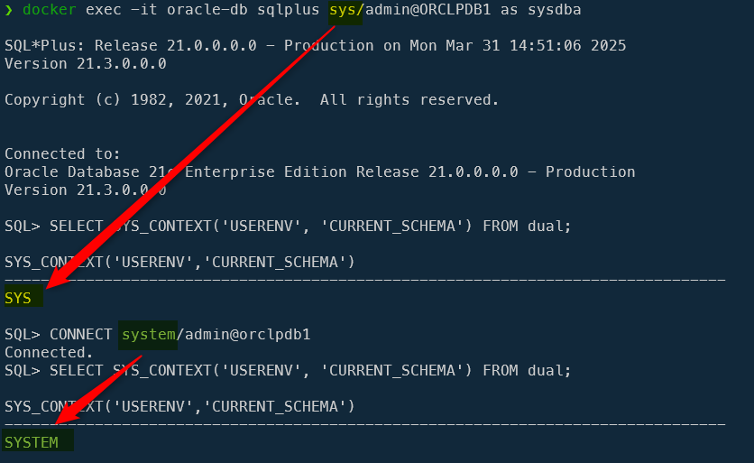

### Check our fake data

This understood, here is how we can see our data:

* Run `docker exec -it oracle-db sqlplus sys/admin@ORCLPDB1 as sysdba`,
* Then, in SQL*Plus, run `CONNECT system/admin@orclpdb1`,
* For esthetic purposes, we'll run `SET WRAP OFF` and `SET PAGESIZE 1000` and
* we can access to our tables like this: `SELECT EMPLOYEE_ID, FIRST_NAME, LAST_NAME, EMAIL FROM EMPLOYEES;`

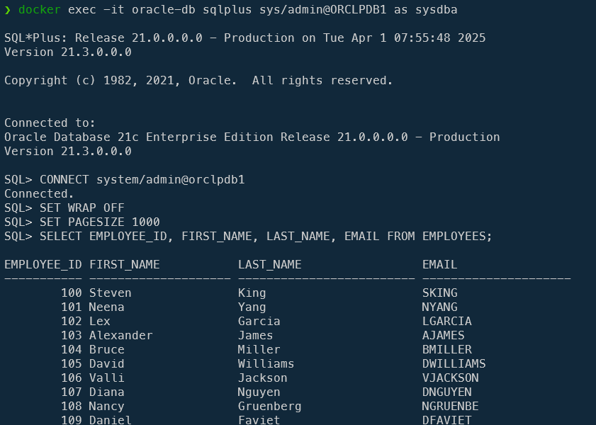

:::tip
`SET WRAP OFF` will allow to use the screen full-width and not a ridiculous width of 80 characters and `SET PAGESIZE 1000` is to not have a paginated list every 10 records.
:::

### Accessing to the Oracle Enterprise Manager Database Express

Earlier, when running our `docker run` command, we've mapped the port `5500` from the container on our host. That port is the one used by Oracle Enterprise Manager Database Express (aka `OEM Express`).

This is a web application we can reach by surfing to `https://localhost:5500/em/`.

Connect to it using `system` / `admin` and `orclpdb1` as container name.

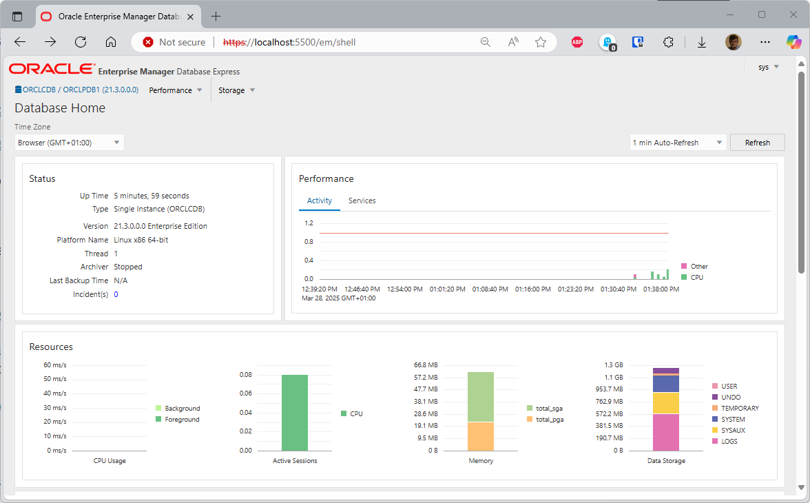

### Accessing our database using Oracle tools

#### Oracle SQL Developer

You can download [Oracle SQL Developer](https://www.oracle.com/be/database/sqldeveloper). It's a ZIP file and once unzipped; you can run the interface without the need to install the software, it's ready-to-use.

Once installed, run it and create a new connection to:

* Username: `SYS`,
* Role: `SYSDBA`,
* Password: `admin`
* Hostname: `127.0.0.1`,
* Port: `1521` and
* Service name: `orclpdb1`

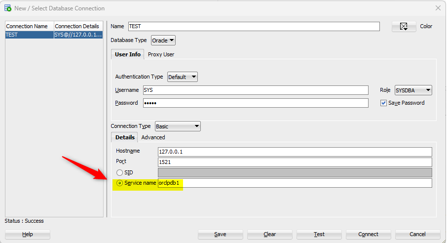

:::note Remember; use should connect to our PDB; not to the CDB
Tables are located in the *pluggable database* (`PDB`); not in the *container database* (`CDB`)
:::

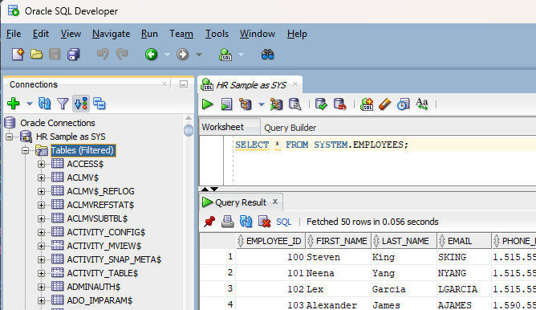

Start to type `SELECT * FROM system.` and press <kbd>CTRL</kbd>+<kbd>SPACE</kbd> to get the list of objects in that schema. By scrolling a few, you'll find employees.

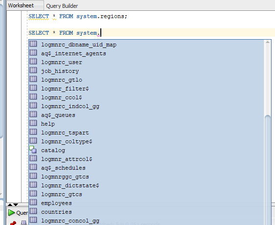

Validate or simply type the full SQL `SELECT * FROM system.employees`. In the example below, I'll asked the list of regions and the list of employees. I will run the query by simply pressing <kb>F5</kb>:

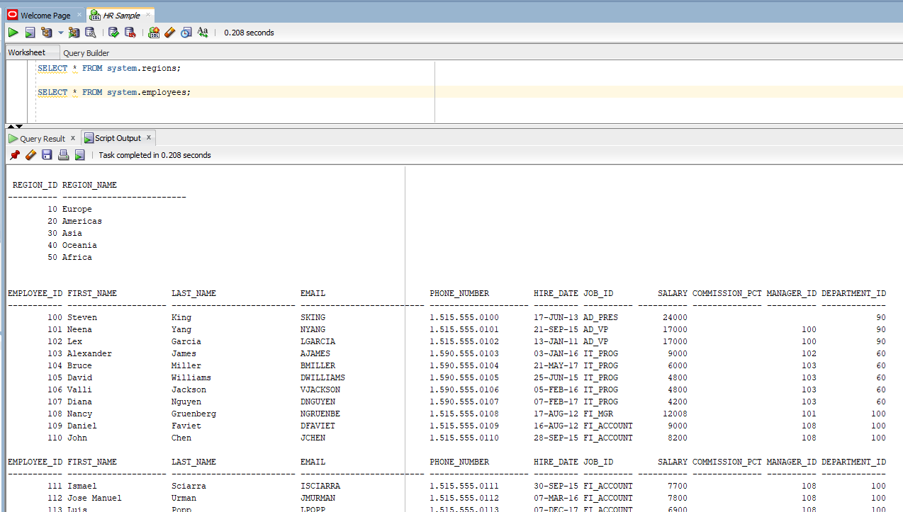

##### Connect to Oracle SQL Developer using the correct user

In the previous chapter, we've established a login using `sys` for the username and for that reason, if we click in the `Tables (Filtered)` menu in the left tree-view, we'll get a bunch of tables but not the one of the `system` user like our employees table.

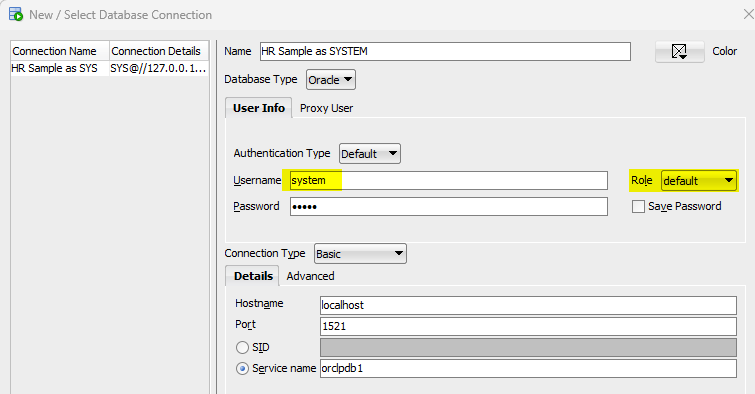

Now, by unfolding the list of tables, we can see ours:

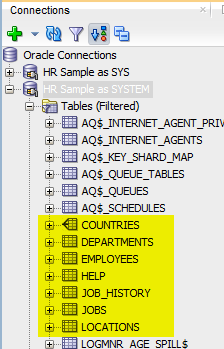

#### Access our Oracle DB container using Oracle SQLPlus

Another way would be to use the official sql*plus Docker image like this:

```bash
docker run --rm -it --network oracle oracletools/sqlplus:v19.18_lin SYS/admin@oracle-db:1521/orclpdb1 as sysdba       
```

Once connected, for instance, we can get the list of countries like this:

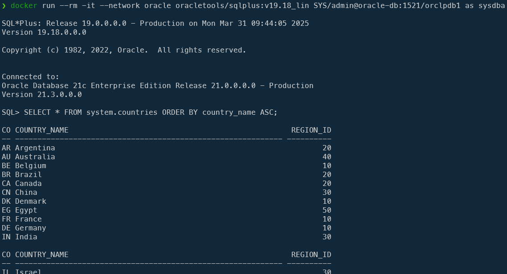

:::note Intern versus extern
For this article, it was not really needed to use that image. Until now, we've more than once used SQL*Plus like when we've fired `docker exec -it oracle-db sqlplus sys/admin@ORCLPDB1 as sysdba` to connect to the database.

The difference is: `docker exec -it oracle-db [...]` jump in our database container and run sqlplus *internally* (from within the container where the database is stored) while `docker run [...] oracle oracletools/sqlplus:v19.18_lin [...]` run sqlplus *outside* as a separate container.
:::
