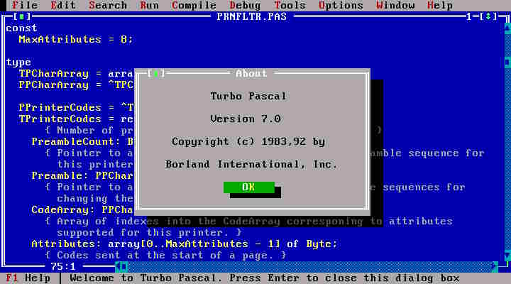

# Play with Docker and Pascal



Nostalgie! Nostalgie! During my studies (in 1991-1993), I was a BIG fan of Turbo Pascal 7.0. It was the first langage that I really learned and love it so much.

Turbo Pascal 7.0 was to create DOS programs (Delphi has comes a few years after and it was for Windows).

**Is it possible 30 years later to run somes of my source code again?** 

<!-- truncate -->

Some of my codes can be retrieved on internet using this parametrized query: [https://www.google.com/search?q=avonture+site%3Ahttp%3A%2F%2Fwww.retroarchive.org](https://www.google.com/search?q=avonture+site%3Ahttp%3A%2F%2Fwww.retroarchive.org). *Also saved on [https://github.com/cavo789/swag](https://github.com/cavo789/swag).*

## Hello world from 30 years ago

Since it's Turbo Pascal 7 codebase, we'll start a DOS console. 

Please run `mkdir C:\tmp\pascal && cd C:\tmp\pascal` in a DOS console to create a folder called `pascal` and jump in it.

Please create a new file called `Hello.pas` with this content:

```pascal
begin
  writeln('Hello world! I''m a Turbo Pascal source code');
end.
```

As you know, Pascal should be compiled into a `.exe` (or `.com`) to be executable. The command below will do this:

```bash
❯ docker run --rm -v %CD%:/workspace signumtemporis/fpc:cross.x86_64-win64.slim Hello.pas

Free Pascal Compiler version 3.2.2 [2021/12/10] for x86_64
Copyright (c) 1993-2021 by Florian Klaempfl and others
Target OS: Win64 for x64
Compiling Hello.pas
Linking Hello.exe
2 lines compiled, 0.1 sec, 32432 bytes code, 1508 bytes data
```

Now, just run `Hello.exe`:

```bash
❯ Hello.exe

Hello world! I'm a Turbo Pascal source code
```

## Convert a number to a byte

Let's try something a *little more complex*. A conversion function to display an integer to his byte-representation *(please be comprehensive; it was a school assigment 😄)*. 

I've write it in 1992 and I've published it in the *SWAG* in 1997: [https://github.com/cavo789/swag/blob/master/Byte2Bin/files/source.pas](https://github.com/cavo789/swag/blob/master/Byte2Bin/files/source.pas)

Create the `Byte2Bin.pas` file on your disk with this content:

```pascal
Function Byte2Bin (Chiffre : Byte) : String;

Var I, Temp : Byte;
    St      : String;

Begin

   St := '';

   For I := 7 Downto 0 do Begin
       Temp := (Chiffre and (1 shl I));
       If (Temp = 0) then St := St + '0' Else St := St + '1';
   End;

   Byte2Bin := St;

End;

begin
    WriteLn( Byte2Bin(197) );
end.
```

And compiled it:

```bash
❯ docker run --rm -v %CD%:/workspace signumtemporis/fpc:cross.x86_64-win64.slim Byte2Bin.pas

Free Pascal Compiler version 3.2.2 [2021/12/10] for x86_64
Copyright (c) 1993-2021 by Florian Klaempfl and others
Target OS: Win64 for x64
Compiling Byte2Bin.pas
Linking Byte2Bin.exe
20 lines compiled, 0.1 sec, 32656 bytes code, 1508 bytes data
```

As you can see in the source code, the idea was to show the binary-representation of `197` and, yes!, it's indeed `11000101`.

```bash
❯ Byte2Bin.exe

11000101
```

Bon, d'accord, l'intérêt d'exécuter du code TP7 en 2023 est pour le moins minime; c'est juste fun.