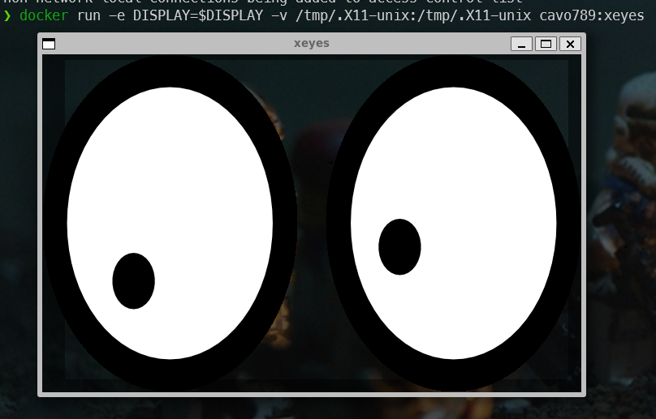

<!-- cspell:ignore xeyes,xhost,seccomp,pgid,puid -->


Until very recently, I didn't know it was possible to run GUIs with Docker and that's just amazing.

:::info `GUI` stands for `Graphical User Interface`
:::

So, using Docker, we can start Firefox or GIMP or even ... [Doom 2](https://hub.docker.com/r/classiccontainers/doom2).


In this blog post, we'll create our own xeyes Docker image, then play with Firefox and Gimp.

<!-- truncate -->

## Creating our own xeyes Docker image

Let's start with something really geeky.

Go to a temporary folder (f.i. `mkdir -p /tmp/xeyes && cd $_`) and create a file called `Dockerfile` with this content:

```Dockerfile
FROM ubuntu:latest

RUN apt-get update && apt-get install -y x11-apps

CMD [ "xeyes" ]
```

Now, create the image by docker build like this: `docker buildx build --rm --tag cavo789/xeyes .` (replace `cavo789` by anything else like your pseudo).

Make sure you've a variable called `DISPLAY`. You can check this by running `printenv | grep DISPLAY`. If you don't have it, create the variable by running `export DISPLAY=:0` in the console.

Now, run `xhost +local:docker` in your console. That command grants permission to connect to an X server using the Docker socket. This means that applications running within Docker containers can display their graphical user interface (GUI) on the host system. The expected result is this text: `non-network local connections being added to access control list` 

Now, simply run a container using and make sure to share the `DISPLAY` variable: `docker run --rm -it --env DISPLAY=$DISPLAY --volume /tmp/.X11-unix:/tmp/.X11-unix cavo789:xeyes`.



Yes, it's true, it's useless, but wow! it's possible to run a GUI from a container and replicate the image in real time on our host machine.
