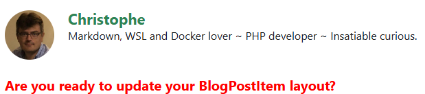

Since a few days, I'm on BlueSky and thus, why not adding a *Share on BlueSky* button on my articles?

I've asked to some IA to tell me how to proceed because I've never created a JS feature for Docusaurus and ... it's easy.

Perhaps am I wrong but here is how I've proceed:

1. I've created the `src/theme/BlogPostItem/index.js` file,
2. I've copied some content to it

and it was already done.

<!-- truncate -->

## Override the BlogPostItem layout

The `src/theme/BlogPostItem/index.js` file will **customize the layout and content of individual blog posts** so, by updating that file, I can override the default layout of every single post of my blog.

We need to override the original file but ... where is that file? There is a command for this.

Start a console and make sure you're in the root folder of your blog *(in my case, because I'm running my blog with Docker and I'm using a self-made Makefile, I just have to run `make bash`)*.

In your console, run `yarn docusaurus swizzle @docusaurus/theme-classic BlogPostItem`.

When prompted, select `Javascript`, then **`Eject`** and finally `YES`.


:::info
`Swizzle` is a word used by Docusaurus. It means `override`.
:::

## Keep things under control

As you can see on the screen, you'll extract a lot of files. Let's keep things under control: we just want to add a share button below our article; we don't want to do more than that.

Look at your Docusaurus site now; go to the `src/theme/BlogPostItem` folder and see that, yes, you've now a lot of files and sub-folders. Just remove every sub-foldes; we don't want to update them i.e. we want to keep the original ones. So next time you'll install a newer version of Docusaurus, you'll stay up-to-date.

Just keep the `index.js` file created by the `swizzle` command:

<details>

<summary>index.js</summary>

```javascript
import React from 'react';
import clsx from 'clsx';
import {useBlogPost} from '@docusaurus/plugin-content-blog/client';
import BlogPostItemContainer from '@theme/BlogPostItem/Container';
import BlogPostItemHeader from '@theme/BlogPostItem/Header';
import BlogPostItemContent from '@theme/BlogPostItem/Content';
import BlogPostItemFooter from '@theme/BlogPostItem/Footer';
// apply a bottom margin in list view
function useContainerClassName() {
  const {isBlogPostPage} = useBlogPost();
  return !isBlogPostPage ? 'margin-bottom--xl' : undefined;
}
export default function BlogPostItem({children, className}) {
  const containerClassName = useContainerClassName();
  return (
    <BlogPostItemContainer className={clsx(containerClassName, className)}>
      <BlogPostItemHeader />
      <BlogPostItemContent>{children}</BlogPostItemContent>
      <BlogPostItemFooter />
    </BlogPostItemContainer>
  );
}
```

</details>

## Updating the layout

Let's play and add a line just after our post title. Look at the example below; I've just added a new line:

<details>

<summary>index.js</summary>

```javascript
import React from 'react';
import clsx from 'clsx';
import {useBlogPost} from '@docusaurus/plugin-content-blog/client';
import BlogPostItemContainer from '@theme/BlogPostItem/Container';
import BlogPostItemHeader from '@theme/BlogPostItem/Header';
import BlogPostItemContent from '@theme/BlogPostItem/Content';
import BlogPostItemFooter from '@theme/BlogPostItem/Footer';
// apply a bottom margin in list view
function useContainerClassName() {
  const {isBlogPostPage} = useBlogPost();
  return !isBlogPostPage ? 'margin-bottom--xl' : undefined;
}
export default function BlogPostItem({children, className}) {
  const containerClassName = useContainerClassName();
  return (
    <BlogPostItemContainer className={clsx(containerClassName, className)}>
      <BlogPostItemHeader />
      // highlight-next-line
      // Just after the blog post title, we'll add a "Are you ready" text
      // highlight-next-line
      <strong style={{color:"red"}}>Are you ready to update your BlogPostItem layout?</strong>
      <BlogPostItemContent>{children}</BlogPostItemContent>
      <BlogPostItemFooter />
    </BlogPostItemContainer>
  );
}
```

</details>

Refresh your page and tadaaa,



:::note
If it didn't works, please stop and restart your Docusaurus server. On my case (I'm using Docker), I just need to stop and restart my container.
:::

## Time to add our share button

As said, I've used IA to generate a function for me and below what I've received.

<details>

<summary>The BlueSkyShare function</summary>

```javascript
const BlueSkyShare = ({ title, url }) => {
  const encodedTitle = encodeURIComponent(title);
  // highlight-next-line
  // MAKE SURE TO DEFINE THE URL TO YOUR DOCUSAURUS SITE HERE BELOW
  // highlight-next-line
  const encodedUrl = 'https://www.avonture.be' + encodeURIComponent(url);
  const shareLink = `https://bsky.app/intent/compose?text=${encodedTitle}%20${encodedUrl}`;

  return (
     <div style={{ borderTop: '1px solid #eee', marginTop: '2rem', paddingTop: '1.5rem' }}>
      <a
        href={shareLink}
        target="_blank"
        rel="noopener noreferrer"
        style={{
          display: 'inline-flex',
          alignItems: 'center',
          gap: '0.4rem',
          padding: '0.4rem 0.9rem',
          backgroundColor: '#f5f5f5',       // Light neutral background
          color: '#333333',                 // Dark grey text (less harsh than black)
          fontWeight: '400',                // Normal weight
          fontSize: '0.9rem',               // Slightly smaller
          borderRadius: '6px',              // Softer rounding
          textDecoration: 'none',
          transition: 'background-color 0.2s ease, color 0.2s ease',
          boxShadow: 'none',                // Remove shadow for minimal look
          border: '1px solid #ddd'          // Subtle border instead of s
        }}
        onMouseEnter={e => e.currentTarget.style.backgroundColor = '#0062cc'}
        onMouseLeave={e => e.currentTarget.style.backgroundColor = '#007aff'}
      >
        <svg
          xmlns="http://www.w3.org/2000/svg"
          viewBox="0 0 100 100"
          width="20"
          height="20"
          fill="white"
        >
          <path d="M50,15C29.9,15,13.2,31.7,13.2,51.8c0,11.7,4.6,22.2,12.1,30c0.9,0.9,2.5,0.8,3.3-0.2l7.8-9.2c0.8-0.9,0.7-2.4-0.2-3.2 c-4.2-3.7-6.9-9.1-6.9-15.1c0-11.2,9-20.3,20.3-20.3s20.3,9,20.3,20.3c0,6-2.7,11.4-6.9,15.1c-0.9,0.8-1,2.3-0.2,3.2l7.8,9.2 c0.8,0.9,2.4,1.1,3.3,0.2c7.5-7.8,12.1-18.3,12.1-30C86.8,31.7,70.1,15,50,15z"/>
        </svg>
        Share on BlueSky
      </a>
    </div>
  );
};
```

</details>

:::caution
Make sure to update the `encodedUrl` variable! You need to specify the URL to your Docusaurus site.
:::

As you can see, we've defined a function called `BlueSkyShare` and that function ask for two parameters, the `title` of your blog post and the `url` to the post itself.

We'll call the function like this `<BlueSkyShare title={metadata.title} url={metadata.permalink}/>`.

But what is `metadata`? We've to defined it before and it's done using this line: `const {metadata} = useBlogPost();`

## Final version of index.js

Here is the final version of the `src/theme/BlogPostItem/index.js` file:

<details>

<summary>Final src/theme/BlogPostItem/index.js</summary>

```javascript
import React from 'react';
import clsx from 'clsx';
import {useBlogPost} from '@docusaurus/plugin-content-blog/client';
import BlogPostItemContainer from '@theme/BlogPostItem/Container';
import BlogPostItemHeader from '@theme/BlogPostItem/Header';
import BlogPostItemContent from '@theme/BlogPostItem/Content';
import BlogPostItemFooter from '@theme/BlogPostItem/Footer';

// apply a bottom margin in list view
function useContainerClassName() {
  const {isBlogPostPage} = useBlogPost();
  return !isBlogPostPage ? 'margin-bottom--xl' : undefined;
}

// highlight-start
const BlueSkyShare = ({ title, url }) => {
  const encodedTitle = encodeURIComponent(title);
  const encodedUrl = 'https://www.avonture.be' + encodeURIComponent(url);
  const shareLink = `https://bsky.app/intent/compose?text=${encodedTitle}%20${encodedUrl}`;

  return (
     <div style={{ borderTop: '1px solid #eee', marginTop: '2rem', paddingTop: '1.5rem' }}>
      <a
        href={shareLink}
        target="_blank"
        rel="noopener noreferrer"
        style={{
          display: 'inline-flex',
          alignItems: 'center',
          gap: '0.4rem',
          padding: '0.4rem 0.9rem',
          backgroundColor: '#f5f5f5',       // Light neutral background
          color: '#333333',                 // Dark grey text (less harsh than black)
          fontWeight: '400',                // Normal weight
          fontSize: '0.9rem',               // Slightly smaller
          borderRadius: '6px',              // Softer rounding
          textDecoration: 'none',
          transition: 'background-color 0.2s ease, color 0.2s ease',
          boxShadow: 'none',                // Remove shadow for minimal look
          border: '1px solid #ddd'          // Subtle border instead of s
        }}
        onMouseEnter={e => e.currentTarget.style.backgroundColor = '#0062cc'}
        onMouseLeave={e => e.currentTarget.style.backgroundColor = '#007aff'}
      >
        <svg
          xmlns="http://www.w3.org/2000/svg"
          viewBox="0 0 100 100"
          width="20"
          height="20"
          fill="white"
        >
          <path d="M50,15C29.9,15,13.2,31.7,13.2,51.8c0,11.7,4.6,22.2,12.1,30c0.9,0.9,2.5,0.8,3.3-0.2l7.8-9.2c0.8-0.9,0.7-2.4-0.2-3.2 c-4.2-3.7-6.9-9.1-6.9-15.1c0-11.2,9-20.3,20.3-20.3s20.3,9,20.3,20.3c0,6-2.7,11.4-6.9,15.1c-0.9,0.8-1,2.3-0.2,3.2l7.8,9.2 c0.8,0.9,2.4,1.1,3.3,0.2c7.5-7.8,12.1-18.3,12.1-30C86.8,31.7,70.1,15,50,15z"/>
        </svg>
        Share on BlueSky
      </a>
    </div>
  );
};
// highlight-end

export default function BlogPostItem({children, className}) {
  // highlight-next-line
  const {metadata} = useBlogPost();
  const containerClassName = useContainerClassName();
  return (
    <BlogPostItemContainer className={clsx(containerClassName, className)}>
      <BlogPostItemHeader />
      <BlogPostItemContent>{children}</BlogPostItemContent>
      <BlogPostItemFooter />
      // highlight-next-line
      <BlueSkyShare title={metadata.title} url={metadata.permalink}/>
    </BlogPostItemContainer>
  );
}
```

</details>

## Warning about the swizzle command

You need to understand that, by swizzling (overriding) the BlogPostItem layout, you're no more *aligned* with the standard layout of Docusaurus. 

**If, in a next release, new features will be added by Docusaurus; you'll not have them!** since you're no more using the default layout for your post.

Just keep that in mind and, perhaps, from time to time (after a major release f.i.), think to run the swizzle command again and restart your customization.