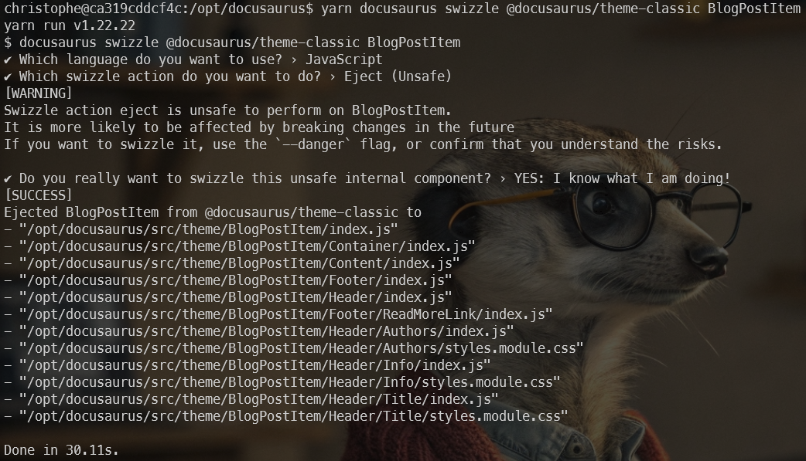

Since a few days, I'm on BlueSky and thus, why not adding a *Share on BlueSky* button on my articles?

I've asked to some IA to tell me how to proceed because I've never created a JS feature for Docusaurus and ... it's easy.

Perhaps am I wrong but here is how I've proceed:

1. I've created the `src/theme/BlogPostItem/index.js` file,
2. I've copied some content to it

and it was already done.

<!-- truncate -->

## Override the BlogPostItem layout

The `src/theme/BlogPostItem/index.js` file will **customize the layout and content of individual blog posts** so, by updating that file, I can override the default layout of every single post of my blog.

We need to override the original file but ... where is that file? There is a command for this.

Start a console and make sure you're in the root folder of your blog *(in my case, because I'm running my blog with Docker and I'm using a self-made Makefile, I just have to run `make bash`)*.

In your console, run `yarn docusaurus swizzle @docusaurus/theme-classic BlogPostItem`.

When prompted, select `Javascript`, then **`Eject`** and finally `YES`.



:::info
`Swizzle` is a word used by Docusaurus. It means `override`.
:::

## Keep things under control

As you can see on the screen, you'll extract a lot of files. Let's keep things under control: we just want to add a share button below our article; we don't want to do more than that.

Look at your Docusaurus site now; go to the `src/theme/BlogPostItem` folder and see that, yes, you've now a lot of files and sub-folders. Just remove every sub-foldes; we don't want to update them i.e. we want to keep the original ones. So next time you'll install a newer version of Docusaurus, you'll stay up-to-date.

Just keep the `index.js` file created by the `swizzle` command:

<details>

<summary>index.js</summary>

```javascript
import React from 'react';
import clsx from 'clsx';
import {useBlogPost} from '@docusaurus/plugin-content-blog/client';
import BlogPostItemContainer from '@theme/BlogPostItem/Container';
import BlogPostItemHeader from '@theme/BlogPostItem/Header';
import BlogPostItemContent from '@theme/BlogPostItem/Content';
import BlogPostItemFooter from '@theme/BlogPostItem/Footer';
// apply a bottom margin in list view
function useContainerClassName() {
  const {isBlogPostPage} = useBlogPost();
  return !isBlogPostPage ? 'margin-bottom--xl' : undefined;
}
export default function BlogPostItem({children, className}) {
  const containerClassName = useContainerClassName();
  return (
    <BlogPostItemContainer className={clsx(containerClassName, className)}>
      <BlogPostItemHeader />
      <BlogPostItemContent>{children}</BlogPostItemContent>
      <BlogPostItemFooter />
    </BlogPostItemContainer>
  );
}
```

</details>

## Updating the layout

Let's play and add a line just after our post title. Look at the example below; I've just added a new line:

<details>

<summary>index.js</summary>

```javascript
import React from 'react';
import clsx from 'clsx';
import {useBlogPost} from '@docusaurus/plugin-content-blog/client';
import BlogPostItemContainer from '@theme/BlogPostItem/Container';
import BlogPostItemHeader from '@theme/BlogPostItem/Header';
import BlogPostItemContent from '@theme/BlogPostItem/Content';
import BlogPostItemFooter from '@theme/BlogPostItem/Footer';
// apply a bottom margin in list view
function useContainerClassName() {
  const {isBlogPostPage} = useBlogPost();
  return !isBlogPostPage ? 'margin-bottom--xl' : undefined;
}
export default function BlogPostItem({children, className}) {
  const containerClassName = useContainerClassName();
  return (
    <BlogPostItemContainer className={clsx(containerClassName, className)}>
      <BlogPostItemHeader />
      // highlight-next-line
      // Just after the blog post title, we'll add a "Are you ready" text
      // highlight-next-line
      <strong style={{color:"red"}}>Are you ready to update your BlogPostItem layout?</strong>
      <BlogPostItemContent>{children}</BlogPostItemContent>
      <BlogPostItemFooter />
    </BlogPostItemContainer>
  );
}
```

</details>

Refresh your page and tadaaa,


:::note
If it didn't works, please stop and restart your Docusaurus server. On my case (I'm using Docker), I just need to stop and restart my container.
:::

## Time to add our share button

As said, I've used IA to generate a function for me. I've then do some changes and here is the function I'm using:

<details>

<summary>The BlueSkyShare function</summary>

```javascript
const BlueSkyShare = ({ title, url }) => {
  const encodedTitle = encodeURIComponent(title);
  const { siteConfig } = useDocusaurusContext();
  const encodedUrl = siteConfig.url + encodeURIComponent(url);
  const shareLink = `https://bsky.app/intent/compose?text=${encodedTitle}%20${encodedUrl}`;

  return (
     <div style={{ borderTop: '1px solid #eee', marginTop: '2rem', paddingTop: '1.5rem' }}>
      <a
        href={shareLink}
        target="_blank"
        rel="noopener noreferrer"
        className={clsx('blueSkyShareButton', 'button')} 
        onMouseEnter={e => e.currentTarget.style.backgroundColor = '#0062cc'}
        onMouseLeave={e => e.currentTarget.style.backgroundColor = '#007aff'}
      >
        
        Share on BlueSky
      </a>
    </div>
  );
};
```

</details>

As you can see, we've defined a function called `BlueSkyShare` and that function ask for two parameters, the `title` of your blog post and the `url` to the post itself.

We'll call the function like this `<BlueSkyShare title={metadata.title} url={metadata.permalink}/>`.

But what is `metadata`? We've to defined it before and it's done using this line: `const {metadata} = useBlogPost();`

### Stylization of the Share button

In order to not add CSS in the BlueSkyShare javascript function, we've added a class called `blueSkyShareButton`.

Please update (or create) the `src/css/custom.css` file and add these rules:

<details>

<summary>src/css/custom.css</summary>

```css
.blueSkyShareButton {
  display: inline-flex;
  align-items: center;
  gap: 0.4rem;
  padding: 0.4rem 0.9rem;
  background-color: #f5f5f5; /* Light neutral background */
  color: #333333; /* Dark grey text */
  font-weight: 400; /* Normal weight */
  font-size: 0.9rem; /* Slightly smaller */
  border-radius: 6px; /* Softer rounding */
  text-decoration: none;
  transition: background-color 0.2s ease, color 0.2s ease;
  box-shadow: none; /* Remove shadow for minimal look */
  border: 1px solid #ddd; /* Subtle border */
}

/* Hover effect */
.blueSkyShareButton:hover {
  background-color: #0062cc;
}
```

</details>

### The BlueSky logo

Please create the `static/img/bluesky.svg` with this content:

<details>

<summary>static/img/bluesky.svg</summary>

```xml
<?xml version="1.0" encoding="UTF-8"?>
<svg width="600" height="530" version="1.1" xmlns="http://www.w3.org/2000/svg">
 <path d="m135.72 44.03c66.496 49.921 138.02 151.14 164.28 205.46 26.262-54.316 97.782-155.54 164.28-205.46 47.98-36.021 125.72-63.892 125.72 24.795 0 17.712-10.155 148.79-16.111 170.07-20.703 73.984-96.144 92.854-163.25 81.433 117.3 19.964 147.14 86.092 82.697 152.22-122.39 125.59-175.91-31.511-189.63-71.766-2.514-7.3797-3.6904-10.832-3.7077-7.8964-0.0174-2.9357-1.1937 0.51669-3.7077 7.8964-13.714 40.255-67.233 197.36-189.63 71.766-64.444-66.128-34.605-132.26 82.697-152.22-67.108 11.421-142.55-7.4491-163.25-81.433-5.9562-21.282-16.111-152.36-16.111-170.07 0-88.687 77.742-60.816 125.72-24.795z" fill="#1185fe"/>
</svg>
```

</details>

## Final version of index.js

Here is the final version of the `src/theme/BlogPostItem/index.js` file:

<details>

<summary>Final src/theme/BlogPostItem/index.js</summary>

```javascript
import React from 'react';
import clsx from 'clsx';
import {useBlogPost} from '@docusaurus/plugin-content-blog/client';

// highlight-next-line
import useDocusaurusContext from '@docusaurus/useDocusaurusContext';

import BlogPostItemContainer from '@theme/BlogPostItem/Container';
import BlogPostItemHeader from '@theme/BlogPostItem/Header';
import BlogPostItemContent from '@theme/BlogPostItem/Content';
import BlogPostItemFooter from '@theme/BlogPostItem/Footer';

// apply a bottom margin in list view
function useContainerClassName() {
  const {isBlogPostPage} = useBlogPost();
  return !isBlogPostPage ? 'margin-bottom--xl' : undefined;
}

// highlight-start
const BlueSkyShare = ({ title, url }) => {
  const encodedTitle = encodeURIComponent(title);

  // highlight-start
  const { siteConfig } = useDocusaurusContext();
  // highlight-start
  const encodedUrl = siteConfig.url + encodeURIComponent(url);

  const shareLink = `https://bsky.app/intent/compose?text=${encodedTitle}%20${encodedUrl}`;

  return (
     <div style={{ borderTop: '1px solid #eee', marginTop: '2rem', paddingTop: '1.5rem' }}>
      <a
        href={shareLink}
        target="_blank"
        rel="noopener noreferrer"
        className={clsx('blueSkyShareButton', 'button')} 
        onMouseEnter={e => e.currentTarget.style.backgroundColor = '#0062cc'}
        onMouseLeave={e => e.currentTarget.style.backgroundColor = '#007aff'}
      >
        
        Share on BlueSky
      </a>
    </div>
  );
};
// highlight-end

export default function BlogPostItem({children, className}) {
  // highlight-next-line
  const {metadata} = useBlogPost();
  const containerClassName = useContainerClassName();
  return (
    <BlogPostItemContainer className={clsx(containerClassName, className)}>
      <BlogPostItemHeader />
      <BlogPostItemContent>{children}</BlogPostItemContent>
      <BlogPostItemFooter />
      // highlight-next-line
      <BlueSkyShare title={metadata.title} url={metadata.permalink}/>
    </BlogPostItemContainer>
  );
}
```

</details>

## Warning about the swizzle command

You need to understand that, by swizzling (overriding) the BlogPostItem layout, you're no more *aligned* with the standard layout of Docusaurus. 

**If, in a next release, new features will be added by Docusaurus; you'll not have them!** since you're no more using the default layout for your post.

Just keep that in mind and, perhaps, from time to time (after a major release f.i.), think to run the swizzle command again and restart your customization.