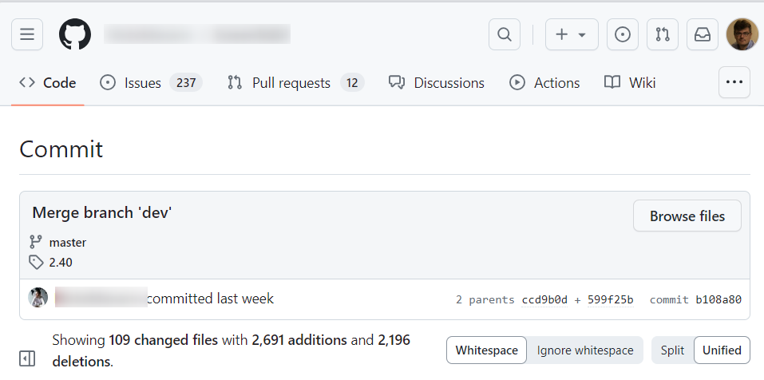
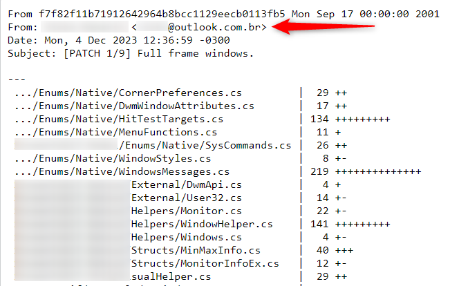

# Github - How to find email addresses for most users

You'd like to get in touch with a GitHub user but, e.g., you don't want to post your question as an issue because, e.g., it's not about a specific repository but more generic.

As a result, the problem can be translated in *How to find the email address linked to a GitHub account*.

Recently, I had this need in order to contact someone with a [Docusaurus](https://docusaurus.io/) blog offering a feature that I couldn't find documented on the web. If his blog is on GitHub, it's not public, but he does offer other repos. So I took the liberty of finding his email this way and sending him an email outside the GitHub environment.

Quite easy, actually.

<!-- truncate -->

The first thing is, for sure, to go to a public repository maintained by this person and to find a commit, any commit in fact, that he's made.

On the main page of the repo, locate f.i. the last commit ID he's made:

Click on the ID and you'll get a new web page with an URL like f.i. `https://github.com/<USERNAME>/<REPONAME>/commit/<LONG_COMMIT_ID>`. Edit the URL and just append the `.patch` suffix to it (so now, the URL should be `https://github.com/<USERNAME>/<REPONAME>/commit/<LONG_COMMIT_ID>.patch`).

Before the suffix was added, this is what the page looked like:

And once added:

As you can see, the email address associated to the Github account used to send the commit is now displayed.

