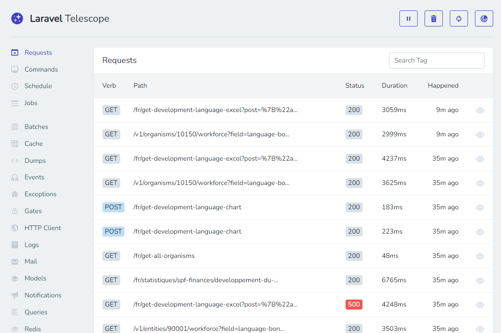

# Laravel Telescope

By installing [Laravel Telescope](https://laravel.com/docs/master/telescope), we can get realtime information's about cache, logs, queries and models, exceptions, ... and this will help a lot to understand how the application is working and what's is running.

Telescope is a great help for debugging and understanding your application, and installs like a dev dependency.

<!-- truncate -->

For an Eloquent model f.i. we'll retrieve in Telescope (the default URL is `http://your_site/telescope`), we'll get the raw SQL so it's easy to copy/paste and run directly in pgadmin f.i.

For Redis cache f.i., we'll see keys and if they were retrieve (`hits`) or created (`set`).

Laravel Telescope can also be installed on a test server to see what the user is doing and get the full context on each request so when an exception was fired, we can retrieve it in the log, the exception message, the post data, the used URL and much more.

Telescope is a really big improvement about debugging a Laravel application.
