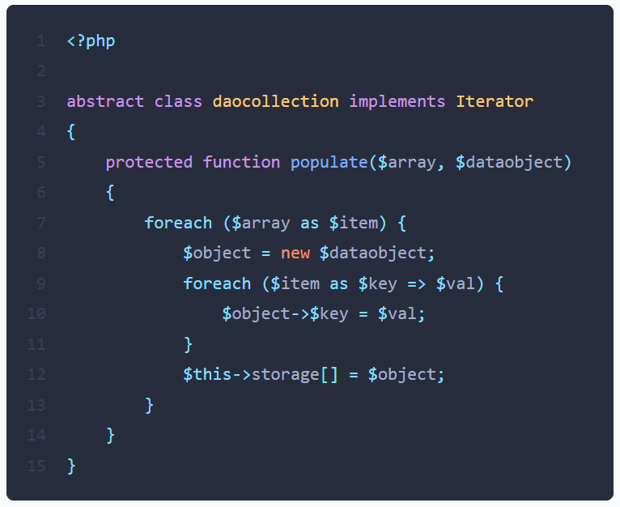

Imagine that you are faced with a PHP script whose layout leaves something to be desired, i.e. with a crazy indentation and little respect for standards.

```php
<?php
abstract class mycollection implements Iterator
{
    protected function populate($array, $dataobject){
foreach($array as $item){
$object = new $dataobject();
foreach($item as $key => $val){$object->$key = $val;}
$this->storage[] = $object;
}}
}
```

<!-- truncate -->

There are a huge number of *linters* on the internet, but this is perhaps one of the best:  [https://benjamincrozat.com/pint-express](https://benjamincrozat.com/pint-express)



Otherwise, you can also use [https://codebeautify.org/php-beautifier](https://codebeautify.org/php-beautifier).
