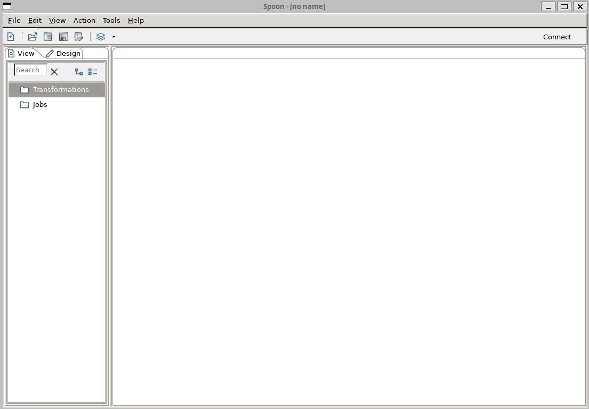
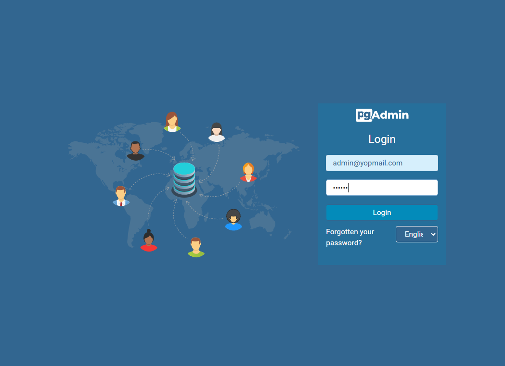
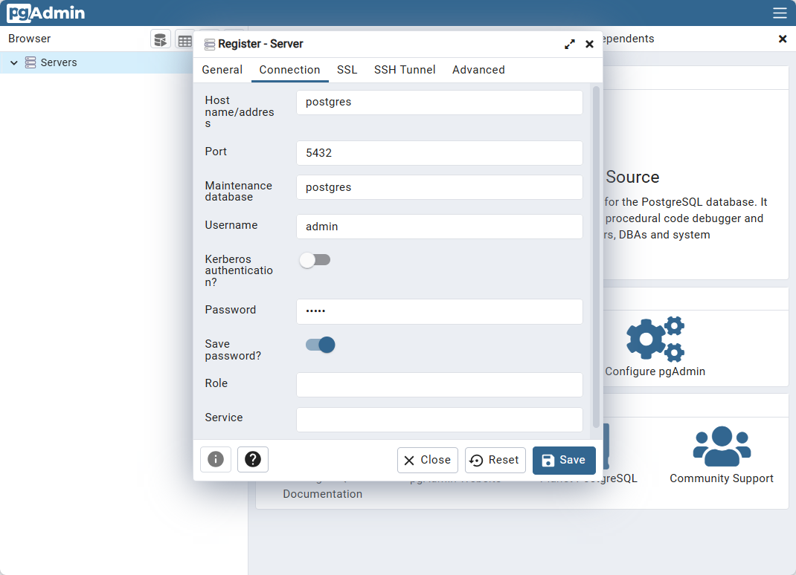

<!-- cspell:ignore pentaho,xtract,ransform -->

Pentaho Data Integration is a ETL tool (**E**xtract, **T**ransform and **L**oad) used for data integration. Let's imagine you've an Excel file and you want to extract records (only those matching a specific rule), then apply a transformation (like adding some new columns based on current data) and load them in a PostgreSQL database.

Pentaho (also called **PDI** or **Kettle**) will allow you to *draw* a data flow (load files, do some merge, apply transformation, run some piece of code (Shell or Javascript), ... and store the result somewhere (a database or a file) or, even, send information by email in case of failure).

Let's quickly discover Pentaho and, as a first example, load an Excel file into a PostgreSQL database.

<!-- truncate -->

## Installation on Linux

Pentaho can be installed on both Windows and Linux since it's a Java application.

My personal experience: even with a powerful computer with plenty of RAM, Java interfaces on Windows are just impossible because interfaces are so unresponsive. On top, before you can even launch the application, you have to go through the trouble of installing Java. So, let's move on and install it under Linux.

1. Go to [https://pentaho.com/pentaho-developer-edition/](https://pentaho.com/pentaho-developer-edition/); fill in the form (it's mandatory) before getting the list of files you can download),
2. Download the `pdi-ce-10.2.0.0-222.zip` file. If like me you're under Windows, the archive will be put on your Windows partition; let's copy it to your Linux one.
   1. Start your Linux console and create a new folder like f.i. `~/tools/pentaho` (you can decide to use another path but, in this documentation, we'll refer to `~/tools/pentaho`)
   2. Still in your console, run `explorer.exe .` in the command line to run Windows Explorer and open your Linux folder in it.
   3. In a new tab (in Windows Explorer thus), go to your download directories to retrieve the downloaded file.
   4. Copy the file from the Windows folder to your Linux one; using a drag&drop f.i. 
3. Back to your Linux console, go to the folder where you've just copied the file (`~/tools/pentaho`)
4. Run `rm *Zone.Identifier` to remove unneeded file (create by Windows during the copy action)
5. Run `unzip pdi-ce-10.2.0.0-222.zip`. That command will create a `data-integration` subfolder.
6. Run `rm pdi-ce-10.2.0.0-222.zip` since we don't need it anymore and run `cd data-integration` to jump in the new folder. 
7. The next things to do is to prepare your system:
   1. Please run `sudo apt-get update`,
   2. Then, please run `sudo apt-get install openjdk-11-jdk` since Pentaho requires Java to run and
   3. Please run `sudo apt-get install libgtk-3-0` to install GTK 3 (*GTK 2 is obsolete*)

### Adding Pentaho to the PATH

To finalize the installation, you also need to update the `PATH` Linux variable.

Please run `code ~/.bashrc` (or `code ~/.zshrc` if you're using Oh-my-ZSH); search in the file if you already have a line with `PATH=`. If yes, please update and add `$HOME/tools/pentaho/data-integration` to it. If not, please go to the end of the file and add this line:

```bash
# Add Pentaho to the path
PATH="$HOME/tools/pentaho/data-integration:$PATH" 
```

Save and quit.

To make the change also for your current console, run `export PATH="$HOME/tools/pentaho/data-integration:$PATH"`  (or create a new console).

From now, you'll be able to run Pentaho whatever the current directory.

## Start Pentaho

We'll create a new project; please run `mkdir -p /tmp/pentaho && cd $_` to create a temporary folder and jump in it.

Now, run `spoon.sh` to start the graphical user interface of Pentaho. That interface is called **Spoon**.



## Let's prepare our environment

### First, we need an Excel file to load

For this tutorial, we'll load an Excel file in PostgreSQL so we need an Excel file.

Copy the table here below into Excel and save the new files as `people.xlsx` (otherwise, click [here](./files/people.xlsx) to download it). Save the file to your Linux `/tmp/pentaho` folder.

<!-- cspell:disable -->
| ID | Firstname | Lastname | City |
|----|-----------|----------|------|
| 1 | Jean | Dupont | Brussels |
| 2 | Marie | Leclerc | Antwerp |
| 3 | Pierre | Dubois | Ghent |
| 4 | Sophie | Martin | Charleroi |
| 5 | Thomas | Bernard | Liège |
| 6 | Chloé | Petit | Bruges |
| 7 | Antoine | Durand | Namur |
| 8 | Léa | Leroy | Leuven |
| 9 | Nicolas | Moreau | Mons |
| 10 | Manon | Simon | Mechelen |
<!-- cspell:enable -->

### Then we need a PostgreSQL database 

For this, we'll use Docker. Please create a file called `compose.yaml` in your `/tmp/pentaho` folder with this content:

<details>

<summary>compose.yaml</summary>

```yaml
# cspell:ignore pgadmin,dpage,pentaho
name: pentaho

services:
  postgres:
    image: postgres:9-alpine
    hostname: postgresql
    environment:
      - DATABASE_HOST=postgresql
      - POSTGRES_DB=people
      - POSTGRES_HOST_AUTH_METHOD=trust
      - POSTGRES_PASSWORD=admin
      - POSTGRES_USER=admin
    ports:
      - "5432:5432"      
    expose:
      - "5432"
    networks:
      - pentaho

  pgadmin:
    image: dpage/pgadmin4:6.12
    hostname: pgadmin
    ports:
      - "8080:80"
    depends_on:
      - postgres
    environment:
      - PGADMIN_DEFAULT_EMAIL=admin@yopmail.com
      - PGADMIN_DEFAULT_PASSWORD=admin
    networks:
      - pentaho

networks:
  pentaho: 
    external: false
```

</details>

### And for our easiness, let's create a makefile

<details>

<summary>makefile</summary>

```makefile
.PHONY: up
up:
	docker compose up
```

</details>

### Let's run our Docker container

Please run `docker compose up --detach` to start the PostgreSQL container and the pgAdmin one.

As you've seen, we've already foresee a pgAdmin interface; we can open it by going to `http://localhost:8080`.



Use `admin@yopmail.com` and `admin` as credentials.

Once in the interface of pgAdmin, we've to create a new server by clicking on the `Add new server` button.

Give a name to the server then, in the `Connection` tab, fill in as below:



As you can see on the image below, during the creation of our PostgreSQL container, a new database called `people` has been created. That database has a `public` schema and, right now, no tables.

:::info
This is done thanks our `composer.yaml` file. If you're curious, open the `composer.yaml` file again and pay attention to the `environment` section for the `postgres` service. We've instruct PostgreSQL to create a database called `people`; owned by user called `admin`.
:::

### The pieces of the jigsaw are in place, create our flow
