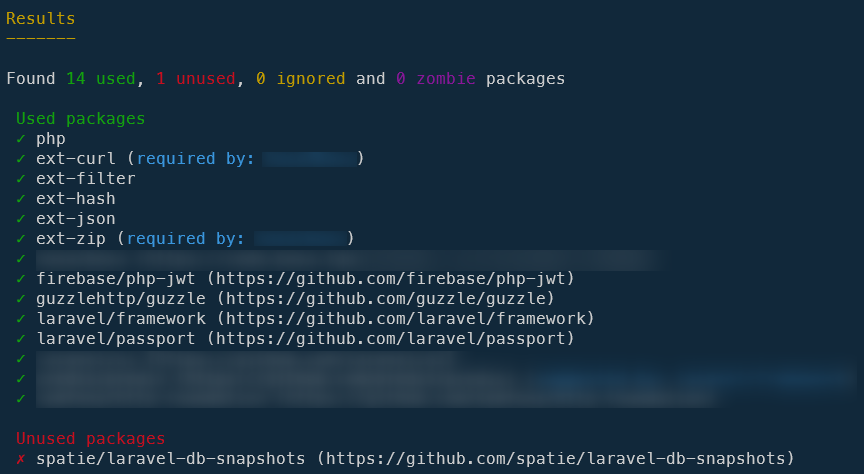
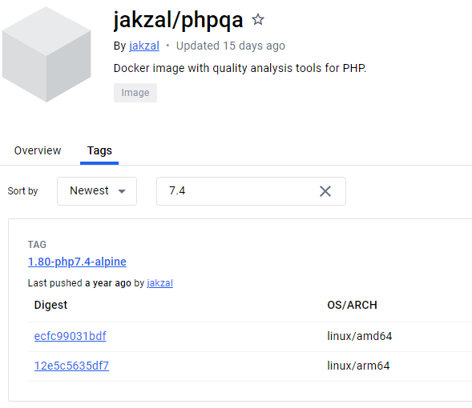

Since years now, I'm using [https://github.com/jakzal/phpqa](https://github.com/jakzal/phpqa) to run a lot of static analysis tools on my PHP codebase.

The list of available tools is really huge; see by yourself: [Available tools](https://github.com/jakzal/phpqa?tab=readme-ov-file#available-tools).

In this blog post, we will see how we can take advantage of all these tools and increase the quality of our scripts.

<!-- truncate -->

First, like always when we need to learn a new software, we have to speak about how to install it. The answer is easy here: there is nothing to do. Oh? Really? For sure! `jakzal/phpqa` is a Docker image so we don't need to install it, just to run it once. During the first call, Docker will download it so, yeah, no installation at all. Thank you Docker!

:::tip Docker CLI reminder
As a reminder, the used Docker run command will always looks like:

* `docker run` to run a Docker image (*Oh? Really?*),
* `-it` to start Docker interactively, this will allow the script running in the container to ask you for some prompts f.i.,
* `--rm` to ask Docker to kill and remove the container as soon as the script has been executed (otherwise you'll have a lot of exited but not removed Docker containers; you can check this by not using the `--rm` flag then running `docker container list` on the console),
* `-v "${PWD}":/project` to share your current folder with a folder called `/project` in the Docker container (use `${PWD}` if you are on Linux, use `%CD%` if you are on DOS),
* `-w /project` to tell Docker that the current directory, in the container, will be the `/project` folder
* then `jakzal/phpqa` which is the name of the Docker image to use (you can also specify a version like `python:3.9.18` if needed; see [https://hub.docker.com/_/python/tags](https://hub.docker.com/_/python/tags)) and, finally,
:::

## Composer normalize

[Composer normalize](https://github.com/ergebnis/composer-normalize) will reorder your `composer.json` file to match best practices.

As you know, in a JSON file, there is no order so you can define your properties in any order. For instance:

```json
{
  "name": "ergebnis/composer-normalize",
  "description": "Provides a composer plugin for normalizing composer.json.",
  "license": "MIT",
  "type": "composer-plugin",
}
```

or

```json
{
  "license": "MIT",
  "description": "Provides a composer plugin for normalizing composer.json.",
  "type": "composer-plugin",
  "name": "ergebnis/composer-normalize",
}
```

or anything else. The above example is just four lines; imagine a file with hundred lines. It's more logic, isn't it, to retrieve first the `name` of the tool, then a small `description`, the `license`, the `type` (is it a project, a library, ...) and so on and not, f.i., first the list of requirements.

Ok, so, to normalize your `composer.json` file, you can install the tool or, and this is the objective of this blog post, simply run `docker run -it --rm -v "${PWD}":/project -w /project jakzal/phpqa composer normalize` and that's all.

The result will be a rewritten `composer.json` file where properties are put in a standard order.

:::tip
Add `--dry-run` if you just want to see what will be the changes; but do not modify any files.
:::

## Composer unused

[Composer unused](https://github.com/composer-unused/composer-unused) will **try** to understand which packages are mentioned in your `composer.json` file and, perhaps, not used anymore.

By running `docker run -it --rm -v "${PWD}":/project -w /project jakzal/phpqa composer-unused` in your project, you'll get something like this:



So, the tool detects that I'm referencing `spatie/laravel-db-snapshots` in my `composer.json` file but, in my codebase, the tool (in fact, the namespace added by the tool) isn't used at all so, yes, probably, I can remove that dependency.

:::caution
Such tool can produce false positive; just make some checks before removing the dependency. The best solution here is, of course, to have plenty unit tests so you can run them before and after the change and see if your code still works as expected.
:::

## PHP-Parallel-lint

As a third example, we'll see [PHP-Parallel-Lint](https://github.com/php-parallel-lint/PHP-Parallel-Lint).

This tool will scan all `.php` files present in your codebase and ensure there is syntax error like a forgetting `}`.

The command to run here is `docker run -it --rm -v "${PWD}":/project -w /project jakzal/phpqa parallel-lint . --exclude vendor`.

Think to add exclusions like `--exclude vendor` to not scan code that is not yours.

As you can see below, in less that two seconds, the tool has checked 823 files of my codebase. Pretty fast.

```text
PHP 8.3.3 | 10 parallel jobs
............................................................  60/823 (7 %)
............................................................ 120/823 (14 %)
............................................................ 180/823 (21 %)
............................................................ 240/823 (29 %)
............................................................ 300/823 (36 %)
............................................................ 360/823 (43 %)
............................................................ 420/823 (51 %)
............................................................ 480/823 (58 %)
............................................................ 540/823 (65 %)
............................................................ 600/823 (72 %)
............................................................ 660/823 (80 %)
............................................................ 720/823 (87 %)
............................................................ 780/823 (94 %)
...........................................                  823/823 (100 %)
```

## PHP-CS-FIXER

Another tool, [PHP-CS-FIXER](https://cs.symfony.com/). *The PHP Coding Standards Fixer (PHP CS Fixer) tool fixes your code to follow standards.*

Here the command will be `docker run -it --rm -v "${PWD}":/project -w /project jakzal/phpqa php-cs-fixer fix` to reformat all your codebase according to the selected rulesets. If none is mentioned, `PSR12` will be the default one.

## PHP_CodeSniffer

Another tool, [PHP_CodeSniffer](https://github.com/squizlabs/PHP_CodeSniffer). *PHP_CodeSniffer tokenizes PHP files and detects violations of a defined set of coding standards.*

This time, the command will be `docker run -it --rm -v "${PWD}":/project -w /project jakzal/phpqa phpcbf .`

## A whole host of other tools await you

As you can see, we can use a lot of tools using `jakzal/phpqa` in a zero installation schema. That's really impressive. We you can find a lot more tools than described in this article, just go to [Available tools](https://github.com/jakzal/phpqa?tab=readme-ov-file#available-tools) and see which ones can help you.

## Change PHP versions

Let's imagine your codebase is a legacy one (not written for PHP 8.3 but f.i. PHP 7.4).

An instruction like `docker run -it --rm -v "${PWD}":/project -w /project jakzal/phpqa parallel-lint . --exclude vendor` (as we have see above) will scan the code with PHP 8.3 (situation end March 2024) and you can have plenty of errors since you're using a PHP 8.3x tool on a PHP 7.4x codebase.

How to solve this? Really easy in fact. As you know, by using `docker run [...] jakzal/phpqa [...]` you're asking Docker to use the `latest` version of the image and that version will change. Every-time the owner of the image publish a newer version, that `latest` image is updated and perhaps, in a few months, it'll be PHP 8.4 by default.

So, to solve our issue: we need to use a specific tag for PHP 7.4. Simply jump on [https://hub.docker.com/r/jakzal/phpqa/tags](https://hub.docker.com/r/jakzal/phpqa/tags) and type `7.4` in the `Filter Tags` area.



You'll found some tags. Now you can start `docker run -it --rm -v "${PWD}":/project -w /project jakzal/phpqa:1.80-php7.4-alpine parallel-lint . --exclude vendor` to run the PHP 7.4 linter.
