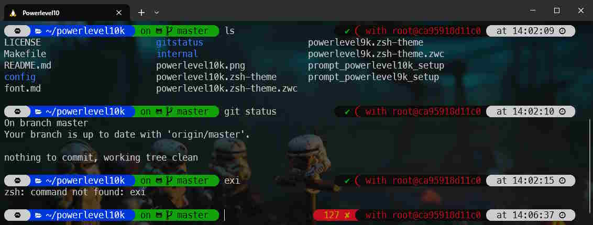

# Customize your Linux prompt with Powerlevel10k



> [https://github.com/romkatv/powerlevel10k/blob/master/README.md#try-it-in-docker](https://github.com/romkatv/powerlevel10k/blob/master/README.md#try-it-in-docker).

When you're working with Linux, there are many ways to personalize your prompt (i.e. your console). One of the simplest solutions is to use [Powerlevel10k](https://github.com/romkatv/powerlevel10k) and its wizard.

<!-- truncate -->

But even better, you can play with the tool without even having to install it, thanks to ... Docker (who else?)

By running the command below, you'll download a very small Linux Alpine image then start some initializations like installing `git`, `zsh`, ... Also download the Powerlevel10k repository from Github and start its wizard.

```bash
docker run -e TERM -e COLORTERM -e LC_ALL=C.UTF-8 -it --rm alpine sh -uec '
  apk add git zsh nano vim
  git clone --depth=1 https://github.com/romkatv/powerlevel10k.git ~/powerlevel10k
  echo "source ~/powerlevel10k/powerlevel10k.zsh-theme" >>~/.zshrc
  cd ~/powerlevel10k
  exec zsh'
```

You can just *simulate* the installation of Powerlevel10k on your computer, see how it's looks like, ... and decide if you want to adopt it or not.

:::note Everything is done in RAM; nothing on your disk
Running the `docker run` command here above will only download a Docker Alpine Linux image on your disk (less than 7 MB) then will install binaries inside the running container so, by leaving the container using the `exit` command, nothing will stay on your disk. Ideal for testing.
:::

When you exit the Docker container, everything will be lost but, now, you know if you like it or not. And, if you like it, just proceed on the installation of Powerlevel10k by following his [installation guide](https://github.com/romkatv/powerlevel10k#installation).

What I particularly like: 

* You can always see the name of the git branch you're working on,
* The connected user name (like `root` f.i.),
* When an instruction is finished, the new prompt displays the time taken by the instruction, useful when you're trying to optimize a command,
* On the right, you can see immediately if the instruction has failed, with a red display and the error code (`exitcode`),
* And, of course, the visual aspect, which is pretty cool.

And also, because I work in Docker containers on a daily basis, using Powerlevel10k locally gives me a strong visual indication to remind me at all times whether I'm local or in a container.