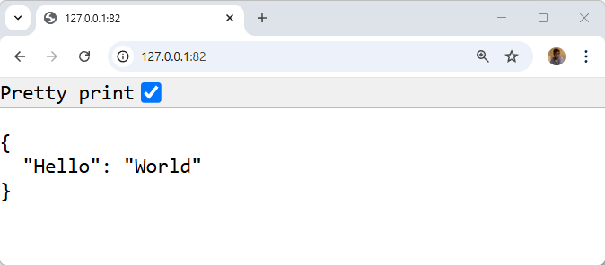
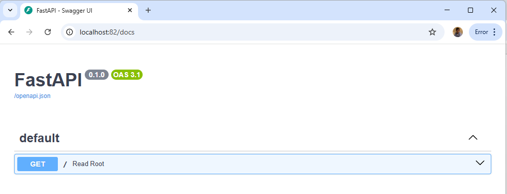
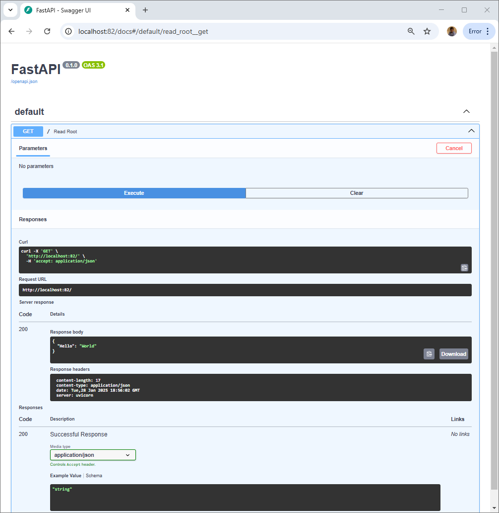
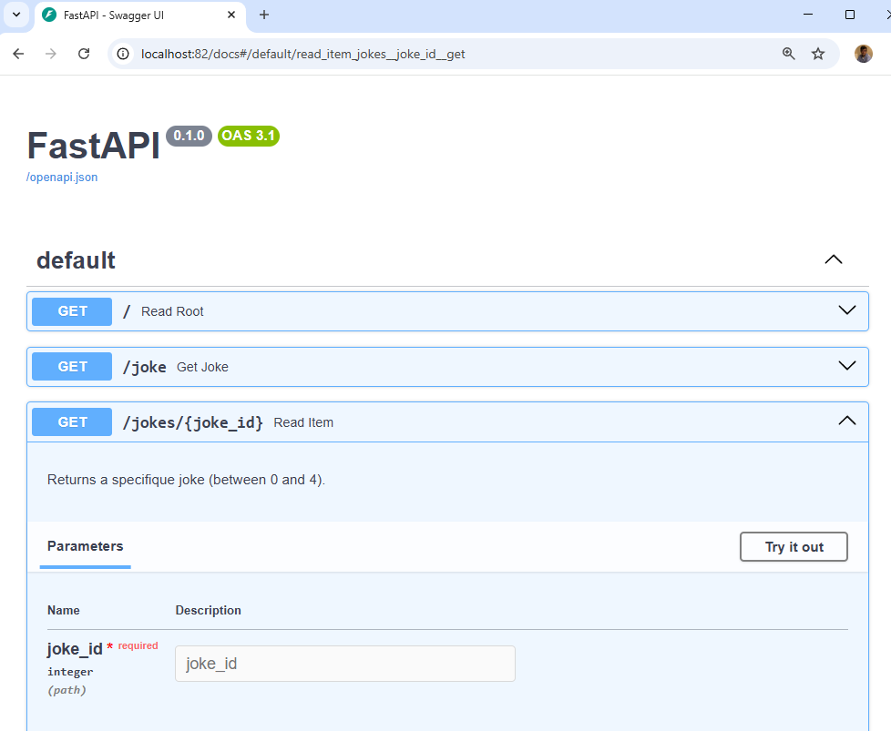

Sounds crazy but it's TRUE. You'll just need one minute to create the example provided here below i.e. create your project's directory, create two files and run two Docker statements and ... it's done.

As PHP programmer, when I've seen my first blog article about FastAPI I thought **Nodidju ! Ç' n'est nén pussibe** (*For Christ's sake! It can't be true*).

With just two files (JUST TWO FILES!), we'll build our own Docker image with Python and FastAPI installed and, in the second file, our REST API. No more than two!

Impossible to not try immediately and ... wow ... that's TRUE!

<!-- truncate -->

## Creating our first API

Like always, we'll build a fully working example.

Please create a dummy folder and jump in it: `mkdir /tmp/fastapi && cd $_`.

In that folder, we've to create our `Dockerfile` based on Python and we'll install FastAPI.

<details>

<summary>Dockerfile</summary>

```dockerfile
FROM python:3.13-slim

WORKDIR /app

RUN pip install --no-cache-dir fastapi[standard]

COPY main.py main.py

CMD ["fastapi", "run", "main.py", "--port", "82"]
```

</details>

The final image size will be about 184MB i.e. almost nothing.

As you've seen, we need a file called `main.py`; let's create it:

<details>

<summary>main.py</summary>

```python
from fastapi import FastAPI

app = FastAPI()

@app.get("/")
def read_root():
    return {"Hello": "World"}
```

</details>

This very straightforward code defines a route called `/`. It's a `GET` method and we'll return a JSON object: 

```json
{
  "Hello": "World"
}
``` 

You know what? It's already done.

## Running our API

We need to build our Docker image and run it:

```bash
docker build -t python-fastapi . && docker run -p 82:82 python-fastapi
```

Once done, just surf to `http://127.0.0.1:82` and you'll obtain your first JSON answer; crazy no?



And it's just the beginning: FastAPI comes with a self-documented API based on the OpenAPI schema.

Please jump to `http://127.0.0.1:82/docs` and you'll see it in action:





## Joke generator

Please return to the console and press <kbd>CTRL</kbd>+<kbd>C</kbd> to stop the running container.

We'll update the Python script like this:

```main.py
// highlight-next-line
from random import choice
from fastapi import FastAPI

app = FastAPI()

// highlight-start
jokes = [
    "Why do programmers always mix up Halloween and Christmas? Because Oct 31 == Dec 25",
    "Why don't programmers like nature? Because it's full of bugs!",
    "How many programmers does it take to change a light bulb? None. That's a hardware problem.",
    "What do you call 8 hobbits? A hobbyte",
    "What is this [“hip”, ”hip”]? hip hip array!"
]
// highlight-end

@app.get("/")
def read_root():
    return {"Hello": "World"}

    from fastapi import FastAPI

// highlight-start
@app.get("/joke")
async def get_joke():
    """
    Returns a random joke from the list.
    """
    return {"joke": choice(jokes)}

@app.get("/jokes/{joke_id}")
def read_item(joke_id: int):
    """
    Returns a specific joke (between 0 and 4).
    """
    try:
        return {"joke": jokes[joke_id]}
    except IndexError:
        return {"error": f"Joke with ID {joke_id} not found."}, 404

@app.get("/joke")
async def get_joke():
    """
    Returns a random joke from the list.
    """
    return {"joke": choice(jokes)}

// highlight-end
```

You immediately see it I think:

* I've defined an array with five jokes;
* I've defined a new route called `/joke` and that one will display a random joke 
* And finally I've defined a `jokes/{joke_id}` to be able to target a specific joke (like "Give me the second joke you know").

:::note
Please note that the array start at position 0 so the first joke is this one: `http://127.0.0.1:82/jokes/0`.
:::

And looking back to the documentation; we've now three routes and, take a look, the Python docstring is used to describe the route.



Really, really impressive!

## Discover FastAPI

Don't wait any longer, go to [https://fastapi.tiangolo.com/](https://fastapi.tiangolo.com/) to see more examples.