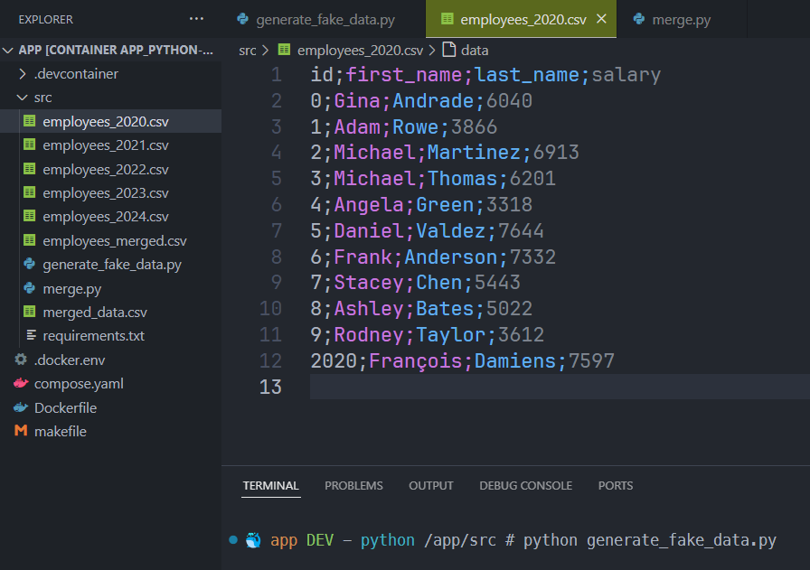
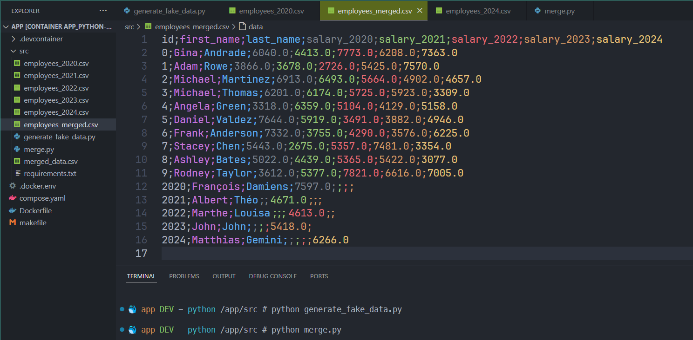
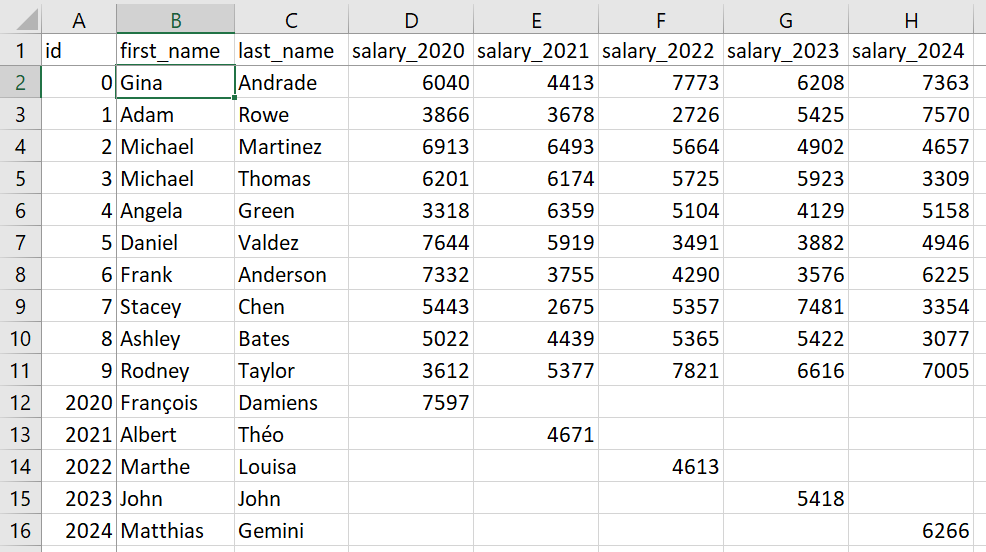

<!-- cspell:ignore vlookup,sheet -->
<!-- markdownlint-disable-file MD010 -->


You've two or more files and you wish to merge them. For instance, a list of employees and their salary for 2020 up to 2024. Or a list of cost centers and their budget/expenses. Or a list of students and their evaluation score. Or ...

Let's look at an example: a list of employees and their salaries.

We've many files, one by year, with this structure:

<!-- cspell:disable -->
```csv
id;first_name;last_name;salary
0;Gina;Andrade;6040
1;Adam;Rowe;3866
2;Michael;Martinez;6913
```
<!-- cspell:enable -->

And our need is to merge yearly files and generate a merged one with employees and their salary across years so, at the end, we wish to obtain this:

<!-- cspell:disable -->
```csv
id;first_name;last_name;salary_2020;salary_2021;salary_2022;salary_2023;salary_2024
0;Gina;Andrade;6040;4413;7773;6208;7363
1;Adam;Rowe;3866;3678;2726;5425;7570
2;Michael;Martinez;6913;6493;5664;4902;4657
```
<!-- cspell:enable -->

Using Pandas will make this piece of cake...

<!-- truncate -->

:::note
It is not certain that an employee is in each of the files. He could be present in 2020 and 2021 and then leave the company; he could be hired in 2022 and resign in 2023; he could arrive just in 2024.

The merge must therefore take this into account.
:::

## Generate fake data script

To illustrate this article, let's create some CSV files. We'll create files for 2020 till 2024. Just skip this chapter if you already have CSV files for your needs.

We'll create a set of 10 employees who will stay with us all the time and, in each year, we'll create an employee just for that specific year. This to illustrate the fact that we can have employees in one file and not in other ones.

The script below will create two files, one called `employees_2023.csv` and one for `employees_2024.csv` so we can have fake files.

:::note
In order to be able to run this script, you should first run `pip install pandas faker` to install the two packages.
:::

<details>
<summary>generate_fake_data.py</summary>

<!-- cspell:disable -->

```python
import pandas as pd

from faker import Faker

def generate_fake_data(filename: str = "employees") -> None:
    fake = Faker()

    max: int = 10

    employees: dict = []

    for id in range(max):
        employee = {
            "id" : id,
            "first_name": fake.first_name(),
            "last_name": fake.last_name(),
        }
            
        employees.append(employee)

    extra_employees: dict = {
        2020: ("François", "Damiens"),
        2021: ("Albert", "Théo"),
        2022: ("Marthe", "Louisa"),
        2023: ("John", "John"),
        2024: ("Matthias", "Gemini")
    }

    for year in { 2020, 2021, 2022, 2023, 2024 }:
        salaries: dict = []

        for id in range(max+1):

            if id == max:
                id = year
                firstname, lastname = extra_employees[id]
            else:
                firstname = employees[id]["first_name"]
                lastname = employees[id]["last_name"]

            salary = {
                "id": id,
                "first_name": firstname,
                "last_name": lastname,
                "salary": int(fake.random.randint(2500, 8000))
            }
            
            salaries.append(salary)

        df = pd.DataFrame(salaries)

        df.to_csv(f"{filename}_{year}.csv", index=False, encoding="utf-8", sep=";")

generate_fake_data("employees")

```

</details>

<!-- cspell:enable -->

By running this script, we'll get a few csv files with the exact same structure like this:

<!-- cspell:disable -->
```csv
id;first_name;last_name;salary
0;Gina;Andrade;6040
1;Adam;Rowe;3866
2;Michael;Martinez;6913
3;Michael;Thomas;6201
4;Angela;Green;3318
```
<!-- cspell:enable -->



## Do the merge

Using Pandas, it's quite simple to loop over files and do a merge.

<details>
<summary>merge.py</summary>

<!-- cspell:disable -->

```python
import pandas as pd

def merge_data(filename: str = "employees") -> None:
    # Initialize the merged DataFrame with the first year's data
    merged_df: pd.DataFrame = pd.read_csv(f"{filename}_2020.csv", sep=";")
    merged_df.rename(columns={'salary': 'salary_2020'}, inplace=True)

    # Iterate over remaining years and merge
    for year in range(2021, 2025):
        df_year = pd.read_csv(f"{filename}_{year}.csv", sep=";")

        # So, for the first run, rename column "salary" as "salary_2021"
        df_year.rename(columns={'salary': f'salary_{year}'}, inplace=True)

        # And merge both: for the first run, we'll retrieve all columns from files 2020 and append 
        # the salary of 2021. And do the same across years
        merged_df = merged_df.merge(df_year, on=['id', 'first_name', 'last_name'], how='outer')

    # Save the merged DataFrame to a new CSV file
    merged_df.to_csv(f"{filename}_merged.csv", index=False, encoding="utf-8", sep=";")

merge_data("employees")

```

<!-- cspell:enable -->

</details>

The script will take the first file (`employees_2020.csv`) and load it in memory. The column `salary` will be, in memory, renamed as `salary_2020`.

Then, for each remaining years (from 2021 till 2025), the script will load a second file and do a merge to the previous one (so, first, merge 2020 and 2021).

The merge action means: retrieve `id`, `first_name` and `last_name` then also `salary_2020` from the first file and `salary_2021` from the second file and create a new file (a `DataFrame` in terms of Pandas).

Then process remaining files (2022 till 2024).

At the end, the script will save the file on disk as `employees_merged.csv`.



As we can see on the image, we've well a merge i.e. our 10 employees (from 0 till 9) then if an employee was present in a file (like employee 2023 called `John John`). We can see their salary in our result.

And, opened using Excel, here our final result:



Next year, we'll have a file called `employees_2025.csv` and we just need to run the merge again.

## Conclusion

Without using Pandas, the common approach is to load the files one by one into Excel. To create formulas such as `vlookup` between each `sheet` and to create a new `sheet` which will include the values found, but this only works when the same record is found in several files.

How do you deal with cases where a record has been added? You'd have to make an `append` in the `sheet` that merges everything together and ... One way would be to append all records in one global sheet (and add a column year) then use a pivot feature to ... ouch, that complicates things, doesn't it?  

Now let's imagine CSV files that aren't 10 rows long but are each over a million rows long.  Loading 5 files (2020 to 2024) means loading more than 5 million rows and having an `sheet` which will contain the merge and which will also contain at least 1 million rows.

Imagine the effort involved in opening the files and waiting for Excel to recalculate its formulas. The horror!
