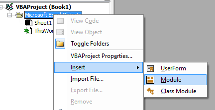
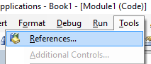
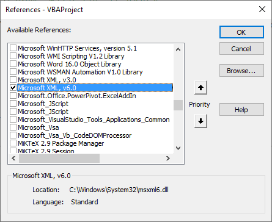
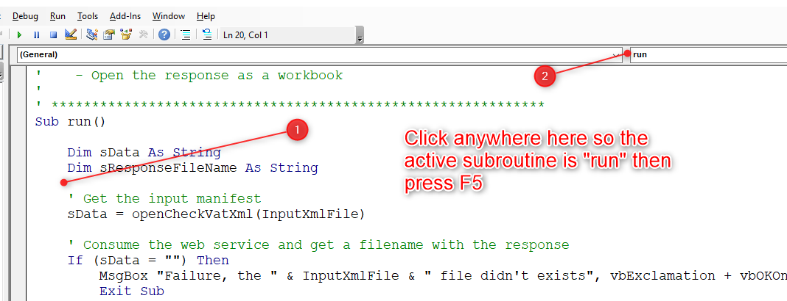
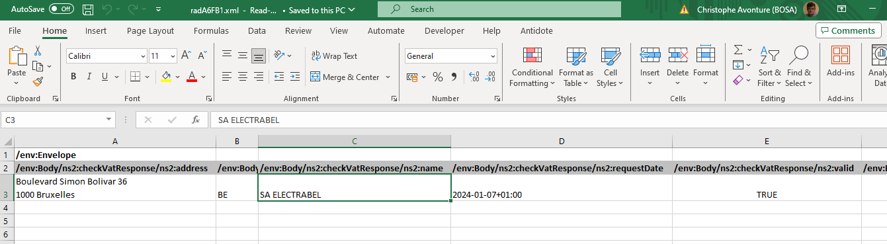

# MS Excel - How to call a SOAP webservice


Imagine you had to make a call to a SOAP webservice in Excel? For example, to validate the VAT number you have been given before carrying out some processing.

You will call the URL that corresponds to the web service you want, but you will also need to pass a number of parameters in XML format so that the service knows what you want to do.

We'll learn, in this blog post, how to validate an european VAT number using the [VIES VAT number validation](https://ec.europa.eu/taxation_customs/vies/#/vat-validation) SOAP webservice.

The VBA code we will see in this article can be used as a skeleton for your future development.

<!-- truncate -->

So, when calling a SOAP service, we must always prepare a XML message first. To do this, we create an .xml file somewhere on our hard drive.

## Create the xml message

Please create the file `C:\temp\checkVat.xml` with this content. This message (content) is expected by the VIES VAT number web service. In the file, we foresee two placeholders for our variables: `%COUNTRY%` and `%VATNUMBER%`. We'll see this later on. 

```xml
<?xml version="1.0" encoding="utf-8"?>
<soapenv:Envelope xmlns:soapenv="http://schemas.xmlsoap.org/soap/envelope/">
    <soapenv:Body>
        <urn:checkVat xmlns:urn="urn:ec.europa.eu:taxud:vies:services:checkVat:types">
            <urn:countryCode>%COUNTRY%</urn:countryCode>
            <urn:vatNumber>%VATNUMBER%</urn:vatNumber>
        </urn:checkVat>
    </soapenv:Body>
</soapenv:Envelope>
```

## Create the Excel workbook.

Now, please,

1. Create an empty Excel workbook,
2. Press <kbd>ALT</kbd>-<kbd>F11</kbd> to get the Visual Basic Editor (aka `vbe`).
3. Create a new module:



4. Copy/Paste the VBA code from here below to it.
5. Check the path for the `InputXmlFile` constant. Make sure it's the same than where you've saved your `.xml` file earlier.
6. Click on the `Tools` menu then select `References` and add a reference to `Microsoft XML, v6.0`





1. Finally, put the cursor anywhere in the `run` subroutine and press <kbd>F5</kbd> to run it.



8. After a few seconds, a new workbook will be created with the answer from the SOAP web service:



```vba
Option Explicit

' URL to call
Const URL = "http://ec.europa.eu/taxation_customs/vies/services/checkVatService"

' XML to send to the web service method
Const InputXmlFile = "C:\temp\checkVat.xml"

' *************************************************************
'
' Entry point
'
'    - Call the web service checkVAT method
'    - Upload XML data (country and VAT number)
'    - Get XML response
'    - Open the response as a workbook
'
' *************************************************************
Sub run()

    Dim sData As String
    Dim sResponseFileName As String

    ' Get the input manifest
    sData = openCheckVatXml(InputXmlFile)

    ' Consume the web service and get a filename with the response
    If (sData = "") Then
        MsgBox "Failure, the " & InputXmlFile & " file didn't exists", vbExclamation + vbOKOnly
        Exit Sub
    End If

    sResponseFileName = consumeWebService(URL, sData)

    ' Open the response as a workbook
    Call Application.Workbooks.OpenXML(Filename:=sResponseFileName)

End Sub

' *************************************************************
'
' Open the checkVat.xml input and replace variables
'
' *************************************************************
Private Function openCheckVatXml(ByVal sFileName As String) As String

    Dim sData As String

    sData = readFile(sFileName)

    If (sData <> "") Then
        sData = Replace(sData, "%COUNTRY%", "BE")
        sData = Replace(sData, "%VATNUMBER%", "0403170701") ' ENGIE Electrabel Belgique
    End If

    openCheckVatXml = sData

End Function

' *************************************************************
'
' Generic file reader. Return the content of the text file
'
' *************************************************************
Private Function readFile(ByVal sFileName As String) As String

    Dim objFso As Object
    Dim objFile As Object
    Dim sContent As String

    Set objFso = CreateObject("Scripting.FileSystemObject")

    If Not (objFso.FileExists(sFileName)) Then
        ' The file didn't exists
        readFile = ""
        Exit Function
    End If

    Set objFile = objFso.OpenTextFile(sFileName, 1)

    sContent = objFile.readAll

    objFile.Close

    Set objFile = Nothing
    Set objFso = Nothing

    readFile = sContent

End Function

' *************************************************************
'
' Return a filename with the response of the web service method
'
' *************************************************************
Private Function consumeWebService(ByVal sURL As String, ByVal sData As String) As String

    Dim xmlhttp As Object
    Dim sResponseFileName As String

    Set xmlhttp = New MSXML2.ServerXMLHTTP60  ' Requires Microsoft XML, v6.0

    xmlhttp.Open "POST", sURL, True
    xmlhttp.send sData
    xmlhttp.waitForResponse

    sResponseFileName = createXmlTempFile(xmlhttp.responseText)

    Set xmlhttp = Nothing

    consumeWebService = sResponseFileName

End Function

' *************************************************************
'
' Create a temporary file in the TEMP folder and write in that
' file the XML response received by the web service.
'
' Return the temporary filename as result of this function
'
' *************************************************************
Private Function createXmlTempFile(ByVal sContent As String) As String

    Dim objFso As Object
    Dim objFile As Object
    Dim objFolder As Object
    Dim sFileName As String

    Set objFso = CreateObject("Scripting.FileSystemObject")

    ' 2 = temporary folder
    Set objFolder = objFso.GetSpecialFolder(2)
    sFileName = objFolder & "\"
    Set objFolder = Nothing

    sFileName = sFileName & objFso.GetTempName()
    sFileName = Replace(sFileName, ".tmp", ".xml")

    Set objFile = objFso.CreateTextFile(sFileName)

    objFile.Write sContent

    objFile.Close

    Set objFile = Nothing
    Set objFso = Nothing

    createXmlTempFile = sFileName

End Function
```

### About placeholders

In our `C:\temp\checkVat.xml`, we've thus foresee two placeholders.

You can see in the `openCheckVatXml` VBA subroutine how we'll replace them by some, example, values. Just adjust them to yours.

## A Linux command line version

For those who can be interested, here is another way to achieve the same result but for a Linux console (or DOS if you've curl installed):

```bash
curl --silent http://ec.europa.eu/taxation_customs/vies/services/checkVatService   \
  -w \\n                                          \
  -H 'SOAPAction: "checkVat"'                        \
  -H "Content-Type: text/xml;charset=UTF-8"          \
  -d '<?xml version="1.0" encoding="UTF-8"?>
<soapenv:Envelope xmlns:soapenv="http://schemas.xmlsoap.org/soap/envelope/">
    <soapenv:Body>
        <urn:checkVat xmlns:urn="urn:ec.europa.eu:taxud:vies:services:checkVat:types">
            <urn:countryCode>BE</urn:countryCode>
            <urn:vatNumber>0403170701</urn:vatNumber>
        </urn:checkVat>
    </soapenv:Body>
</soapenv:Envelope>'
```

:::tip Add `xmlstarlet` for a nice output 
See my [The xmlstarlet utility for Linux](/blog/linux-xmlstarlet) article 

Add `| xmlstarlet format --indent-spaces 4` at the end of the previous command to pipe the output to `xmlstartlet` 
:::

The answer will be:

```xml
<?xml version="1.0"?>
<env:Envelope xmlns:env="http://schemas.xmlsoap.org/soap/envelope/">
    <env:Header/>
    <env:Body>
        <ns2:checkVatResponse xmlns:ns2="urn:ec.europa.eu:taxud:vies:services:checkVat:types">
            <ns2:countryCode>BE</ns2:countryCode>
            <ns2:vatNumber>0403170701</ns2:vatNumber>
            <ns2:requestDate>2024-01-07+01:00</ns2:requestDate>
            <ns2:valid>true</ns2:valid>
            <ns2:name>SA ELECTRABEL</ns2:name>
            <ns2:address>Boulevard Simon Bolivar 36\n1000 Bruxelles</ns2:address>
        </ns2:checkVatResponse>
    </env:Body>
</env:Envelope>
```

Now, it's up to you to modify the VBA code and tailer it to your needs.