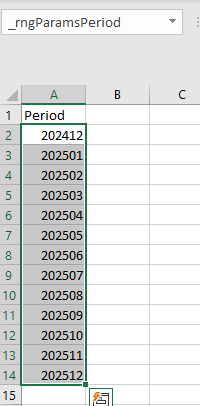
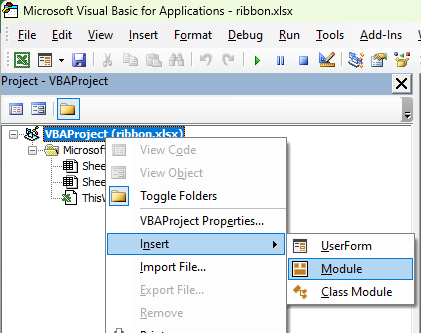

In this article, we'll see how, very easily, we can load an Excel range into the ribbon as a dropdown.

The idea is to provide a list of values in a ribbon but to not have to hardcode values in the list but, just, to link to a range, anywhere in your workbook.

I've used this technique in many of my Excel application's (i.e. Excel having VBA code).

As example here, we'll create a list of YYYYMM in a worksheet and load that list in our custom ribbon.

<!-- truncate -->

First, create an empty workbook. Create a new sheet called f.i. `Params` with a list of values. For this article, let's create a list of periods:



Nothing difficult right now. To be flexible, please select the range and name it: `_rngParamsPeriod`.

Second things to do is to foresee a cell in your sheet where the selected value will be written i.e. when the user will select a value from the list, we'll ask Excel to put the selected value there. To do this, just click anywhere in a sheet (no matter which one) and create a new range (one cell) called `_Period`:


Please save your Excel file let's say in `c:\temp\ribbon.xlsx`, then close the workbook.

Time to add our ribbon. To do this, just download this free tool: [https://bettersolutions.com/vba/ribbon/custom-ui-editor-download.htm](https://bettersolutions.com/vba/ribbon/custom-ui-editor-download.htm). You'll find an executable called `CustomUIEditor.exe`. Double-click on it to start the editor then open your `c:\temp\ribbon.xlsx` file:


Click on the Insert menu then select `Office 2010 Custom UI Part`.

Paste the XML below in the editor window:

<details>

<summary>The ribbon XML code</summary>

<!-- cspell:disable -->
```xml
<customUI xmlns="http://schemas.microsoft.com/office/2009/07/customui">
  <ribbon>
    <tabs>
      <tab id="demoRibbon" label="demo Ribbon" insertBeforeMso="TabHome">
        <group id="grpParams" label="Parameters">
          <dropDown id="paramsCbxPeriod" label="Period" screentip="Select the period" supertip="Please select the period..." onAction="modToolbar_cbxPeriod.onAction" getSelectedItemID="modToolbar_cbxPeriod.getSelectedItemID" getItemLabel="modToolbar_cbxPeriod.getItemLabel" getItemID="modToolbar_cbxPeriod.getItemID" getItemCount="modToolbar_cbxPeriod.getItemCount"/>
        </group>
      </tab>
    </tabs>
  </ribbon>
</customUI>
```
<!-- cspell:enable -->

</details>

You'll then have this:


Save your changes and quit the editor.

Double-click on your `c:\temp\ribbon.xlsx` file to start Excel and open the workbook again.

You'll get an error message and it's perfectly normal: we still need to add some VBA code so just press on **Ok**.


Press <kbd>ALT</kbd>-<kbd>F11</kbd> to open the VBE editor

As illustrated below, right-click on the `VBEProject` project and insert a new module.



This done, click on the added module and bottom left, you can give it a name, f.i. `modToolbar_cbxPeriod`.

In the right, main, part of the screen, please paste this code:

<details>

<summary>Content to paste in the `modToolbar_cbxPeriod` module</summary>

<!-- cspell:disable -->
```vba
Option Explicit
Option Base 0
Option Compare Text

' Name of the range in the workbook, witn the list of periods
Private Const cRangeName = "_rngParamsPeriod"

' When a period will be selected from the ribbon, a "name"
' will be created in the active workbook so, in a cell formula,
' it's possible to retrieve the selected value.
' Formula example :
'     = "Selected period is " & _Period
Private Const cName = "_Period"

Private sValue As String

' -------------------------------------------------------------
'
' Initialization, define default value : select the last value
' of the range
'
' -------------------------------------------------------------

Public Sub Initialize()

Dim wLastIndex As Byte

    ' Get the last value of the range
    wLastIndex = shParams.Range(cRangeName).Rows.Count
    sValue = shParams.Range(cRangeName).Cells(wLastIndex, 1).Value

    ' Create / Update the name
    Range(cName).Value = sValue

End Sub

' -------------------------------------------------------------
'
' Return the selected value to the calling code.
'
' For instance, from within a VBA module just call
'    Msgbox modToolbar_cbxPeriod.GetValue()
'
' -------------------------------------------------------------

Public Function GetValue() As String
    GetValue = sValue
End Function

' -------------------------------------------------------------
'
' Remember the selected value : the user has selected a value from
' the ribbon
'
' -------------------------------------------------------------

Sub onAction(control As IRibbonControl, id As String, index As Integer)
    sValue = id
    
    Range(cName).Value = sValue

    ' Optional, inform the user in the Excel's statusbar
    Application.StatusBar = "Set to [" & sValue & "]"
End Sub

' -------------------------------------------------------------
'
' Return the number of entries for the combobox
'
' -------------------------------------------------------------

Sub getItemCount(control As IRibbonControl, ByRef returnedVal)
    returnedVal = shParams.Range(cRangeName).Rows.Count
End Sub

' -------------------------------------------------------------
'
' Set the ID for each entry (the ID can be different of the displayed caption)
'
' -------------------------------------------------------------

Public Sub getItemID(control As IRibbonControl, index As Integer, ByRef id)
    id = shParams.Range(cRangeName).Cells(index + 1, 1).Value
End Sub

' -------------------------------------------------------------
'
' Define the label (the caption) of each entry in the list
'
' -------------------------------------------------------------

Public Sub getItemLabel(control As IRibbonControl, index As Integer, ByRef returnedVal)
    returnedVal = shParams.Range(cRangeName).Cells(index + 1, 1).Value
End Sub

' -------------------------------------------------------------
'
' Get the default value for the combobox
'
' -------------------------------------------------------------

Public Sub getSelectedItemID(control As IRibbonControl, ByRef id)
    id = sValue
End Sub

```
<!-- cspell:enable -->
</details>

We're almost done: we need to give a name to the sheet where the range is located. If you still remember the beginning of this blog post, we've added the range in a sheet called `Params` so, now in the VBE editor, just select the `Params` sheet as illustrated below (see 1.) and name the sheet `shParams` (see 2).

Save the Excel workbook but, this time, with the `.xlsm` extension since the workbook contains VBA code.

Time to test our feature: open the workbook again and, this time, your list has been populated and by selecting a value from the list, the value will be injected in your worksheet; ready to be used.


