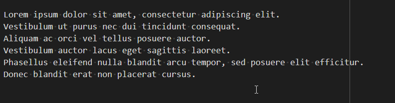

One of the best features in vscode is the *Multiple cursors* one.

Imagine you've a bunch of lines where you need for instance remove the first two characters. Each lines starts with '//' and you wish to remove them but only there (a search & replace can't be used).

Or, for another example, you must enclose each line in double brackets.

With vscode, it's ultra-simple: multiple cursors.

<!-- truncate -->

Imagine the lines below and you need to add `*` before each line to make a list of items. In this example, I only have six lines so yeah, it's possible to do it manually, one by one. Imagine you had a hundred or a thousand.

<!-- cspell:disable -->
```markdown
Lorem ipsum dolor sit amet, consectetur adipiscing elit.
Vestibulum ut purus nec dui tincidunt consequat.
Aliquam ac orci vel tellus posuere auctor.
Vestibulum auctor lacus eget sagittis laoreet.
Phasellus eleifend nulla blandit arcu tempor, sed posuere elit efficitur.
Donec blandit erat non placerat cursus.
```
<!-- cspell:enable -->

Here is how to do:

* Select all the lines you need to update,
* Press <kbd>SHIFT</kbd>-<kbd>ALT</kbd>-<kbd>I</kbd> to enable multiple cursors,
* Press <kbd>Home</kbd> to put cursors at the beginning of each lines,
* Press `*` followed by a space to transform the list of lines to a bullet list.
* Press <kbd>ESC</kbd> to quit the multiple cursors mode.



While the multiple cursor mode is enabled, you can also press <kbd>END</kbd> to go to the end of lines, add/remove f.i. a character, you can press <kbd>CTRL</kbd>-<kbd>RIGHT</kbd> to move from one word right and so on.

Pretty cool option.
