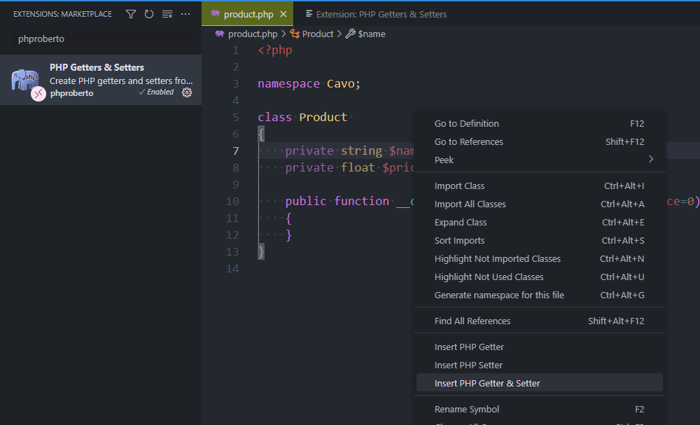
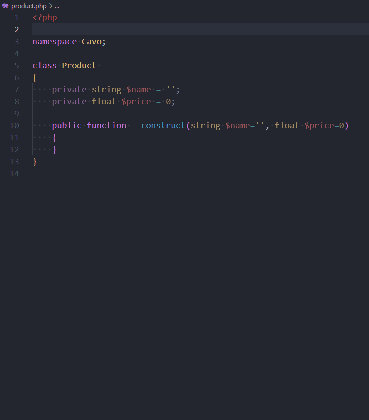

Because you're an excellent developer, you deny anyone access to the properties of your class directly, but only via a getter or setter.

Some people will say "Yes, but it's tedious to write these functions", but not at all.

<!-- truncate -->

As you know, if I'm providing a class like the one below, it should be forbidden to have live access to properties, e.g.

```php
$product = new Product();
$product->name('keyboard');
```

Never ever allow to access directly to a property; that's why I'm using the `private` keyword:

```php
<?php

namespace Cavo;

class Product
{
    private string $name = '';
    private float $price = 0;

    public function __construct(string $name='', float $price=0)
    {
    }
}
```

So, for each property, you need to write a function called `Getter` to read its contents and another function called `Setter` to modify it. It could be a hassle, but it's not, thanks to addon [PHP Getters & Setters](https://marketplace.visualstudio.com/items?itemName=phproberto.vscode-php-getters-setters).

Once enabled, we just need to right-click on a property, select what we wish as action and run it.



Here is in action:



Easy no?

Now, I can write:

```php
$product = new Product();
$product->setName('keyboard');
```

:::tip Think to add correct datatype
At the end of 2023, the extension was still not correctly adding the type of data used/returned. This has to be done manually.

```php
//highlight-next-line
public function getName(): string
{
    return $this->name;
}

//highlight-next-line
public function setName(string $name): self
{
    $this->name = $name;

    return $this;
}
```

:::
