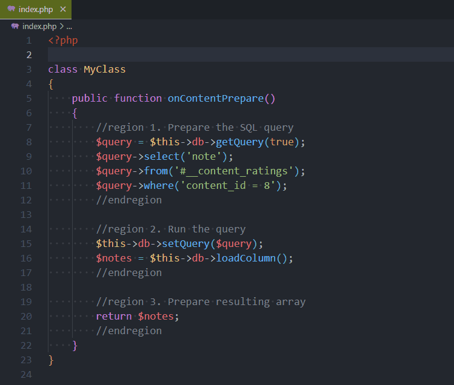
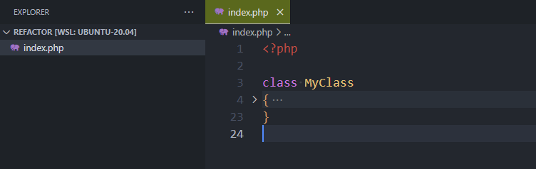

# Working with regions in VSCode


VSCode supports `region` and `endregion` tags. These two special tags can be written differently depending on the language you're using but have, always, the same objective: allow you to fold part of the code.

<!-- truncate -->

Consider the following example (*very brief example for illustrative purposes*):

```php
<?php

class MyClass
{
    public function onContentPrepare()
    {
        $query = $this->db->getQuery(true);
        $query->select('note');
        $query->from('#__content_ratings');
        $query->where('content_id = 8');

        $this->db->setQuery($query);
        $notes = $this->db->loadColumn();

        return $notes;
    }
}
```

We can clearly identify three blocs: preparation of the query, run it and return the data. Using regions, we can do this:

```php
<?php

class MyClass
{
    public function onContentPrepare()
    {
        //region 1. Prepare the SQL query
        $query = $this->db->getQuery(true);
        $query->select('note');
        $query->from('#__content_ratings');
        $query->where('content_id = 8');
        //endregion

        //region 2. Run the query
        $this->db->setQuery($query);
        $notes = $this->db->loadColumn();
        //endregion

        //region 3. Prepare resulting array
        return $notes;
        //endregion
    }
}
```

And now, why folding can be really useful: we can fold / unfold them:



:::tip You should avoid to have functions having more than 60 lines
Regions are supported by a very large number of languages, but don't make the mistake of assuming that this allows you to have functions of several dozen lines. That's not the point!  If you have long functions, you need to split them up. You need to create smaller, more specialised functions. We've already touched on this point in a [previous post](/blog/vscode-php-refactoring).
:::

## Auto fold extension

There some extensions like [Auto Fold](https://marketplace.visualstudio.com/items?itemName=bobmagicii.autofoldyeah) who can automatically fold regions when opening a file.

The idea is: when you open a file with a lot of methods, all functions are first *folded* (we just see the function name, not his content). That way you can directly see the structure of the file, the list of functions and so on without to scroll much.

If you install [Auto Fold](https://marketplace.visualstudio.com/items?itemName=bobmagicii.autofoldyeah), you also need to add the `"autofold.default": 1,` setting in your `settings.json` file.

If you don't know how to do, just press <kbd>CTRL</kbd>-<kbd>,</kbd> (the comma) to display the `Settings` page then start to type `autofold` to get access to the setting.

Now, if you open a file, his content will be automatically folded.


