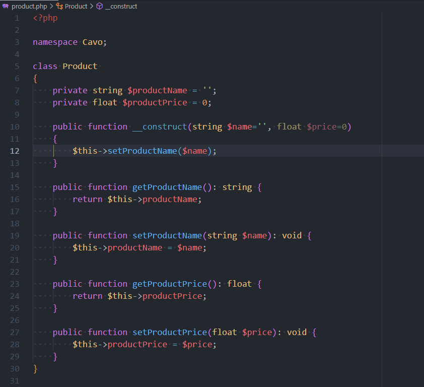

# Tabnine - AI Autocomplete for VSCode


Tabnine is a **MUST HAVE** extension.

Tabnine will predict your next keystroke and sometimes it's just **WOW; HOW IS IT POSSIBLE?**.

<!-- truncate -->

> Download page [Tabnine: AI Autocomplete & Chat for Javascript, Python, Typescript, PHP, Go, Java & more](https://marketplace.visualstudio.com/items?itemName=TabNine.tabnine-vscode)

Imagine the code below and take a look on the `__construct` method. We need to handle the `$price` parameter. We need to call the setter for it.

```php
<?php

namespace Cavo;

class Product 
{
    private string $productName = '';
    private float $productPrice = 0;

    public function __construct(string $name='', float $price=0)
    {
        $this->setProductName($name);
    }

    public function getProductName(): string {
        return $this->productName;
    }

    public function setProductName(string $name): void {
        $this->productName = $name;
    }

    public function getProductPrice(): float {
        return $this->productPrice;
    }

    public function setProductPrice(float $price): void {
        $this->productPrice = $price;
    }
}
```

And here is how VSCode will predict my keystrokes when TabNine is enabled. As you can see, TabNine will predict that, after I've typed `$this-` that I'll used my `setProductPrice` method. And he knows that this function requires a parameter so he suggest me to use my `$price` one.



It's really amazing.

By default, TabNine works offline i.e. don't use any cloud data provider like what GitHub Copilot does.

TabNine supports a lot of languages, for instance, he's also working with pure text file (like this blog post).
