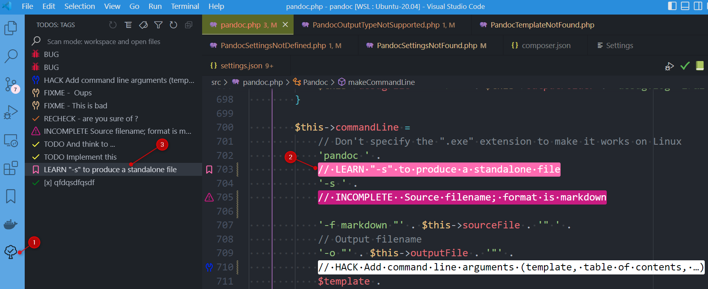

In any codebase, you'll quickly find annotations like `@TODO` or `// TODO` or `//HACK` or things like that.

The idea behind `Todo Tree` (you can find the download page [here](https://marketplace.visualstudio.com/items?itemName=Gruntfuggly.todo-tree)) is to add such window in VSCode.

<!-- truncate -->

Once the addon has been installed, you'll get a new icon in your left sidebar (see 1. on the image below). By clicking on it, you'll get items like `BUG`, `CHECK`, `FIXME`, `TODO`, ... and by clicking on an item you'll be directly redirected to where the todo is located in your codebase.

I recommend reading the [https://dev.to/koustav/how-a-vs-code-extension-todo-tree-can-make-your-coding-easier-todo-tree-configuration-and-use-cases-11kc](https://dev.to/koustav/how-a-vs-code-extension-todo-tree-can-make-your-coding-easier-todo-tree-configuration-and-use-cases-11kc) article to learn more about it.

Really nice addon to no more forget your TODOs.
