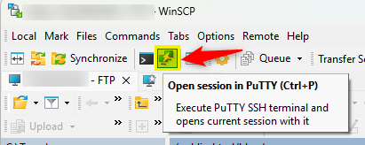

[WinSCP](https://winscp.net/) is a free tool for Windows allowing you to connect to a remote server and start to upload/download files using various protocols like SFTP, FTP, SCP, ...  In short, it's a FTP client.

But not just that. Did you ever see there is an "Open session in PuTTY" button?

This will allow you to start a remote SSH connection on your server.  

In this article, we'll learn a tip: start an SSH connection without having to re-enter your credentials (already known by WinSCP).

<!-- truncate -->

First, make sure you've PuTTY installed. Visit the [official](https://www.putty.org/) site and just download the Windows executable. Save the putty.exe executable to **C:\Program Files (x86)\PuTTY\putty.exe** (you'll need to create the folder yourself).

Now, back to WinSCP, go to the `Options` menu then `Preferences` entry. In the left menu, click on  `Applications` under `Integrations`. Be sure to check *Remember session password and pass it to PuTTY*.

Now by starting PuTTY, you won't be anymore prompted for credentials. Easy!
