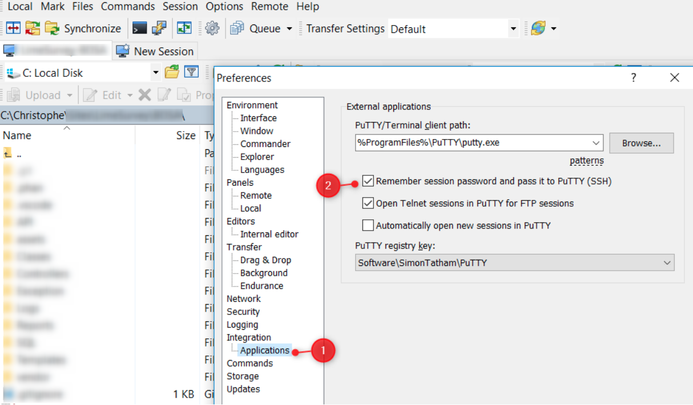
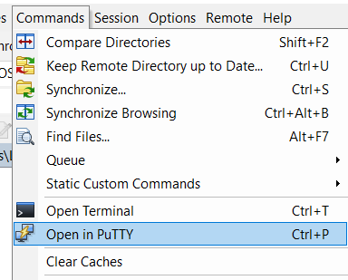

# WinSCP - Start PuTTY without typing a password

If you're a [WinSCP](https://winscp.net/) user, you may not yet know that you can start a remote SSH connection on your server (using [PuTTY](https://www.putty.org/)) without having to re-enter your credentials.

<!-- truncate -->

To do this, just go to the `Preferences` menu then go to `Integrations` then `Applications`. Be sure to check *Remember session password and pass it to PuTTY*.

Now by starting PuTTY, you won't be anymore prompted for credentials.

