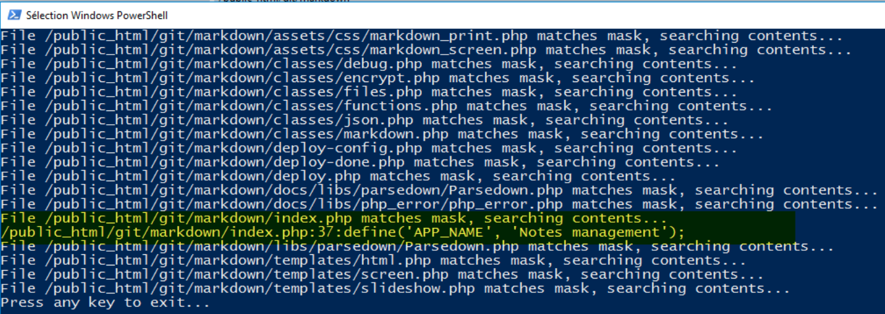

It is possible to launch a search to, for example, find the string `Notes management` in all the `.php` files of the remote site.

To do this, go to the `Commands` menu, then `Static custom` commands and finally `Search for Text...`

<!-- truncate -->

By searching for `Notes management`, [WinSCP](https://winscp.net/) will inform me that this pattern has been retrieved in file `/public_html/git/markdown/index.php`.

:::tip
It is, in fact, the execution of a script (an extension in the WinSCP language) which is here : `C:\Program Files (x86)\WinSCP\Extensions\SearchText.WinSCPextension.ps1`
:::

## PHP-grep

Look at my [php_grep](https://github.com/cavo789/php_grep) PHP script. This script will allow you to scan files of your website and search for a specific pattern; f.i. a word or a sentence.

