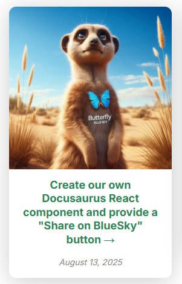
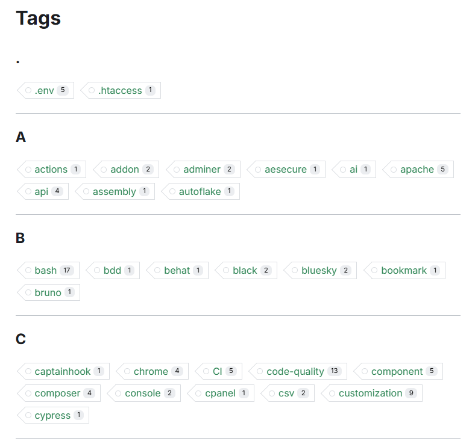
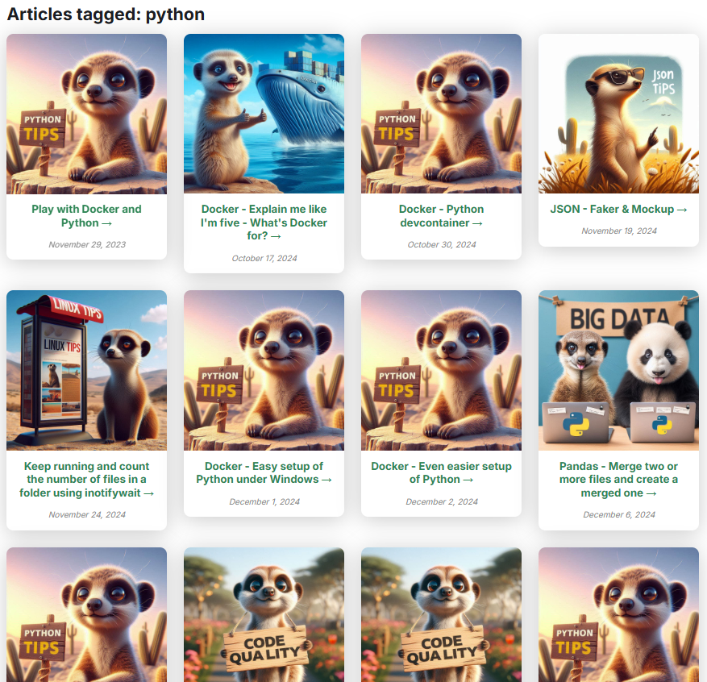

<!-- cspell:ignore  -->


In this series, we'll learn how to create a card from a blog post.

If you're using Docusaurus for your blog, you might be looking for some ways to improve the layout of pages. Instead of displaying posts as a list, let's see how we can display them as **cards**.

In this guide, we'll walk through how to create this. You've be just asked to copy/paste files to your site and make a small change in your configuration file.

<!-- truncate -->



This will implies a big number of files but the idea is then to reuse created components / files for later use.

## Reusing the Card component of Docux

First, we'll retrieve the [Card Component](https://docusaurus.community/knowledge/component-library/new/Card/) of our friend, Docux.  That one can be retrieve on the Docusaurus Community site.

In your Docusaurus site, please create these files:

<Snippet filename="src/components/Card/index.js">

```js
import React, { CSSProperties } from "react"; // CSSProperties allows inline styling with better type checking.
import clsx from "clsx"; // clsx helps manage conditional className names in a clean and concise manner.
const Card = ({
  className, // Custom classes for the container card
  style, // Custom styles for the container card
  children, // Content to be included within the card
  shadow, // Used to add shadow under your card. Expected values are: low (lw), medium (md), tall (tl)
}) => {
  const cardShadow = shadow ? `item shadow--${shadow}` : "";
  return (
    <div className={clsx("card", className, cardShadow)} style={style}>
      {children}
    </div>
  );
};
export default Card;
```

</Snippet>

<Snippet filename="src/components/Card/CardBody/index.js">

```js
import React, { CSSProperties } from "react";
import clsx from "clsx";
const CardBody = ({
  className, // classNamees for the container card
  style, // Custom styles for the container card
  children, // Content to be included within the card
  textAlign,
  variant,
  italic = false,
  noDecoration = false,
  transform,
  breakWord = false,
  truncate = false,
  weight,
}) => {
  const text = textAlign ? `text--${textAlign}` : "";
  const textColor = variant ? `text--${variant}` : "";
  const textItalic = italic ? "text--italic" : "";
  const textDecoration = noDecoration ? "text-no-decoration" : "";
  const textType = transform ? `text--${transform}` : "";
  const textBreak = breakWord ? "text--break" : "";
  const textTruncate = truncate ? "text--truncate" : "";
  const textWeight = weight ? `text--${weight}` : "";
  return (
    <div
      className={clsx(
        "card__body",
        className,
        text,
        textType,
        textColor,
        textItalic,
        textDecoration,
        textBreak,
        textTruncate,
        textWeight
      )}
      style={style}
    >
      {children}
    </div>
  );
};
export default CardBody;
```

</Snippet>

<Snippet filename="src/components/Card/CardFooter/index.js">

```js
import React, { CSSProperties } from "react";
import clsx from "clsx";
const CardFooter = ({
  className,
  style,
  children,
  textAlign,
  variant,
  italic = false,
  noDecoration = false,
  transform,
  breakWord = false,
  truncate = false,
  weight,
}) => {
  const text = textAlign ? `text--${textAlign}` : "";
  const textColor = variant ? `text--${variant}` : "";
  const textItalic = italic ? "text--italic" : "";
  const textDecoration = noDecoration ? "text-no-decoration" : "";
  const textType = transform ? `text--${transform}` : "";
  const textBreak = breakWord ? "text--break" : "";
  const textTruncate = truncate ? "text--truncate" : "";
  const textWeight = weight ? `text--${weight}` : "";
  return (
    <div
      className={clsx(
        "card__footer",
        className,
        text,
        textType,
        textColor,
        textItalic,
        textDecoration,
        textBreak,
        textTruncate,
        textWeight
      )}
      style={style}
    >
      {children}
    </div>
  );
};
export default CardFooter;
```

</Snippet>

<Snippet filename="src/components/Card/CardHeader/index.js">

```js
import React, { CSSProperties } from "react"; // CSSProperties allows inline styling with better type checking.
import clsx from "clsx"; // clsx helps manage conditional className names in a clean and concise manner.
const CardHeader = ({
  className, // classNamees for the container card
  style, // Custom styles for the container card
  children, // Content to be included within the card
  textAlign,
  variant,
  italic = false,
  noDecoration = false,
  transform,
  breakWord = false,
  truncate = false,
  weight,
}) => {
  const text = textAlign ? `text--${textAlign}` : "";
  const textColor = variant ? `text--${variant}` : "";
  const textItalic = italic ? "text--italic" : "";
  const textDecoration = noDecoration ? "text-no-decoration" : "";
  const textType = transform ? `text--${transform}` : "";
  const textBreak = breakWord ? "text--break" : "";
  const textTruncate = truncate ? "text--truncate" : "";
  const textWeight = weight ? `text--${weight}` : "";
  return (
    <div
      className={clsx(
        "card__header",
        className,
        text,
        textType,
        textColor,
        textItalic,
        textDecoration,
        textBreak,
        textTruncate,
        textWeight
      )}
      style={style}
    >
      {children}
    </div>
  );
};
export default CardHeader;
```

</Snippet>

<Snippet filename="src/components/Card/CardImage/index.js">

```js
import React, { CSSProperties } from "react";
import clsx from "clsx";
import useBaseUrl from "@docusaurus/useBaseUrl"; // Import the useBaseUrl function from Docusaurus
const CardImage = ({ className, style, cardImageUrl, alt, title }) => {
  const generatedCardImageUrl = useBaseUrl(cardImageUrl);
  return (
    
  );
};
export default CardImage;
```

</Snippet>

So right now, you've created five files on your disk.

In order to try them, please create a new post in your `blog` folder but pay attention to the extension, it should be a `.mdx` file (because we'll add some code that should be interpreted).

<Snippet filename="blog/card.mdx">

```md
import Card from "@site/src/components/Card";
import CardBody from "@site/src/components/Card/CardBody";
import CardFooter from "@site/src/components/Card/CardFooter";
import CardHeader from "@site/src/components/Card/CardHeader";
import CardImage from "@site/src/components/Card/CardImage";

<Card>
  <CardHeader
    className="padding-top--lg"
    style={{ backgroundColor: "rgb(33 126 209)", color: "black" }}
  >
    <div className="avatar avatar--vertical">
      
      <div className="avatar__intro">
        <div className="avatar__name">Docux (@Juniors017)</div>
        <small className="avatar__subtitle">
          humble contributor on:
          <a style={{ color: "white" }} href="https://docusaurus.community/">
            docusaurus.community
          </a>
        </small>
      </div>
    </div>
  </CardHeader>
  <CardImage
    style={{ backgroundColor: "rgb(33 126 209)", color: "black" }}
    cardImageUrl="https://img.freepik.com/vecteurs-libre/dino-mignon-jouant-illustration-icone-vecteur-dessin-anime-planche-roulettes-concept-icone-sport-animal-isole_138676-7099.jpg?size=626&ext=jpg&ga=GA1.1.1416347011.1716591654&semt=sph"
  />
  <CardBody
    style={{ backgroundColor: "white", color: "#8f600b" }}
    className="padding-vert--md"
    textAlign="center"
    transform="uppercase"
  >
    <h3>Docux Card component</h3>
    Lorem ipsum dolor sit amet, consectetur adipiscing elit, sed do eiusmod tempor
    incididunt ut labore et dolore magna aliqua. Quis ipsum suspendisse ultrices
    gravida.
  </CardBody>
  <CardFooter
    style={{ backgroundColor: "#2887bf", color: "black" }}
    className="text--center"
  >
    <div className="button-group button-group--block">
      <button className="button button--secondary">Like</button>
      <button className="button button--secondary">Comment</button>
      <button className="button button--secondary">Share</button>
    </div>
  </CardFooter>
</Card>
```

</Snippet>

That code will generate this:


It'll be our starting point for our Blog post card.

In this article, we'll create override the standard page with the list of tags. As you know, natively, Docusaurus can display a page with the list of tags used accross your articles if you access to the **/blog/tags** page.  So for my own blog, the page is [https://www.avonture.be/blog/tags](https://www.avonture.be/blog/tags) and you'll get something like this:



By clicking on a specific tag, Docusaurus will show a list of posts for that tag and we'll change this.

We'll no more show that lists but our cards. As an example, on my blog, I'm also writing about  [python](https://www.avonture.be/blog/tags/python) and here is how I'm rendering the page:



In this example, we'll implement a lot of concepts.

## Overriding the /blog/tags/a_tag page by creating a plugin

Please create the file here above.

<Snippet filename="plugins/docusaurus-plugin-tag-route/index.cjs">

```js
module.exports = function () {
  return {
    name: "docusaurus-plugin-tag-route",
    async contentLoaded({ actions }) {
      actions.addRoute({
        path: "/blog/tags/:tag",
        component: "@site/src/components/Blog/Tags/TagArticlesPage",
        exact: true,
      });
    },
  };
};
```

</Snippet>

As you can see, that one will tell to Docusaurus to no more use his own standard `/blog/tags/:tag` page but ours. Our page has still to be created. Let's do that.

## Creating the TagArticlesPage

Please create the file below. It's the `TagArticlesPage` function that'll be called by Docusaurus when he'll display a specific tag.

<Snippet filename="src/components/Blog/Tags/TagArticlesPage.js">

```js
import { createSlug } from "@site/src/components/Blog/utils/slug";
import { getBlogMetadata } from "@site/src/components/Blog/utils/posts";
import { useLocation } from "@docusaurus/router";
import Layout from "@theme/Layout";
import Link from "@docusaurus/Link";
import PostCard from "@site/src/components/Blog/PostCard";

function getTagFromPathname(pathname) {
  const match = pathname.match(/\/blog\/tags\/([^/]+)/);
  return match ? decodeURIComponent(match[1]) : null;
}

export default function TagArticlesPage() {
  const location = useLocation();
  const rawTag = getTagFromPathname(location.pathname);

  if (!rawTag) {
    return (
      <Layout>
        <div className="container">
          <p>No tag specified.</p>
          <Link href="/blog/tags">Go back to all tags</Link>
        </div>
      </Layout>
    );
  }

  const posts = getBlogMetadata();

  // Find original tag name based on slug
  const allTags = Array.from(new Set(posts.flatMap((post) => post.tags || [])));
  const displayTag = allTags.find((t) => createSlug(t) === rawTag) || rawTag;

  // Filter posts by slug-matched tag
  const taggedPosts = posts.filter((post) =>
    post.tags?.some((t) => createSlug(t) === rawTag)
  );

  if (taggedPosts.length === 0) {
    return (
      <Layout title={`Tag: ${displayTag}`}>
        <div className="container margin-top--lg margin-bottom--lg text--center">
          <h2>No articles found with tag "{displayTag}"</h2>
          <Link href="/blog/tags">Browse all tags</Link>
        </div>
      </Layout>
    );
  }

  return (
    <Layout title={`Tag: ${displayTag}`}>
      <div className="container margin-top--lg margin-bottom--lg">
        <h1>Articles tagged: {displayTag}</h1>
        <div className="row">
          {taggedPosts.map((post) => (
            <PostCard key={post.title} post={post} />
          ))}
        </div>
      </div>
    </Layout>
  );
}

```

</Snippet>

As you can see at the very top of the `TagArticlesPage.js` file, we're importing a few files. Some already exists in your Docusaurus site; some should be created.

There are three files we should create

## The slug generator

<Snippet filename="src/components/Blog/utils/slug.js">

```js
/**
 * Converts a string into a URL-friendly slug.
 *
 * This function:
 * - Converts the string to lowercase
 * - Normalizes accented characters (e.g., é → e)
 * - Removes diacritics and special characters
 * - Replaces spaces with hyphens
 * - Collapses multiple hyphens into one
 * - Trims leading and trailing hyphens
 *
 * @param {string} text - The input string to convert.
 * @returns {string} - The slugified version of the input.
 */
export function createSlug(text) {
  return text
    .replace(/([a-z0-9])([A-Z])/g, "$1-$2") // camelCase → kebab-case
    .toLowerCase()
    .normalize("NFD") // Decomposes accented characters
    .replace(/[\u0300-\u036f]/g, "") // Removes diacritics
    .replace(/[^a-z0-9\s-]/g, "") // Removes special characters
    .replace(/\s+/g, "-") // Replaces spaces with hyphens
    .replace(/-+/g, "-") // Collapses multiple hyphens
    .replace(/^-+|-+$/g, ""); // Trims leading/trailing hyphens
}
```

</Snippet>

## The getBlogMetaData function

We need a function to loop all our existing blog posts (all `.md` or `.mdx` files under the `blog` folder) and collect informations like the post title, image, slug and so on.

<Snippet filename="src/components/Blog/utils/posts.js">

```js
/**
 * 🧠 getBlogMetadata
 *
 * Extracts metadata from all MDX blog posts located in the `/blog` directory.
 * Uses Webpack's `require.context` to dynamically load and parse frontmatter
 * from each post, returning a structured array of metadata objects.
 *
 * 🔍 Behavior:
 * - Resolves permalinks based on `slug` or folder structure
 * - Normalizes image paths for static assets
 * - Filters out invalid or missing entries
 *
 * 📦 Returned metadata includes:
 * - `title`: Post title
 * - `description`: Short summary
 * - `image`: Resolved image path
 * - `draft`: Boolean flag for unpublished posts
 * - `unlisted`: Boolean flag for hidden posts
 * - `permalink`: URL path to the post
 * - `tags`: Array of tags
 * - `mainTag`: Primary tag (optional); used by the RelatedBlogPost component
 * - `authors`: Array of author names
 * - `date`: Publication date
 * - `series`: Series name (optional); used by the SeriesBlogPost component
 *
 * 🛠️ Usage:
 * ```js
 * import { getBlogMetadata } from './getBlogMetadata';
 * const posts = getBlogMetadata();
 * ```
 *
 * ⚠️ Note:
 * This function is intended for use in static site generation or client-side rendering
 * where Webpack's `require.context` is available.
 */

const posts = require.context("../../../../blog", true, /\.mdx?$/);

export function getBlogMetadata() {
  return posts
    .keys()
    .map((key) => {
      const post = posts(key);

      const dir = key.replace(/\/index\.mdx?$/, "").replace(/^\.\//, "");

      let permalink;
      if (post.frontMatter.slug) {
        permalink = post.frontMatter.slug.startsWith("/")
          ? post.frontMatter.slug
          : `/blog/${post.frontMatter.slug.replace(/^\//, "")}`;
      } else {
        permalink = `/blog/${dir}/`;
      }

      let imageUrl = post.frontMatter.image;
      if (imageUrl && imageUrl.startsWith("./")) {
        imageUrl = `/blog/${dir}/${imageUrl.replace("./", "")}`;
      }

      return {
        title: post.frontMatter.title,
        description: post.frontMatter.description,
        image: imageUrl,
        draft: post.frontMatter.draft || false,
        unlisted: post.frontMatter.unlisted || false,
        permalink,
        tags: post.frontMatter.tags || [],
        mainTag: post.frontMatter.mainTag || null,
        authors: post.frontMatter.authors || [],
        date: post.frontMatter.date,
        series: post.frontMatter.series || null,
      };
    })
    .filter(Boolean);
}

```

</Snippet>

## Our PostCard component

And, finally, we need our PostCard component; the one who will display a blog post as a card.

You can see, in the top of the code, that we're importing a few parts of the [Card component](https://docusaurus.community/knowledge/component-library/new/Card/) of Docux.

<Snippet filename="src/components/Blog/PostCard">

```js
/**
 * ♣️ PostCard component
 *
 * A reusable Docusaurus component that displays a blog post preview card.
 * It shows the post image (with fallback), title (as a link), and description.
 *
 * Accessibility:
 * - The title is wrapped in a semantic link with an aria-label for screen readers.
 * - The image includes alt and title attributes.
 *
 * Styling:
 * - Uses Infima utility classes for layout and spacing.
 * - Custom styles can be applied via `styles.module.css`.
 *
 * Location: src/components/Blog/PostCard/index.js
 */

import Card from "@site/src/components/Card";
import CardBody from "@site/src/components/Card/CardBody";
import CardImage from "@site/src/components/Card/CardImage";
import Link from "@docusaurus/Link";
import PropTypes from "prop-types";
import styles from "./styles.module.css";

/**
 * Renders a formatted date string.
 * @param {Object} props
 * @param {string} props.date - The date string to format.
 * @param {string} props.layout - The layout variant ('big' or 'small').
 * @returns {JSX.Element | null}
 */
const FormattedDate = ({ date, layout }) => {
  if (!date) {
    return null;
  }
  return (
    <p
      className={layout === "small" ? "" : styles.date}
      style={
        layout === "small"
          ? { color: "#888", fontSize: "0.95em", marginBottom: 8 }
          : {}
      }
    >
      <span>
        {new Date(date).toLocaleDateString("en-US", {
          year: "numeric",
          month: "long",
          day: "numeric",
        })}
      </span>
    </p>
  );
};

/**
 * @param {Object} props
 * @param {Object} props.post - Blog post metadata.
 * @param {string} [props.layout='big'] - The layout variant: 'big' or 'small'.
 * @param {string} props.defaultImage - Fallback image used when no image is provided.
 * @returns {JSX.Element}
 */
export default function PostCard({
  post,
  layout = "big",
  defaultImage = "/img/default.jpg",
}) {
  const { permalink, image, title, description, date } = post;

  if (layout === "small") {
    return (
      <div
        className="col col--4"
        style={{ marginBottom: "2rem", display: "flex" }}
      >
        <div
          className="card"
          style={{
            width: "100%",
            display: "flex",
            flexDirection: "column",
            height: "100%",
          }}
        >
          <div className="card__image">
            
          </div>
          <div className="card__body" style={{ flex: 1 }}>
            <h3>
              <Link to={permalink}>{title}</Link>
            </h3>
            {description && (
              <div
                style={{
                  color: "#6c63ff",
                  fontWeight: "bold",
                  marginBottom: 6,
                }}
              >
                {description}
              </div>
            )}
            <FormattedDate date={date} layout={layout} />
          </div>
          <div className="card__footer" style={{ textAlign: "right" }}>
            <Link className="button button--primary button--sm" to={permalink}>
              Read more
            </Link>
          </div>
        </div>
      </div>
    );
  }

  // Default "big" layout
  return (
    <div className="col col--3 margin-bottom--lg">
      <Card shadow="md">
        <CardImage
          cardImageUrl={image || defaultImage}
          alt={title}
          title={title}
        />
        <CardBody className="padding-vert--md text--center" textAlign="center">
          <h3>
            <Link href={permalink} aria-label={`Read article: ${title}`}>
              {title}&nbsp;→
            </Link>
          </h3>
          {description && <p className={styles.description}>{description}</p>}
          <FormattedDate date={date} layout={layout} />
        </CardBody>
      </Card>
    </div>
  );
}

PostCard.propTypes = {
  post: PropTypes.shape({
    permalink: PropTypes.string.isRequired,
    image: PropTypes.string,
    title: PropTypes.string.isRequired,
    description: PropTypes.string,
  }).isRequired,
  layout: PropTypes.oneOf(["big", "small"]),
  defaultImage: PropTypes.string,
};

```

</Snippet>

## We need to load our plugin

Remember, the very first file we've created was `plugins/docusaurus-plugin-tag-route/index.cjs`; a plugin.

Please edit your existing `docusaurus.config.js` file like below illustrated:

```js
import pluginTagRoute from "./plugins/docusaurus-plugin-tag-route/index.cjs"

const config = {
  // [...]
  plugins: [
    // [...]
    [pluginTagRoute, {}],
  ],
  // [...]
};

export default config;
```

i.e.

1. You've to import the plugin at the top of your file
2. In the configuration and more specifically in the `plugins` section, you've to add a new line to load your imported plugin.

:::important
It's important to follow this syntax.
:::

We're almost finished!

:::important
Please stop and restart your Docusaurus server. On my case (I'm using Docker), I just need to stop and restart my container.
:::

If everything is going fine after the restart (no error message), please visit your website tags page and open a tag. You should now see your posts as cards.

In next articles, we'll reuse this concept of cards.