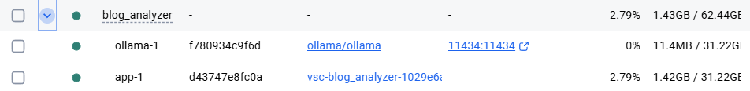
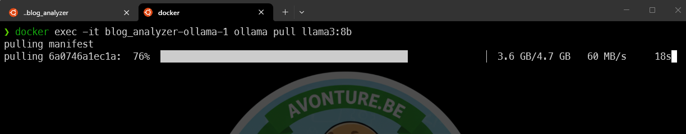
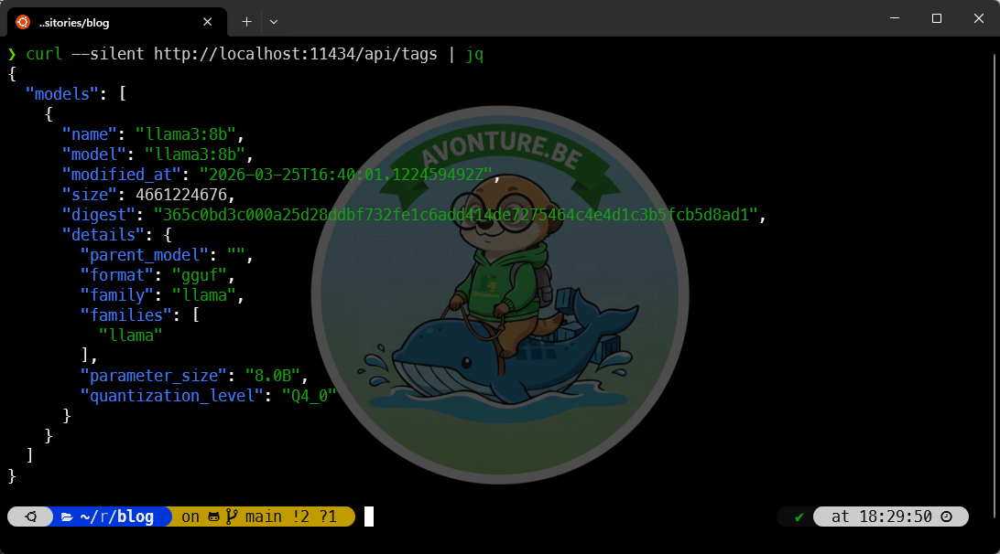
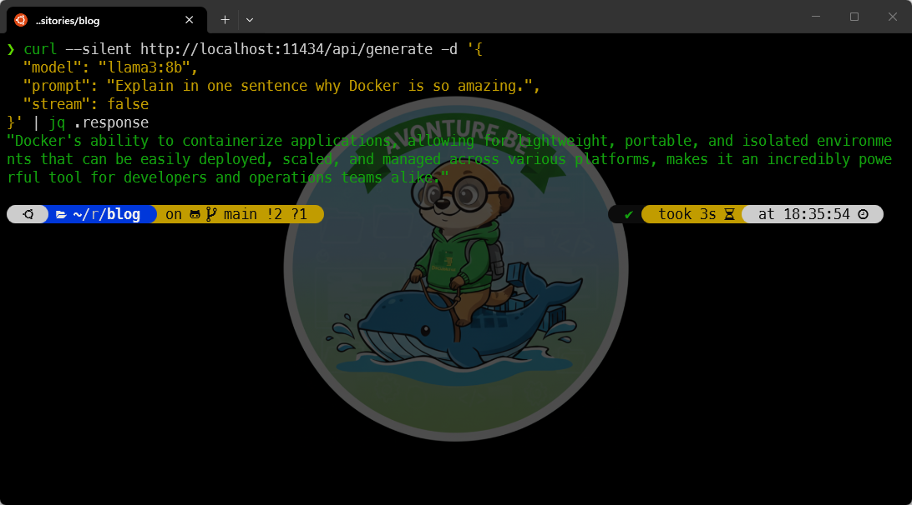
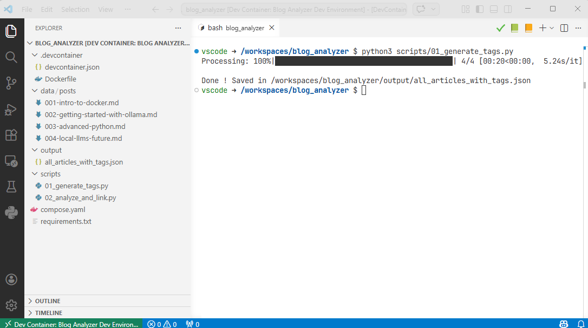
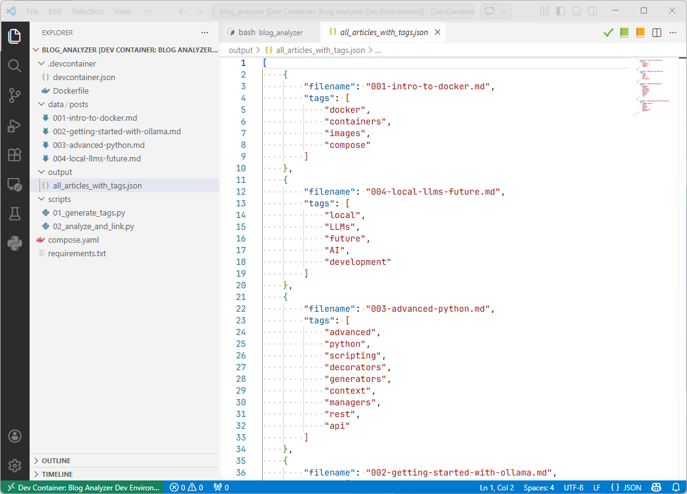
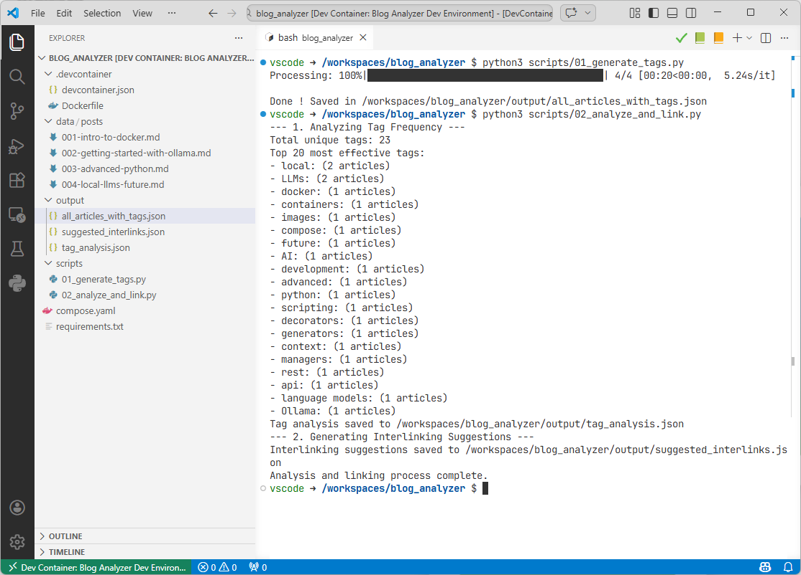

## Copy the directory structure and files

Please run the following command in your terminal to copy the directory structure and files for this tutorial:

<ProjectSetup folderName="/tmp/joomla" createFolder={true} >
  <Guideline>
  </Guideline>
  <Snippet filename=".devcontainer/devcontainer.json" source="./files/.devcontainer/devcontainer.json" />
  <Snippet filename=".devcontainer/Dockerfile" source="./files/.devcontainer/Dockerfile" />
  <Snippet filename="data/posts/001-intro-to-docker.md" source="./files/data/posts/001-intro-to-docker.txt" />
  <Snippet filename="data/posts/002-getting-started-with-ollama.md" source="./files/data/posts/002-getting-started-with-ollama.txt" />
  <Snippet filename="data/posts/003-advanced-python.md" source="./files/data/posts/003-advanced-python.txt" />
  <Snippet filename="data/posts/004-local-llms-future.md" source="./files/data/posts/004-local-llms-future.txt" />
  <Snippet filename="output/all_articles_with_tags.json" source="./files/output/all_articles_with_tags.json" />
  <Snippet filename="scripts/01_generate_tags.py" source="./files/scripts/01_generate_tags.py" />
  <Snippet filename="scripts/02_analyze_and_link.py" source="./files/scripts/02_analyze_and_link.py" />
  <Snippet filename="compose.yaml" source="./files/compose.yaml" />
  <Snippet filename="requirements.txt" source="./files/requirements.txt" />
</ProjectSetup>

Once done, please run `code .` to open the current directory in Visual Studio Code then press <kbd>Ctrl</kbd>+<kbd>Shift</kbd>+<kbd>P</kbd> and select `Remote-Containers: Reopen in Container` to open the project in a development container.

It will take a few minutes to build the container and install the dependencies. Once the devcontainer is running, you'll see in your Docker Desktop that the two containers are running:



## Download the LLM model

Then, return to your terminal (on your host) and run the following command to donwload the LLM model:

<Terminal wrap={true}>
$ docker exec -it blog_analyzer-ollama-1 ollama pull llama3:8b
</Terminal>



## Test Ollama service

So we've just downloaded the LLM model, now let's test that the Ollama service is working correctly. Run the following command in your terminal (on your host):

<Terminal wrap={true}>
$ curl --silent http://localhost:11434/api/tags | jq
</Terminal>



<AlertBox variant="note" title="If you don't have jq">
The `jq` command is used to format the JSON output for better readability. If you don't have `jq` installed, you can simply run the `curl` command without it to see the raw JSON response.
</AlertBox>


```bash
curl --silent http://localhost:11434/api/generate \
  -d '{\
    "model": "llama3:8b", \
    "prompt": "Explain in one sentence why Docker is so amazing.", \
    "stream": false \
  }' | jq .response
```



Ok, the service is working, and we can see that the `tags` endpoint is available. This endpoint will be used by our Python scripts to send the content of the blog posts and receive the generated tags.

## Run the tag generation script

Go back to Visual Studio Code, jump in the terminal (in VSCode) and run the `scripts/01_generate_tags.py` file. This script will read all the markdown files in the `data/posts` directory, send their content to the LLM model running in the container, and save the generated tags in a JSON file.



And, indeed, you can see that the `output/all_articles_with_tags.json` file has been created with the generated tags:



## Run the analyze and link script

The second script, `scripts/02_analyze_and_link.py`, will read the generated tags from the JSON file, analyze the relationships between the articles based on their tags, and create a list of related articles for each article.

Two JSON files will be created in the `output` directory:

* `suggested_interlinks.json` with the related articles for each article i.e. which articles should be interlinked together based on their tags, and
* `tag_analysis.json` which lists all the tags and their occurrences across the articles.



So lets look at the first output:

<Snippet source="./files/output/suggested_interlinks.json" defaultOpen={true} />

Indeed, articles 002 and 004 are related as they both talk about local LLMs. Articles 001 and 003 are not related to any other article as they talk about different topics. Sounds good!

The second output file, `tag_analysis.json`, shows us the tags and their occurrences across the articles. So, in our example, the tag "local LLMs" appears in two articles (002 and 004) while the other tags appear only in one article:

<Snippet source="./files/output/tag_analysis.json" defaultOpen={true} />
This is a great addition to your post. To make it more reader-friendly, I have restructured your content into a more professional format. I've focused on clarity, providing a clear "why" for each model so your readers can choose based on their specific hardware and needs.

## Choosing the Right Model

In this article, I used `llama3:8b` as a starting point. However, the true beauty of Ollama lies in the flexibility to swap "brains" depending on the task at hand. The Ollama registry offers a vast library of models, but choosing the right one depends on your available hardware—specifically your RAM and GPU.

### Model Comparison at a Glance

| Model | Ideal Use Case | Pros | Cons | Hardware Requirement |
| :--- | :--- | :--- | :--- | :--- |
| **Llama 3 (8B)** | Casual chat, simple scripts, fast tasks. | Extremely fast, lightweight, runs on almost anything. | Lower reasoning capability for complex logic. | ~8GB RAM |
| **Mistral (7B)** | Coding, creative writing, general reasoning. | Often more "human-sounding" and concise. | Can be less rigorous than Llama 3 for structured data. | ~8GB RAM |
| **Llama 3 (70B)** | Deep analysis, complex coding, heavy reasoning. | Near-human intelligence, very low hallucination rate. | Resource-intensive; slower generation. | ~48GB+ RAM |

### Which one should you pick?

* **Go for `llama3:8b`** if you are just getting started or have limited RAM. It is perfect for rapid prototyping and simple automation tasks that don't require deep logical reasoning.
* **Try `mistral`** if you find Llama 3's responses a bit too rigid. Many developers prefer Mistral for its creative flair and efficiency. It’s an excellent "daily driver" for general coding support.
* **Scale up to `llama3:70b`** if you are performing tasks that demand high precision—such as refactoring complex codebases, deep logical debugging, or processing large datasets where accuracy is critical. Because this model is massive, it significantly reduces "hallucinations," making it the most reliable choice for professional work.

### Downloading your models

You can add any of these models to your local environment instantly. Simply run the following commands in your terminal:

**To pull the standard Llama 3 (8B) model:**

<Terminal wrap={true}>
$ docker exec -it blog_analyzer-ollama-1 ollama pull llama3:8b
</Terminal>

**To pull the highly capable Llama 3 (70B) model:**

<Terminal wrap={true}>
$ docker exec -it blog_analyzer-ollama-1 ollama pull llama3:70b
</Terminal>

**To pull the Mistral model:**

<Terminal wrap={true}>
$ docker exec -it blog_analyzer-ollama-1 ollama pull mistral
</Terminal>

> **Note:** The `70b` model is significantly larger (~40GB). Ensure you have enough disk space and, more importantly, at least 48GB of RAM available to ensure the model runs smoothly without slowing down your system.

<AlertBox variant="tip" title="Not enough RAM?">

On my machine with 64GB of RAM, I can run the `70b` model, but it does consume a lot of resources. If you have less RAM, you might want to stick with the `8b` or `mistral` models for a smoother experience.

I was quite surprised when I got the "You don't have enough RAM to run this model" message while trying to run the `70b` model. I've thus added a `.wslconfig` file to the project to increase the amount of RAM allocated to WSL, which is required to run the `70b` model. If you want to run this model, make sure to add this file in your home directory (e.g., `C:\Users\YourUsername\.wslconfig`) and restart WSL for the changes to take effect.

<Snippet filename=".wslconfig" source="./files/.wslconfig" defaultOpen={true} />

(Think to run `wsl --shutdown` in a Powershell console if you've created/updated the `.wslconfig` file.)

</AlertBox>
