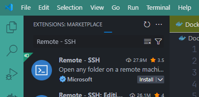
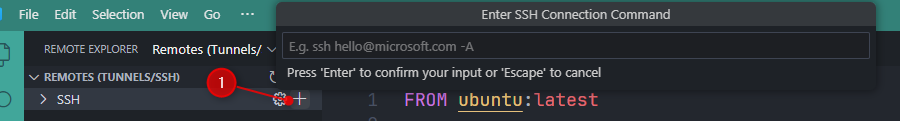

<!-- cspell:ignore ssword -->

At work, I was faced with the following situation: I had to program a complex script in Python to attack an Oracle database. The difficulty lay in network security: I couldn't access the database either from my computer or even from my virtual machine (a Windows VM), **but only from the Linux server**.

Given that my development tools are on my PC as well as my virtual machine: I would have had to develop *blind*, push my changes to GitLab, connect to the server, do a git pull to be able to test my code. And that over and over again. No, really, not possible.

The solution: develop under VSCode with an SSH gateway and therefore ask VSCode to give me access to the server filesystem and, from the terminal integrated into VSCode, open an SSH session so that I can run commands as if I were on the server.

<!-- truncate -->

Like always, let's experiment this thanks to Docker. We'll create a Docker container that will act as a Linux server. We'll install a SSH client on it so we can connect to that server (the container) using VSCode.

Please create a temporary folder using `mkdir -p /tmp/remote-ssh && cd $_`. Once in that folder, just run `code .` to start VSCode.

## Create the Docker container that will act as our SSH server

Please create the `Dockerfile` with the content below.

<Snippets filename="Dockerfile">

```dockerfile
# cspell:ignore ssword

FROM ubuntu:latest

# Install the SSH server so we can use the `ssh` command to connect to the container
# Also create the required `/var/run/sshd` directory
RUN apt-get update \
    && apt-get install -y openssh-server \
    && apt-get clean \
    && rm -rf /var/lib/apt/lists/* \
    && mkdir -p /var/run/sshd

# Create our test user (christophe) and assign him a password (p@ssword)
RUN useradd -rm -d /home/christophe -s /bin/bash christophe \
    && echo 'christophe:p@ssword' | chpasswd

# Do some changes to the ssh configuration like disabling authentication with the `root` user
RUN sed -i 's/^#PermitRootLogin.*/PermitRootLogin no/' /etc/ssh/sshd_config \
    && sed -i 's/^#PasswordAuthentication.*/PasswordAuthentication yes/' /etc/ssh/sshd_config \
    && sed -i 's/^#ChallengeResponseAuthentication.*/ChallengeResponseAuthentication no/' /etc/ssh/sshd_config \
    && sed -i 's/^UsePAM.*/UsePAM no/' /etc/ssh/sshd_config \
    && sed -i 's/^#ListenAddress.*/ListenAddress 0.0.0.0/' /etc/ssh/sshd_config \
    && sed -i 's/^#Port.*/Port 22/' /etc/ssh/sshd_config

EXPOSE 22

CMD ["/usr/sbin/sshd", "-D"]
```

</Snippets>

This done, please create the Docker image by running `docker build -t ssh-server .` then, create the container by running `docker run -d -p 2222:22 --name remote-dev ssh-server`.

So, now, we've a container that will act as our SSH server. We've defined a user called `christophe` with
`p@ssword` for his password.

### Test our container

In your console, run `ssh christophe@localhost -p 2222` to start a SSH connection, just to make sure your container is correctly configured.

Once prompted, fill in `p@ssword` as password.

You should be able to enter in the container and run actions like `ls -alh`.

## The Remote - SSH extension

First, we need to install [Remote - SSH](https://marketplace.visualstudio.com/items?itemName=ms-vscode-remote.remote-ssh), a Microsoft extension.



Once installed, you'll have a new button at the left called *Remote Explorer*. Click on it and in the new pane, make sure to click on the `Remote Explorer` dropdown and to select `Remotes (Tunnels/SSH)`.


Click on the `+` button to create a new connection:



You're prompted to type the SSH connection string you'll use.

In our example, it'll be `christophe@localhost -p 2222` because:

* The user defined in our `Dockerfile` is called `christophe`,
* Our server is our `localhost` (since it's a Docker container running on our machine) and
* The port number to use is `2222` (the one we've specified in the `docker run` command)

VSCode will then ask which SSH configuration file you want to update. Since I'm using WSL, VSCode is showing a.o.t. my `C:\Users\Christophe\.ssh\config` file; this is the one I'll select.

VSCode will create/update the file for me and will show this:


Now, if I click on the **SSH** link on my left pane, I see my `remote-dev` server. There is also a arrow button to start the connection:


I'll need to specify the operating system, it's Linux here.

When prompted, fill in the password to use (it's `p@ssword`).

After a few seconds, you'll be able to open a folder:


Just click on OK to open the home folder of the user.

And now, we can play:


As you can see here above, it's possible to create a new file called `hello.sh`, add some commands and, in the VSCode terminal, make the script executable and run it.

By running `hostname` we can retrieve the name of the container; not the name of our machine.

:::note
We can see `d3cacfe67885` for the host name; in fact, it's the container ID.
:::

Just for illustration, exit VSCode, go back to the console and run `ssh christophe@localhost -p 2222`.

We can well see our `hello.sh` file:


## Conclusion

This article illustrates how, thanks to VSCode and the [Remote - SSH](https://marketplace.visualstudio.com/items?itemName=ms-vscode-remote.remote-ssh) extension, it is possible to connect to a SSH server and edit files *as if* we were connected to the server.

Executing a command in VSCode's built-in terminal works in the same way: it's as if we were on the server.

At the beginning of this article, I mentioned that it was impossible for me to connect to a database from my computer (due to strict network security rules). Thanks to the Remote - SSH extension, this is now perfectly possible and quite easy in fact.
