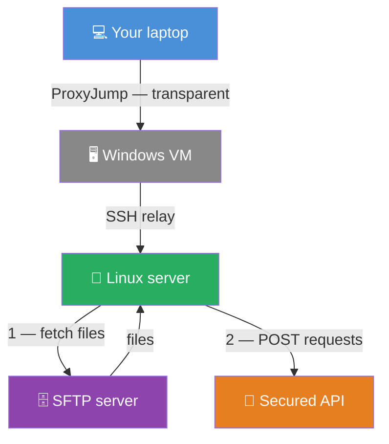
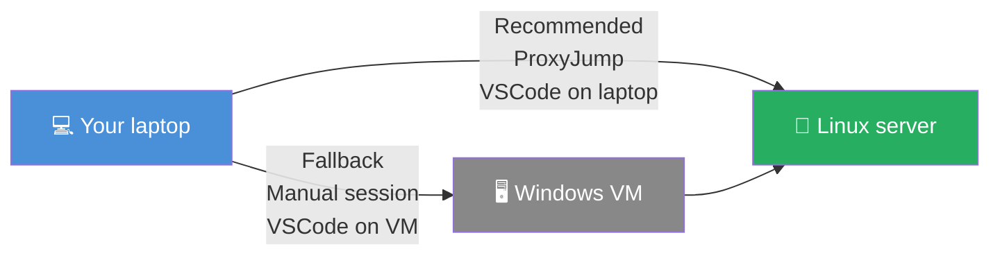

<TLDR>
Les extensions Remote - SSH et Dev Containers de VSCode s'enchaînent : vous vous connectez à un serveur Linux distant via SSH, puis vous rouvrez le projet dans un devcontainer qui tourne *sur ce serveur*. Le container hérite des privilèges réseau du serveur : tout service uniquement joignable depuis ce serveur — un endpoint SFTP privé, une API sécurisée — devient joignable depuis votre terminal. Deux chemins pour y arriver : ProxyJump depuis votre portable (un clic, transparent), ou VSCode sur une VM Windows intermédiaire (solution de repli si le SSH direct n'est pas disponible).
</TLDR>

Je devais écrire un script Bash qui récupère des fichiers sur un serveur SFTP et envoie des requêtes POST à une API sécurisée. Assez simple — sauf que les deux se trouvent sur un segment réseau privé uniquement joignable depuis un serveur Linux précis. Et ce serveur Linux n'est lui-même joignable que depuis une VM Windows au bureau. Mon portable, au bout de la chaîne, ne voit aucun des deux services directement.

Sans la technique ci-dessous, le workflow est lourd : ouvrir un terminal sur la VM, faire un SSH vers le serveur Linux, éditer le script avec `nano`, l'exécuter, copier-coller les erreurs vers mon éditeur. Pas génial.

**Ou bien je peux me passer complètement de la VM et travailler directement depuis mon portable. Cet article présente les deux chemins — et la route directe depuis le portable est plus simple qu'elle n'y paraît.**

Avec VSCode Remote SSH enchaîné à Dev Containers, le workflow devient : ouvrir VSCode, se connecter une fois, et travailler exactement comme en local — éditeur complet, devcontainer complet, et le serveur SFTP ainsi que l'API joignables depuis le terminal intégré. Il y a deux façons de mettre ça en place, et l'article couvre les deux.

*Prérequis : vous devez déjà être à l'aise avec les bases de VSCode Remote SSH. Sinon, <Link to="/blog/vscode-remote-ssh">SSH Remote development with VSCode</Link> couvre l'installation de l'extension et le fichier de configuration SSH depuis zéro.*

<!-- truncate -->

<QuickJump
  links={[
    { label: "Approche recommandée — ProxyJump depuis votre portable", to: "#recommended-approach--proxyjump-from-your-laptop" },
    { label: "Approche de repli — VSCode sur la VM Windows", to: "#fallback-approach--vscode-on-the-windows-vm" },
    { label: "Se connecter avec VSCode", to: "#connect-with-vscode" },
    { label: "Ouvrir le DevContainer", to: "#open-the-devcontainer" },
  ]}
/>

<Vars
  vmUser="vm-user"
  vmIp="windows-vm-ip"
  devUser="dev-user"
  linuxHost="test.example.internal"
  linuxAlias="linux-test"
  sshKey="id_ed25519"
  labels={{
    vmUser: "Nom d'utilisateur de la VM",
    vmIp: "Nom d'hôte ou IP de la VM",
    devUser: "Nom d'utilisateur du serveur Linux",
    linuxHost: "Nom d'hôte du serveur Linux",
    linuxAlias: "Alias SSH",
    sshKey: "Nom de la clé SSH",
  }}
/>

## Ce que vous obtenez au final {#what-you-get-at-the-end}

Avec l'approche recommandée, l'architecture ressemble à ceci :

VSCode tourne sur votre portable et se connecte au serveur Linux en un clic — la VM Windows n'est qu'un relais dans la configuration SSH, invisible à l'usage. Le devcontainer tourne sur le serveur Linux, donc il hérite du réseau du serveur : le serveur SFTP et l'API sécurisée sont joignables depuis l'intérieur du container, même s'ils sont invisibles depuis votre portable.

## Quelle approche vous convient ? {#which-approach-works-for-you}

Deux situations, deux chemins :

<AlertBox variant="note" title="Serveur SSH sur la VM Windows">
L'approche recommandée nécessite un serveur SSH sur la VM Windows. Si vous êtes admin sur la VM, il suffit d'une commande pour installer le serveur SSH.
</AlertBox>

**Pour vérifier si l'approche recommandée est disponible**, lancez ceci depuis le terminal de votre portable :

<Terminal wrap={true} typewriter>
ssh -J %%vmUser=vm-user%%@%%vmIp=windows-vm-ip%% %%devUser=dev-user%%@%%linuxHost=test.example.internal%% "whoami && hostname"
</Terminal>

- Ça affiche <Var name="devUser">dev-user</Var> et le nom d'hôte du serveur Linux → **utilisez l'approche recommandée**.
- Ça part en timeout → votre portable ne peut pas joindre la VM du tout → **utilisez l'approche de repli**.
- `Connection refused` sur le port 22 → la VM est joignable mais OpenSSH Server n'est pas installé → **voyez le correctif ci-dessous**.

*La seconde ligne est la sortie de `hostname` sur la machine distante — elle reflète le nom défini dans `/etc/hostname`, qui peut différer de l'adresse utilisée pour vous connecter. C'est normal ; ce qui compte, c'est que la commande ait renvoyé quelque chose plutôt que de partir en timeout ou d'être refusée.*

`Connection refused` signifie que le chemin réseau fonctionne — seul le service SSH manque. Si vous avez les droits admin sur la VM, ouvrez un PowerShell **en tant qu'administrateur** et lancez :

<Terminal title="%%vmUser=vm-user%%@%%vmIp=windows-vm-ip%%: PowerShell (Administrator)">
$ Add-WindowsCapability -Online -Name OpenSSH.Server~~~~0.0.1.0
$ Start-Service sshd
$ Set-Service -Name sshd -StartupType Automatic
</Terminal>

Une fois fait, relancez le test depuis votre portable — il devrait maintenant afficher <Var name="devUser">dev-user</Var> et le nom d'hôte du serveur. Si c'est le cas, suivez l'**approche recommandée**.

**L'autorisation de la clé est optionnelle.** La connexion fonctionne aussi avec l'authentification par mot de passe — on vous demandera simplement le mot de passe de la VM à chaque connexion de VSCode. Pour un usage occasionnel, c'est acceptable ; pour un usage quotidien, la clé rend la connexion totalement silencieuse.

*Vous préférez une installation graphique ? Ouvrez **Paramètres → Système → Fonctionnalités optionnelles**, cherchez **OpenSSH Server** et installez-le depuis là — puis lancez les commandes `Start-Service` et `Set-Service` ci-dessus pour le démarrer et l'activer.*

**Remarque** Si vous rencontrez des difficultés à l'installation d'OpenSSH Server (en CLI ou en interface graphique), vous pouvez en alternative télécharger le fichier `.msi` à la main depuis [https://github.com/PowerShell/Win32-OpenSSH/releases](https://github.com/PowerShell/Win32-OpenSSH/releases). Une fois téléchargé, double-cliquez sur le fichier `.msi` pour lancer l'installation.

## Pourquoi ça fonctionne {#why-it-works}

- **Deux extensions, une seule chaîne.** Remote - SSH lance un processus VS Code Server sur l'host Linux. Dev Containers démarre ensuite un container sur *cet host* et y connecte VSCode — le container tourne sur le moteur Docker du serveur, pas sur celui de votre portable.
- **Le privilège réseau est hérité de l'host.** La pile réseau du container vit sur le serveur Linux, donc chaque connexion sortante part de l'IP du serveur. Les services qui bloquent l'adresse de votre portable laissent passer le serveur.
- **ProxyJump délègue le relais à SSH.** Avec `ProxyJump` dans `~/.ssh/config`, SSH ouvre une connexion vers la VM, puis y fait passer une seconde connexion SSH vers le serveur Linux. VSCode ne voit qu'un seul host et un seul clic.
- **Aucun transfert de fichiers.** Les fichiers vivent sur le serveur. L'éditeur les lit et les écrit directement — pas de `scp`, pas de rsync, pas d'étape d'upload.

## Configurer SSH {#configure-ssh}

### Approche recommandée — ProxyJump depuis votre portable {#recommended-approach--proxyjump-from-your-laptop}

#### Prérequis {#prerequisites}

Votre clé privée SSH (`~/.ssh/`<Var name="sshKey">id_ed25519</Var>) doit se trouver sur votre portable — si vous n'en avez pas encore, <Link to="/blog/github-connect-using-ssh">cet article détaille la génération d'une paire de clés ed25519</Link>. ProxyJump fait passer l'authentification dans le tunnel — la clé de votre portable authentifie les deux hosts, donc elle n'a jamais besoin de quitter votre machine. L'authentification par mot de passe fonctionne aussi si l'authentification par clé n'est pas en place sur la VM <Var name="vmIp">windows-vm-ip</Var>.

#### Configurer SSH sur votre portable {#configure-ssh-on-your-laptop}

Créez le fichier `C:\Users\your_laptop_user\.ssh\config` (Windows ; WSL inclus) ou `~/.ssh/config` (si vous êtes sous Linux/macOS) sur votre portable :

<Snippet title={<>C:\Users\your_laptop_user\.ssh\config · ~/.ssh/config</>} source="./files/ssh_config_laptop.txt" />

La ligne `ProxyJump` indique à SSH d'atteindre <Var name="linuxAlias">linux-test</Var> en passant par la VM <Var name="vmIp">windows-vm-ip</Var>. À partir de là, `ssh `<Var name="linuxAlias">linux-test</Var> depuis votre portable se connecte directement au serveur Linux — plus d'étape manuelle sur la VM.

#### Tester la chaîne complète {#test-the-full-chain}

Lancez la commande avec l'alias nommé, maintenant que la configuration est en place :

<Terminal title="laptop: ~" typewriter>
$ ssh %%linuxAlias=linux-test%% "whoami && hostname"
</Terminal>

La première exécution ressemblera à ceci :

<Terminal source="./files/terminal_proxyjump_first_run.txt" title="laptop: ~" />

Deux choses se produisent ici, toutes deux normales et uniquement à la première fois :

- **Les demandes de clé d'hôte** (`The authenticity of host ... can't be established`) : SSH n'a jamais vu ces hosts. Tapez `yes` pour chacun — l'empreinte est stockée dans `~/.ssh/known_hosts` et la question ne revient plus.
- **Les demandes de mot de passe** : une pour la VM et une pour le serveur Linux — la connexion fonctionne dans tous les cas. Pour la rendre totalement silencieuse, autorisez votre clé publique sur chaque host (voir ci-dessous).

Il y a deux sauts, donc deux endroits où autoriser votre clé. Faites-les dans l'ordre.

##### Étape 1 — autoriser votre clé sur la VM Windows {#step-1--authorize-your-key-on-the-windows-vm}

Pour les comptes admin sous Windows, OpenSSH lit un fichier commun au système — et **pas** le `~\.ssh\authorized_keys` de l'utilisateur. Le dossier `C:\ProgramData\ssh\` a des ACL restrictives : même un membre du groupe Administrateurs a besoin d'une session PowerShell **réellement élevée** (clic droit → *Exécuter en tant qu'administrateur*). Sur la VM :

**Étape 1a** — sur votre portable, affichez votre clé publique et copiez la ligne entière :

<Terminal title="laptop: ~">
$ cat ~/.ssh/%%sshKey=id_ed25519%%.pub
</Terminal>

**Étape 1b** — sur la VM (PowerShell en administrateur), ajoutez la clé copiée :

<Terminal title="%%vmUser=vm-user%%@%%vmIp=windows-vm-ip%%: PowerShell (Administrator)">
$ Add-Content C:\ProgramData\ssh\administrators_authorized_keys "ssh-ed25519 AAAA...your-key-here"
</Terminal>

Relancez le test — la demande de mot de passe de la VM devrait avoir disparu. Le serveur Linux demandera encore un mot de passe ; c'est l'étape 2.

##### Étape 2 — autoriser votre clé sur le serveur Linux {#step-2--authorize-your-key-on-the-linux-server}

Avec ProxyJump déjà configuré dans `~/.ssh/config`, `ssh-copy-id` fonctionne de façon transparente — il passe par la VM et copie votre clé sur le serveur Linux en une seule commande :

<Terminal source="./files/terminal_ssh_copy_id.txt" title="laptop: ~" copyCommandOnly />

Il demande le mot de passe du serveur Linux une dernière fois, puis ajoute votre clé publique à `~/.ssh/authorized_keys` sur le serveur. Après ça, toute la chaîne est silencieuse — plus aucune question.

<QuickJump
  links={[
    { label: "SSH configuré — on continue avec VSCode", to: "#connect-with-vscode" },
  ]}
/>

### Approche de repli — VSCode sur la VM Windows {#fallback-approach--vscode-on-the-windows-vm}

Suivez ce chemin si l'approche recommandée n'est pas disponible (serveur SSH non installé sur la VM <Var name="vmIp">windows-vm-ip</Var>, ou VM non joignable en SSH depuis votre portable).

#### Créer le fichier de configuration SSH sur la VM {#create-the-ssh-config-file-on-the-vm}

Ouvrez une session Powershell sur la VM <Var name="vmIp">windows-vm-ip</Var>. Si le sous-dossier `$HOME\.ssh` n'existe pas encore, créez-le : `New-Item -ItemType Directory -Path "$HOME\.ssh"`.

Ouvrez (ou créez) `C:\Users\`<Var name="vmUser">vm-user</Var>`\.ssh\config` dans Notepad. Le fichier doit s'appeler `config`, **sans extension** — `config.txt` est silencieusement ignoré par tous les clients SSH.

<Snippet title={<>C:\Users\<Var name="vmUser">vm-user</Var>\.ssh\config</>} source="./files/ssh_config.txt" />

#### Copier votre clé privée SSH sur la VM {#copy-your-ssh-private-key-to-the-vm}

Le client SSH de la VM a besoin de votre clé privée. Copiez-la manuellement via l'Explorateur (allez dans votre home Linux sous `\\wsl$\` et copiez `~/.ssh/`<Var name="sshKey">id_ed25519</Var> vers `C:\Users\`<Var name="vmUser">vm-user</Var>`\.ssh\`), ou lancez ce one-liner dans une session Powershell qui a accès à WSL :

<Terminal title="%%vmUser=vm-user%%@%%vmIp=windows-vm-ip%%: ~" wrap={true}>
$ wsl sh -c 'cp "$HOME/.ssh/%%sshKey=id_ed25519%%" "/mnt/c/Users/$(cmd.exe /c echo %USERNAME% | tr -d "\r")/.ssh/%%sshKey=id_ed25519%%"'
</Terminal>

#### Tester la connexion depuis la VM {#test-the-connection-from-the-vm}

Depuis Powershell sur la VM, vérifiez que l'alias se résout et que l'authentification passe :

<Terminal source="./files/terminal_ssh_test.txt" title="%%vmUser=vm-user%%@%%vmIp=windows-vm-ip%%: ~" copyCommandOnly />

## Se connecter avec VSCode {#connect-with-vscode}

SSH est maintenant configuré et la commande de test a renvoyé votre nom d'utilisateur — la connexion fonctionne de bout en bout. Que vous ayez suivi l'approche recommandée ou celle de repli, vous êtes au même point : prêt à ouvrir VSCode et à vous connecter au serveur Linux.

<AlertBox variant="important" title="Utilisateurs WSL — n'utilisez pas `code .` pour cette étape">

Si vous travaillez exclusivement dans WSL, votre réflexe est `code .` depuis le terminal. **Ne l'utilisez pas ici.**

Quand VSCode s'ouvre via `code .` depuis WSL, il se connecte à WSL comme host distant. Dans ce mode, le Remote Explorer n'affiche que **WSL Targets** et **Dev Containers** — la catégorie **Remotes (Tunnels/SSH)** n'apparaît jamais, quelles que soient les extensions installées.

Ouvrez plutôt VSCode à la manière Windows : depuis le **menu Démarrer**, la **barre des tâches**, ou un terminal PowerShell (juste `code`, sans argument). Vous obtenez une fenêtre locale, avec la liste complète du Remote Explorer — y compris **Remotes (Tunnels/SSH)**.

</AlertBox>

Donc, **côté Windows, ouvrez une console Powershell** et installez l'extension **[Remote - SSH](https://marketplace.visualstudio.com/items?itemName=ms-vscode-remote.remote-ssh)** — c'est elle qui fournit la barre latérale Remote Explorer utilisée pour se connecter à l'host distant :

<Prerequisite
  name="Remote - SSH"
  install="code --install-extension ms-vscode-remote.remote-ssh"
  installOutput="Installing extension 'ms-vscode-remote.remote-ssh'...
Extension 'ms-vscode-remote.remote-ssh' v0.120.0 was successfully installed."
  check="code --list-extensions | grep remote-ssh"
  checkOutput="ms-vscode-remote.remote-ssh"
/>

<AlertBox variant="tip" title="Sous Powershell, utilisez findstr au lieu de grep">

<Terminal title="laptop: ~">
$ code --list-extensions | grep remote-ssh
</Terminal>

</AlertBox>

Ouvrez VSCode — **sur votre portable** si vous avez suivi l'approche recommandée, ou **sur la VM Windows** si vous avez suivi l'approche de repli. Dans la barre latérale **Remote Explorer**, sélectionnez **Remotes (Tunnels/SSH)** dans la liste déroulante.

> Utilisateurs WSL : encore une fois, parce que c'est important : passez par le menu Démarrer de Windows et lancez VSCode depuis là.

Repérez <Var name="linuxAlias">linux-test</Var> dans la liste et cliquez sur l'icône flèche à côté pour l'ouvrir dans une nouvelle fenêtre.

VSCode déploie un petit binaire serveur sur l'host Linux la première fois — surveillez la barre d'état en bas à gauche pour le message *Opening Remote...*. Dès que le nom de l'host y apparaît, vous êtes connecté.

<AlertBox variant="tip" title="L'host n'apparaît pas dans la liste ?">

Deux choses à vérifier :

1. L'extension du fichier de configuration. Ouvrez l'Explorateur, allez dans `C:\Users\`<Var name="vmUser">vm-user</Var>`\.ssh\`, et vérifiez que le fichier s'appelle `config`, pas `config.txt`. L'Explorateur Windows masque les extensions connues par défaut — activez « Extensions de noms de fichiers » dans le menu Affichage pour en être sûr.

2. Une extension obsolète. Si l'host était visible avant et a disparu, ouvrez le panneau Extensions et mettez Remote - SSH à jour. C'est arrivé au moins une fois après une mise à jour de VS Code.

</AlertBox>

<AlertBox variant="coreConcept" title="Vous venez d'ouvrir un projet sur un serveur que votre portable ne peut pas joindre directement">

VSCode est connecté au serveur Linux. Vous pouvez déjà ouvrir des fichiers, lancer des terminaux, utiliser Git — tout fonctionne depuis votre portable, sur des fichiers qui vivent sur le serveur. L'endpoint SFTP et l'API sécurisée sont déjà joignables depuis le terminal intégré. Bravo !

**Le chapitre suivant est optionnel.** Il ajoute un DevContainer par-dessus cette connexion — utile si votre projet nécessite un runtime spécifique ou un environnement isolé. Si vous n'avez besoin que de l'éditeur distant, c'est terminé.

</AlertBox>

### Vérifier la connexion {#verify-the-connection}

Ouvrez un terminal dans VSCode (**Terminal → New Terminal**) et lancez :

<Terminal title="%%linuxAlias=linux-test%%: ~" typewriter>
$ hostname
%%linuxHost=test.example.internal%%
</Terminal>

Le nom d'hôte correspond au serveur Linux — le terminal tourne sur la machine distante, pas sur votre portable.

C'est ce contexte réseau qui rend la suite possible. Les services invisibles depuis votre portable mais joignables depuis le serveur sont désormais accessibles depuis ce terminal. Si votre projet se connecte à un serveur SFTP, essayez tout de suite :

<Terminal title="%%linuxAlias=linux-test%%: ~">
$ sftp -i ~/.ssh/%%sshKey=id_ed25519%% -P 22 user@sftp.example.internal
Connected to sftp.example.internal.
sftp>
</Terminal>

Vous êtes sur un prompt `sftp>` depuis un terminal à l'intérieur de VSCode sur votre portable — le réseau du serveur Linux fait le routage, de façon invisible.

## Ouvrir le DevContainer {#open-the-devcontainer}

Une fois connecté à l'host distant, installez l'extension **Dev Containers** pour ouvrir le projet dans un container qui tourne sur cet host :

<Prerequisite
  name="Dev Containers"
  install="code --install-extension ms-vscode-remote.remote-containers"
  installOutput="Installing extension 'ms-vscode-remote.remote-containers'...
Extension 'ms-vscode-remote.remote-containers' v0.395.0 was successfully installed."
  check="code --list-extensions | grep remote-containers"
  checkOutput="ms-vscode-remote.remote-containers"
/>

Ouvrez le dossier du projet sur le serveur Linux, puis appuyez sur <kbd>F1</kbd> et lancez **Dev Containers: Rebuild and Reopen in Container** la première fois (ou **Reopen in Container** lors des connexions suivantes).

<AlertBox variant="important" title="Docker doit être installé sur le serveur Linux">

Dev Containers nécessite Docker sur l'host distant, pas sur votre portable ni sur la VM. Si vous obtenez une erreur indiquant que Docker n'est pas trouvé, votre administrateur système doit l'installer, ou suivez le [guide d'installation officiel de Docker](https://docs.docker.com/engine/install/) pour la distribution de votre serveur.

</AlertBox>

Une fois le container démarré, votre prompt change pour refléter l'environnement du container. À partir de là, le serveur SFTP et l'API sécurisée sont joignables — les deux services invisibles depuis votre portable sont maintenant sur le réseau local du container.

## Sous le capot (à sauter si vous voulez juste l'utiliser) {#under-the-hood-skip-this-if-you-just-want-to-use-it}

**Remote - SSH** installe un processus `vscode-server` sur l'host Linux à la première connexion, réutilisé ensuite. Ce serveur gère toute la communication de l'éditeur — lecture de fichiers, I/O du terminal, language server protocol — à travers le tunnel SSH.

**Dev Containers** dialogue ensuite avec la socket Docker de cet host *distant*. Il lit `devcontainer.json`, construit ou récupère l'image, et démarre le container. VSCode rebranche son protocole d'éditeur sur le runtime du container, en laissant le layer SSH intact en dessous. Résultat : deux connexions imbriquées : tunnel SSH → VS Code Server sur l'host → runtime du container.

Avec l'approche recommandée, il y a un troisième niveau : le tunnel SSH lui-même passe par la VM via ProxyJump. Le VS Code Server n'en sait rien — il sait seulement qu'il tourne sur l'host Linux. Le ProxyJump se joue entièrement au niveau SSH.

Les bind mounts du container référencent des chemins *sur le serveur Linux*, pas des chemins de votre portable ou de la VM — et c'est exactement ce qu'on veut.

<AlertBox variant="tip" title="Cette commande de test est aussi une session SSH complète">

Vous vous souvenez de la commande utilisée plus haut pour vérifier si l'approche recommandée était disponible ?

<Terminal wrap={true} title="laptop: ~">
ssh -J %%vmUser=vm-user%%@%%vmIp=windows-vm-ip%% %%devUser=dev-user%%@%%linuxHost=test.example.internal%% "whoami && hostname"
</Terminal>

Retirez la commande entre guillemets à la fin et vous obtenez un one-liner autonome qui ouvre une session SSH interactive sur le serveur Linux — directement depuis votre portable, sans aucun fichier de configuration SSH :

<Terminal wrap={true} title="laptop: ~">
ssh -J %%vmUser=vm-user%%@%%vmIp=windows-vm-ip%% %%devUser=dev-user%%@%%linuxHost=test.example.internal%%
</Terminal>

Maintenant que la configuration SSH est en place, `ssh `<Var name="linuxAlias">linux-test</Var> fait la même chose en un mot. Mais la forme `-J` fonctionne sur n'importe quelle machine sans toucher à `~/.ssh/config` — pratique dès que vous avez besoin d'une session rapide depuis un poste inconnu.

</AlertBox>

## Bonus - one-liners ssh -J {#bonus---ssh--j-one-liners}

Toutes les commandes ci-dessous fonctionnent depuis n'importe quelle machine sans toucher à `~/.ssh/config` — la chaîne complète est encodée dans le flag `-J`.

**Vérification rapide — exécute une commande et quitte :**

<Terminal wrap={true} title="laptop: ~">
ssh -J %%vmUser=vm-user%%@%%vmIp=windows-vm-ip%% %%devUser=dev-user%%@%%linuxHost=test.example.internal%% "whoami && hostname"
</Terminal>

**Shell interactif sur le serveur Linux :**

<Terminal wrap={true} title="laptop: ~">
ssh -J %%vmUser=vm-user%%@%%vmIp=windows-vm-ip%% %%devUser=dev-user%%@%%linuxHost=test.example.internal%%
</Terminal>

Pour les sessions interactives qui lancent un programme précis, ajoutez `-t` afin d'allouer un pseudo-terminal. Sans lui, le programme distant démarre mais n'affiche aucun prompt — la session semble figée, alors qu'elle attend silencieusement une entrée.

**Session SFTP sur un serveur uniquement joignable depuis l'host Linux :**

<Terminal wrap={true} title="laptop: ~">
ssh -t -J %%vmUser=vm-user%%@%%vmIp=windows-vm-ip%% %%devUser=dev-user%%@%%linuxHost=test.example.internal%% sftp -i ~/.ssh/%%sshKey=id_ed25519%% user@sftp.example.internal
</Terminal>

**Session PostgreSQL sur une base uniquement joignable depuis l'host Linux :**

<Terminal wrap={true} title="laptop: ~">
ssh -t -J %%vmUser=vm-user%%@%%vmIp=windows-vm-ip%% %%devUser=dev-user%%@%%linuxHost=test.example.internal%% psql -h db.example.internal -U postgres
</Terminal>

**Port forwarding — utilisez n'importe quel outil graphique depuis votre portable :**

Pour les clients graphiques Windows (HeidiSQL, DBeaver, TablePlus…) qui ne peuvent pas passer directement par SSH, le port forwarding est la réponse. Il expose le port distant comme `localhost` sur votre machine — l'outil graphique ne sait pas qu'il traverse deux sauts SSH :

<Terminal wrap={true} title="laptop: ~">
ssh -fNL 5432:db.example.internal:5432 -J %%vmUser=vm-user%%@%%vmIp=windows-vm-ip%% %%devUser=dev-user%%@%%linuxHost=test.example.internal%%
</Terminal>

Connectez ensuite HeidiSQL (ou n'importe quel client) à `Host: localhost`, `Port: 5432`. Le tunnel tourne silencieusement en arrière-plan (`-f`) sans commande distante (`-N`). Tuez le processus `ssh` quand vous avez fini.

## Conclusion {#conclusion}

La combinaison de VSCode Remote SSH et Dev Containers résout un problème qui demande sinon un workflow manuel pénible en plusieurs étapes : développer du code qui doit tourner — ou atteindre des services qui n'existent que — sur un serveur que votre portable ne peut pas joindre directement.

L'approche recommandée (ProxyJump) est la plus propre : une fois la configuration SSH en place, la connexion se fait en un clic et la VM Windows devient une infrastructure invisible. L'approche de repli est l'alternative fiable quand le serveur SSH de la VM n'est pas disponible.

<Link to="/blog/vscode-remote-ssh">SSH Remote development with VSCode</Link> est l'article compagnon si vous voulez partir d'un cas plus simple — éditer des fichiers sur un host distant sans devcontainer, avec un container Docker local comme terrain d'entraînement sûr avant de toucher à un vrai serveur.
