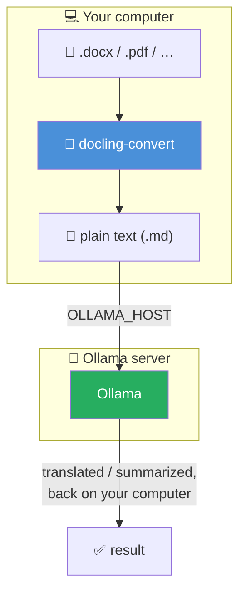

<!-- cspell:ignoreCase ai-test ai-commit ai-translate ai-summarize qwen ollama docling zshrc -->

<TLDR>
Cet article ajoute `ai-translate` et `ai-summarize` à la série « Ollama daily use ». Les deux acceptent un fichier `.pdf`, `.docx`, `.pptx`, `.xlsx` ou `.html` — converti en Markdown par [Docling](/blog/docling) — ou directement un simple fichier `.md`/`.txt`, puis transmettent le texte au modèle Ollama local pour le traduire ou le condenser en points clés. Tout l'aller-retour reste sur votre machine : pas d'API de traduction dans le cloud, pas de document envoyé quelque part. C'est précisément l'intérêt pour un contrat, un document RH, ou tout ce que vous hésiteriez à coller dans Google Translate.
</TLDR>

Je travaille dans un bureau où un `.docx` atterrit dans ma boîte mail en néerlandais, en anglais ou en français. Pour un tas de bonnes raisons, j'ai parfois besoin de traduire d'une langue vers une autre.

Quand ce n'est pas confidentiel du tout, le réflexe que tout le monde a, c'est d'ouvrir le navigateur, de coller dans un outil de traduction, et d'espérer que personne ne s'offusque qu'un contrat client vienne de transiter par les serveurs d'un tiers. Personne ne m'a jamais explicitement interdit de le faire. C'est exactement le genre de chose pour laquelle vous ne devriez pas avoir besoin d'une autorisation pour l'éviter.

<!-- truncate -->

## Démo — ai-translate {#demo--ai-translate}

Traduction d'un contrat depuis n'importe quelle langue vers le français :

<Terminal source="./files/terminal_translate_french.txt" typewriter />

Et la même chose vers le néerlandais :

<Terminal source="./files/terminal_translate_dutch.txt" typewriter />

C'est un contrat de service fictif, converti depuis `.docx` et traduit en français/néerlandais, avec chaque titre et chaque terme en gras intact — le genre de document que je ne collerais sincèrement pas dans un traducteur en ligne.

Le même document, pour que vous puissiez essayer vous-même avant d'adapter l'une ou l'autre fonction à vos propres fichiers :

<DownloadButton file={require("./files/contract.docx").default} label="contract.docx — le document source" title="Télécharger le contrat de service fictif utilisé dans cette démo" />

## Démo — ai-summarize {#demo--ai-summarize}

Le même contrat, condensé en quatre points clés au lieu d'être traduit :

<Terminal source="./files/terminal_summarize.txt" typewriter />

Délais de livraison, conditions de paiement, clause de résiliation et quelles parties du contrat-cadre sont écrasées — les quatre points qui comptent, extraits sans lire le document complet.

## Réutiliser Docling pour l'extraction {#reusing-docling-for-extraction}

Les deux fonctions ci-dessous partagent une même tâche avant même de parler à Ollama : transformer un document en texte brut. J'avais déjà construit cette brique dans [mon article sur Docling](/blog/docling) — `docling-convert file.docx` produit `file.md` en local, avec accélération GPU si vous l'avez configuré ainsi. Plutôt que de dupliquer cette logique deux fois, elle vit dans un petit helper :

<Snippet filename="~/.zsh/fns/_ai-docs.zsh" source="./files/_ai-docs.zsh" defaultOpen={true} />

<AlertBox variant="note" title="Les fichiers Markdown et texte sautent complètement la conversion">
Si vous avez déjà un fichier `.md` ou `.txt`, `_ai_extract_text` fait juste un `cat` — pas d'appel à Docling, pas de dépendance. L'étape de conversion ne se déclenche que pour les vrais formats bureautiques.
</AlertBox>

<AlertBox variant="caution" title="Pourquoi le subshell autour de docling-convert">
`docling-convert` (de l'article précédent) monte le *répertoire courant* dans son container et attend un nom de fichier relatif à celui-ci — il n'a pas été conçu pour résoudre un path absolu arbitraire. `( cd "$dir" && docling-convert "$filename" )` l'exécute depuis le dossier du document lui-même, dans un subshell, pour que votre répertoire de travail réel reste intact au retour de la fonction.
</AlertBox>

## ai-translate {#ai-translate}

<Snippet filename="~/.zsh/fns/ai-translate.zsh" source="./files/ai-translate.zsh" defaultOpen={true} />

On extrait, puis on demande au modèle de traduire vers la langue passée en deuxième argument (le français par défaut — celle dont j'ai le plus souvent besoin), avec une instruction explicite de préserver la structure Markdown pour que les titres, les listes et les tableaux survivent à l'aller-retour au lieu de s'effondrer en un mur de texte.

## ai-summarize {#ai-summarize}

<Snippet filename="~/.zsh/fns/ai-summarize.zsh" source="./files/ai-summarize.zsh" defaultOpen={true} />

Même étape d'extraction, prompt différent : un nombre fixe de points clés (5 par défaut), avec la consigne explicite de privilégier les décisions, les chiffres, les échéances et les actions à mener plutôt que la description générique — et de répondre dans la langue du document source, plutôt que de basculer silencieusement en anglais.

## Enregistré dans le menu ai {#registered-in-the-ai-menu}

Deux lignes — `AI_COMMANDS[translate]=...` et `AI_COMMANDS[summarize]=...` — et les deux sont accessibles via `ai translate` / `ai summarize`, ou directement via `ai-translate` / `ai-summarize`, aux côtés de toutes les autres fonctions de cette série.

Les deux fonctions appellent `_ollama_query` et s'enregistrent dans `AI_COMMANDS`, qui vivent dans la fondation partagée `_ollama.zsh` introduite dans <Link to="/blog/ollama-test-generator">ai-test</Link>. Si vous avez déjà suivi un article précédent de cette série, elle est déjà dans `~/.zsh/fns/` et sourcée par votre autoloader — rien de plus à faire. Vous commencez ici ?

<Snippet filename="~/.zsh/fns/_ollama.zsh" source="./files/_ollama.zsh" defaultOpen={false} />

<AlertBox variant="tip" title="Docling et Ollama n'ont pas besoin d'être sur la même machine">

`docling-convert` tourne toujours en local, sans GPU requis — convertir un document en Markdown fonctionne sur n'importe quel portable. Traduire ou résumer nécessite en revanche un serveur Ollama joignable quelque part : les deux fonctions se connectent à `OLLAMA_HOST`, même configuration que dans <Link to="/blog/accessing-ollama-across-your-local-network">accéder à Ollama depuis votre réseau local</Link> — un LAN partagé, ou un VPN/tunnel entre deux réseaux distincts.

</AlertBox>

## À retenir {#key-takeaways}

<StepsCard
  variant="remember"
  title="ai-translate / ai-summarize : référence rapide"
  steps={[
    { content: "**Extraction partagée** — `_ai_extract_text` dans `_ai-docs.zsh`, réutilisé par les deux fonctions" },
    { content: "**Docling pour les formats bureautiques** — `.pdf`/`.docx`/`.pptx`/`.xlsx`/`.html` passent d'abord par `docling-convert`" },
    { content: "**Markdown/texte sans conversion** — les fichiers `.md`/`.txt` sont lus directement" },
    { content: "**Rien ne quitte la machine** — extraction et traduction/résumé tournent en local, de bout en bout" },
    { content: "**S'enregistre dans `ai`** — accessible via `ai translate` et `ai summarize`" }
  ]}
/>

## Tous les fichiers en un coup d'œil {#all-files-at-a-glance}

Les quatre fichiers, réunis au même endroit — `_ollama.zsh` est la même fondation partagée vue plus tôt dans la série, incluse ici pour que l'archive soit complète même si c'est le premier article de la série que vous suivez. Téléchargez-la ou copiez la ligne de commande pour tout créer directement dans `~/.zsh/fns` :

<ProjectSetup folderName="~/.zsh/fns">
  <Snippet filename="_ollama.zsh" source="./files/_ollama.zsh" defaultOpen={false} />
  <Snippet filename="_ai-docs.zsh" source="./files/_ai-docs.zsh" defaultOpen={false} />
  <Snippet filename="ai-translate.zsh" source="./files/ai-translate.zsh" defaultOpen={false} />
  <Snippet filename="ai-summarize.zsh" source="./files/ai-summarize.zsh" defaultOpen={false} />
</ProjectSetup>

Si c'est la première fois que vous mettez en place `~/.zsh/fns`, l'autoloader lui-même — la boucle `.zshrc` qui source chaque fichier de ce dossier — est couvert dans <Link to="/blog/ripgrep">mon article sur ripgrep</Link>.

## Conclusion {#conclusion}

Ici, la vraie histoire de confidentialité n'est ni une politique ni une promesse — c'est une architecture. Un document entre, Docling le transforme en texte sans appel réseau, Ollama traite ce texte sans appel réseau, et le résultat atterrit dans mon terminal. Il n'y a aucune étape de cette chaîne où il faut « faire confiance au fournisseur », et c'est exactement ce qui la rend utilisable pour les documents que je ne risquerais jamais sur un outil cloud. Entre ça, `ai-ci` pour les pipelines, `ai-standup` pour le récap du matin et le reste de cette série, le modèle local que je faisais déjà tourner pour d'autres raisons trouve encore une chose de plus à faire, discrètement, en arrière-plan, sans rien me demander d'autre qu'un chemin de fichier.
