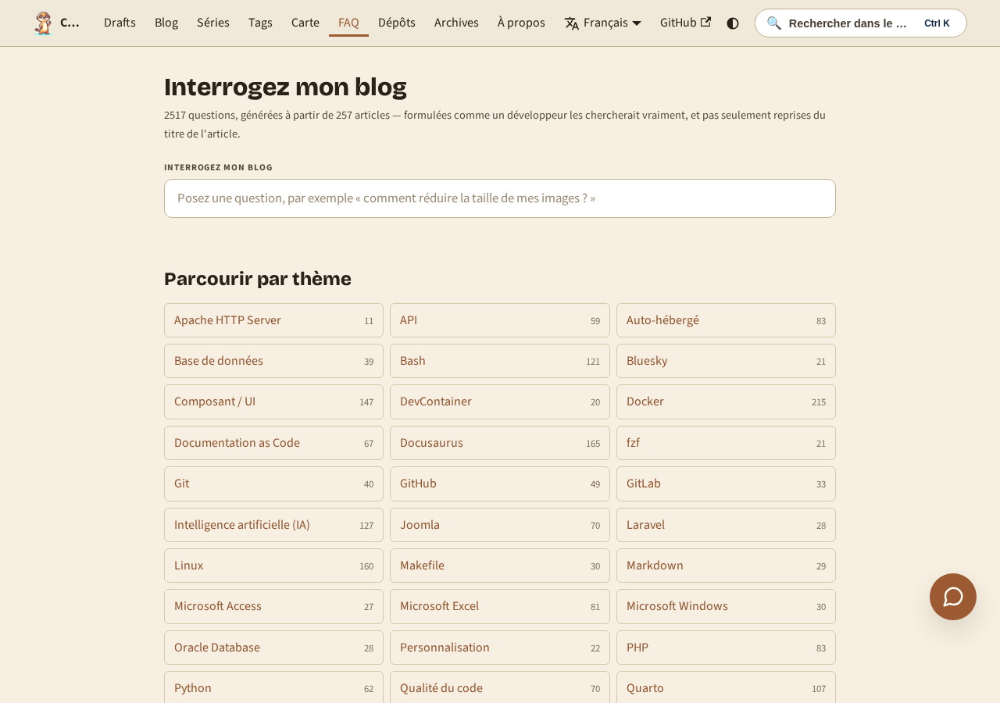
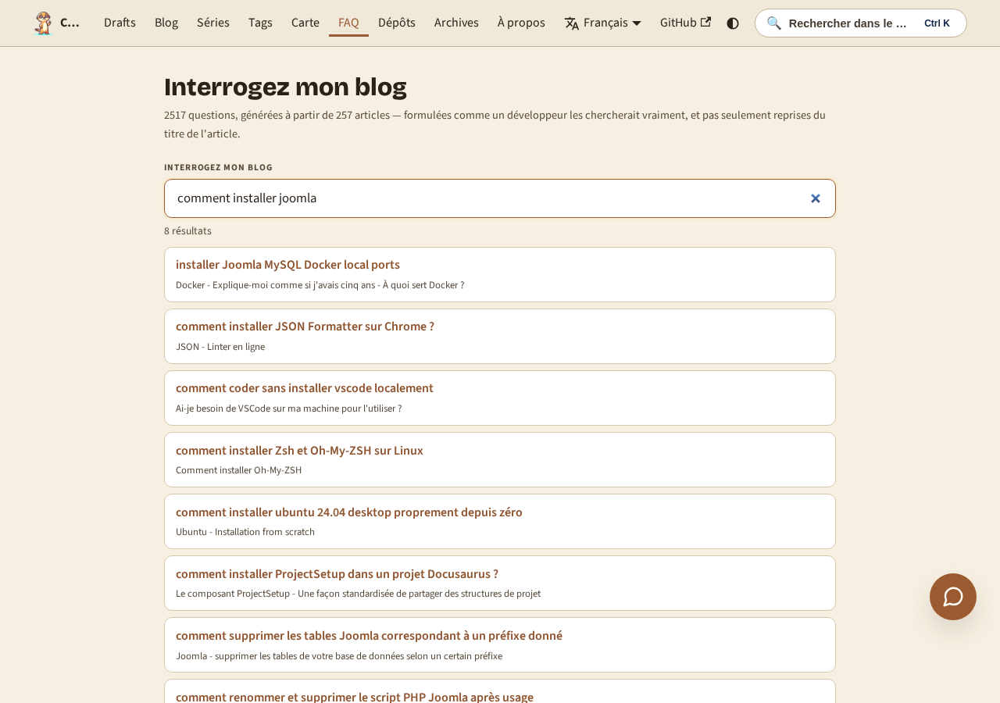

<!-- cspell:ignore BM25 Okapi tokenize tokenizes docfreq sidecar sidecars maintag -->


<TLDR>
Une recherche de site ne trouve que les mots que *vous* avez écrits. Un lecteur dont l'image Docker est trop grosse tape « my docker image is huge », pas « optimizing layer caching » — et ne trouve rien. J'ai donc fait lire mes 259 articles à un modèle Ollama local, en lui demandant d'écrire pour chacun les 8 à 12 questions qu'un développeur taperait réellement, chacune reliée au titre qui y répond. Ça a donné 2 160 questions, servies comme un index généré au build et interrogées dans le navigateur avec un simple BM25. Pas d'embeddings, pas de base vectorielle, pas de clé d'API.
</TLDR>

La recherche sur un blog personnel est presque toujours décevante, et j'ai mis un moment à comprendre pourquoi. Ce n'est pas la faute du moteur de recherche — le mien indexe parfaitement chaque mot de chaque page. Le problème, c'est qu'il ne peut trouver que les mots que *j'ai* écrits.

J'écris « réduire la taille finale de l'image avec des builds multi-stage ». Le lecteur en galère tape « mon image docker est énorme ». Zéro résultat. L'article dont il avait besoin est là, indexé, comparé à un vocabulaire qu'il n'a jamais employé.

La réponse habituelle, ce sont les embeddings : tout transformer en vecteurs, comparer des sens plutôt que des mots. Mais ça veut dire un modèle dans le navigateur, ou un appel d'API à chaque frappe, pour un blog statique sans backend. Il existe une façon bien moins coûteuse de faire le pont entre deux vocabulaires — et ça commence par remarquer que ce pont ne doit être construit qu'**une seule fois**.

<!-- truncate -->

<QuickJump
  links={[
    { label: "Ce que vous obtenez", to: "#what-you-get" },
    { label: "Comment les questions sont générées", to: "#generating-the-questions" },
  ]}
/>

## Ce que vous obtenez {#what-you-get}

La <Link to="/faq">page `/faq`</Link> s'ouvre sur un hub : des cartes de sujets, une par tag principal — *Docker*, *AI*, *Bash*, *WSL*, et d'autres. Chaque carte indique combien de questions y sont classées. Cliquez sur l'une d'elles et vous arrivez sur une page qui liste toutes les questions de ce sujet, chacune pointant vers le titre d'article exact qui y répond :

<BrowserWindow url="https://www.avonture.be/fr/faq">



</BrowserWindow>

Le même index alimente aussi une boîte de recherche sur cette page. Tapez un problème avec vos propres mots — « mon image docker est trop grosse », « comment installer joomla » — et vous obtenez des questions, pas des titres de page. Chaque résultat pointe vers le titre exact qui y répond :

<BrowserWindow url="https://www.avonture.be/fr/faq">



</BrowserWindow>

C'est toute l'idée, et le reste de cet article explique comment c'est construit.

## Pourquoi ça marche sans modèle dans le navigateur {#why-this-works-without-a-model-in-the-browser}

L'idée est minuscule et c'est tout l'article : **le travail sémantique n'a pas à se faire au moment de la recherche.**

- La requête d'un lecteur et la prose d'un article sont écrites dans deux vocabulaires différents. Quelque chose doit traduire entre les deux.
- Cette traduction est une propriété fixe de l'article. Elle ne dépend ni de qui cherche, ni de quand. Elle peut donc être calculée une fois et stockée.
- Une fois qu'un modèle a déjà formulé « comment empêcher mon image Docker d'être énorme ? » et l'a classée à côté du bon titre, comparer la requête d'un lecteur à **cette** phrase devient un simple problème de similarité de chaînes. Un classement lexical vieux de vingt ans s'en sort parfaitement.
- Ce qui part vers le navigateur, c'est donc une liste de phrases et une fonction de scoring — pas un modèle, pas un index vectoriel, pas un appel réseau.

Le build devient plus lent (environ 11 secondes par article, une seule fois). Chaque lecteur ensuite obtient une réponse instantanée.

## Générer les questions {#generating-the-questions}

Le générateur demande à une instance <Link to="/blog/ollama-installation">Ollama</Link> locale des questions sur un article, et les écrit dans un fichier sidecar à côté de celui-ci — la même convention que celle déjà utilisée par mes <Link to="/blog/docusaurus-eli5-snippet-tooltips">tooltips ELI5</Link> pour leur propre contenu généré :

<Terminal source="./files/generate_demo.txt" />

Le résultat est un petit fichier JSON, `index.md.questions.json`, committé à côté de l'article :

<Snippet filename="blog/2025/09/12/docusaurus-go-top/index.md.questions.json" source="./files/demo.questions.json" defaultOpen={true} />

Trois choses rendent cette sortie utilisable plutôt que simplement plausible.

**On explique au modèle ce que « spécifique » veut dire.** Le system prompt interdit purement et simplement les questions génériques (« Qu'est-ce que Docker ? »), exige un mélange de requêtes courtes façon mots-clés et de phrases complètes, et interdit deux questions qui ne diffèrent que par l'ordre des mots :

```text title="scripts/generate-questions.mjs — system prompt (extract)"
- Every question must be SPECIFIC to this article's actual content — never generic
  ("What is Docker?", "How does Markdown work?").
- Vary the phrasing style: some short keyword-style queries, some full questions.
- Each question maps to exactly one heading by index. Index 0 means "the article as a
  whole / introduction", not tied to a specific heading.
- Do not invent facts not supported by the material given.
```

**La forme de la réponse est imposée, pas espérée.** Ollama accepte un schéma JSON dans `format:`, donc le modèle ne peut pas renvoyer de la prose, une liste markdown ou un champ nommé différemment. Le script valide quand même chaque élément après coup, et fait échouer l'article entier s'il en reste moins de cinq — une entrée maigre est pire qu'aucune entrée.

**Les titres sont résolus en vraies ancres.** Le prompt donne au modèle une liste numérotée de titres et lui demande un index ; le script remappe cet index vers le slug que Docusaurus va lui-même générer, avec le même package `github-slugger` que Docusaurus utilise en interne. Un mauvais index n'est pas fatal — la question retombe en haut de l'article au lieu d'être jetée.

Voici le générateur complet :

<Snippet filename="scripts/generate-questions.mjs" source="scripts/generate-questions.mjs" defaultOpen={false} />

<AlertBox variant="tip" title="Choisir un petit modèle, volontairement">
Ça tourne sur `task-tiny`, un modèle instruct de 3B. Les modèles locaux plus gros ne produisaient pas de meilleures questions en comparaison directe et tournaient environ dix fois plus lentement. Écrire des questions de recherche à partir d'un titre, d'une description et d'une liste de titres est une tâche d'*extraction*, pas de raisonnement — et 259 articles à 11 secondes chacun, c'est une pause café, alors que 259 à deux minutes chacun, c'est un après-midi.
</AlertBox>

## Servir 2 160 questions de trois manières différentes {#serving-2160-questions-three-different-ways}

Un plugin Docusaurus agrège les 259 sidecars en un seul index. Le point intéressant, c'est qu'il n'expédie **pas** cet index une fois — il l'expédie trois fois, sous trois formes différentes, parce qu'il a trois consommateurs aux besoins incompatibles :

| Consommateur | Ce dont il a besoin | Comment il l'obtient |
| --- | --- | --- |
| Le hub `/faq` | 40 noms de sujets et leurs compteurs, groupés par <Link to="/blog/docusaurus-tags">tag principal</Link> | `setGlobalData` — quelques centaines d'octets |
| Les pages `/faq/<topic>` | Les questions d'un seul sujet, crawlables | `addRoute` + `createData`, code-split par route |
| La boîte de recherche | Tout le corpus | Un simple fichier JSON statique, récupéré à la demande |

C'est la troisième ligne qui compte. Le corpus complet pèse **468 Ko** (63 Ko gzippés), et la boîte de recherche vit dans un composant monté sur *chaque* page du site. L'exposer via `setGlobalData` aurait embarqué les 468 Ko dans le JavaScript de chaque page, que quelqu'un tape un caractère ou non.

Le plugin l'écrit donc directement sur disque comme asset statique, et le client le `fetch` la première fois que quelqu'un ouvre vraiment la boîte de recherche :

<Snippet filename="plugins/questions-index-plugin/index.cjs" source="plugins/questions-index-plugin/index.cjs" defaultOpen={false} />

Le fetch est mis en cache au niveau du module, donc la palette et la page `/faq` partagent un seul téléchargement — et un fetch raté vide le cache au lieu de l'empoisonner, pour qu'un lecteur ayant cherché avant la fin du build du serveur de dev puisse simplement réessayer :

<Snippet filename="src/components/AskMyBlog/questionsIndex.ts" source="src/components/AskMyBlog/questionsIndex.ts" defaultOpen={false} />

Et la boîte de recherche elle-même :

<ProjectSetup folderName="src/components/AskMyBlog">
  <Snippet filename="src/components/AskMyBlog/index.tsx" source="src/components/AskMyBlog/index.tsx" defaultOpen={false} />
  <Snippet filename="src/components/AskMyBlog/utils.ts" source="src/components/AskMyBlog/utils.ts" defaultOpen={false} />
  <Snippet filename="src/components/AskMyBlog/styles.module.css" source="src/components/AskMyBlog/styles.module.css" defaultOpen={false} />
</ProjectSetup>

## Sous le capot (passez votre chemin si vous voulez juste les questions) {#under-the-hood-skip-this-if-you-just-want-the-questions}

### Interroger l'index depuis la ligne de commande {#querying-the-index-from-the-command-line}

Le fichier JSON est un simple tableau, vous pouvez donc le sonder hors du navigateur en quelques lignes. Pratique pour déboguer l'index avant de le livrer, ou pour vérifier si une formulation précise correspond :

<Terminal source="./files/search_demo.txt" />

### BM25 en quarante lignes {#bm25-in-forty-lines}

Le classement, c'est Okapi BM25 — fréquence des termes avec saturation, plus normalisation par la longueur, pondérée par la fréquence inverse de document. C'est ce qu'utilisent Lucene et Elasticsearch, et ça tient dans un petit fichier parce que chaque « document » ici est une seule question d'une douzaine de mots.

Deux adaptations étaient nécessaires pour cette longueur de document inhabituellement courte.

**Le matching par préfixe, développé une fois par requête.** Un lecteur qui tape `docus` n'a pas fini son mot, donc un token inconnu de trois caractères ou plus est développé vers tous les termes indexés qu'il préfixe. En dessous de trois caractères, un préfixe correspond à trop de vocabulaire pour signifier quoi que ce soit, donc les tokens inconnus courts sont simplement écartés. Point crucial : l'expansion a lieu une fois par requête, pas une fois par document — la boucle de scoring ne voit jamais que de vrais termes indexés.

**Un tokenizer qui découpe les mots composés sans les perdre.** `CaesiumCLT` tokenisé naïvement est un seul token indivisible, donc un lecteur qui tape « caesium » ne trouve rien. Insérer une frontière avant de passer en minuscules règle ça — mais alors `WordPress` devient `word` + `press`, et quelqu'un qui tape « wordpress » en un mot ne correspond à aucune des deux moitiés. La solution est une union plutôt qu'un remplacement : garder à la fois la forme découpée et la forme entière.

```ts title="src/components/AskMyBlog/utils.ts"
export function tokenize(text: string): string[] {
  const withBoundaries = text.replace(/([a-z0-9])([A-Z])/g, "$1 $2");
  const split = withBoundaries.toLowerCase().match(/[a-z0-9]+/g) || [];
  const whole = text.toLowerCase().match(/[a-z0-9]+/g) || [];
  return [...new Set([...split, ...whole])];
}
```

### Le problème des doublons {#the-duplicate-problem}

Si quarante articles génèrent chacun « Comment installer Docker ? », l'index ne sert à rien — le lecteur obtient quarante lignes identiques et aucun signal. Le plugin normalise chaque question et supprime **toutes** les instances en collision, y compris la première. Ce dernier détail est volontaire : une question qui n'est pas spécifique à exactement un article a déjà enfreint la règle du prompt, donc en garder une copie reviendrait quand même à livrer une mauvaise entrée. Sur mon corpus, ça retire 5 questions sur 2 055. Le prompt fait l'essentiel du travail ; ceci n'est que le filet de sécurité.

### Les sidecars sont faits pour être édités à la main {#sidecars-are-meant-to-be-hand-edited}

La génération est un premier jet. La plupart des entrées sont correctes, certaines sont une blague reprise telle quelle dans la prose d'un article et reformatée en question. Un petit élagueur interactif les retrouve par mot-clé et permet de supprimer par numéro :

```console
$ yarn questions:edit "dinosaur"

blog/2024/05/17/some-article/index.md.questions.json
  [0] How do I install the CLI? → #installation
  [1] How can I play with a green dinosaur?
  [2] What does the --force flag do? → #options
Delete which number(s)? (space-separated, Enter to skip): 1
  ✅ Removed 1 question(s), 11 left.
```

Supprimer une question ne touche jamais à l'article lui-même, ce qui compte pour la dernière pièce.

### Détecter la dérive {#detecting-drift}

Une question générée peut pourrir en silence : renommez un titre et son ancre casse ; réécrivez une section et les questions cessent de la décrire. `yarn questions:check` compare le `sourceHash` stocké dans chaque sidecar au contenu actuel de l'article et signale `STALE`, plus les articles qui n'ont aucun sidecar. Par défaut il se contente de rapporter ; `--strict` échoue sur les entrées périmées mais jamais sur la couverture manquante, parce qu'un article fraîchement écrit n'a légitimement aucune question tant que vous n'avez pas lancé le générateur dessus.

<Snippet filename="scripts/check-questions-freshness.mjs" source="scripts/check-questions-freshness.mjs" defaultOpen={false} />

### Les pages de sujet embarquent des données structurées FAQ {#the-topic-pages-carry-faq-structured-data}

Chaque page `/faq/<topic>` émet du JSON-LD `FAQPage`. Autant être honnête sur le retour : Google a restreint les rich results FAQ en août 2023 à un ensemble étroit de sites gouvernementaux et de santé faisant autorité, donc un blog personnel n'obtiendra pas l'affichage dépliable. Ça reste du balisage correct et conforme aux standards, que d'autres consommateurs lisent — mais pas un gain garanti dans la page de résultats.

## Conclusion {#conclusion}

J'ai commencé en voulant de la recherche sémantique et j'ai fini sans avoir besoin de la moindre sémantique à l'exécution. Le modèle a fait le plus dur une fois, hors ligne, sur ma propre machine, gratuitement — et ce qu'il a laissé derrière lui, ce sont 2 160 phrases en anglais courant qu'un classement lexical ordinaire traite à merveille.

Ce recadrage vaut la peine d'être transposé ailleurs. « Ça nécessite un modèle » signifie très souvent « ça a nécessité un modèle, une fois, et maintenant ça nécessite un fichier ». La version de votre fonctionnalité qui fait tourner un modèle de langage dans le navigateur de chaque visiteur et celle qui livre un fichier JSON calculé au build peuvent produire la même réponse — et une seule des deux fonctionne encore quand la clé d'API expire.

Mon index complet, généré localement et committé dans Git, pèse 63 Ko sur le réseau. C'est moins que l'image de bannière en haut de cet article.
