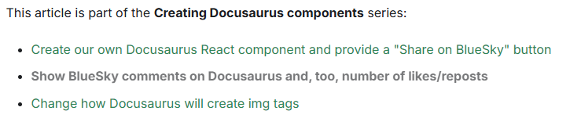

# 📚 SeriesPosts Component

A React component for Docusaurus that displays a list of blog posts belonging to the same series. Ideal for guiding readers through multi-part tutorials, thematic articles, or serialized content.

## 🚀 Features

* 🔗 Links related blog posts in a series
* 🗂️ Filters posts by series name
* 📅 Sorts posts chronologically
* 🎯 Highlights the current post
* 🎨 Custom styling via CSS modules

## Example

Out-of-the-box, here is how the component will looks like:



## 📦 Installation

Place the component in your Docusaurus project:

```bash
src/components/SeriesPosts/SeriesPosts.js
src/components/SeriesPosts/styles.module.css
```

Ensure you have a `getBlogMetadata()` utility that returns blog metadata including `title`, `date`, `series` and `permalink`.

## 🧪 Usage

```jsx
import SeriesPosts from "@site/src/components/SeriesPosts";

<SeriesPosts
  series="Creating components for Docusaurus"
  excludePermalink="/blog/components-docusaurus"
  highlightCurrent={true}
/>
```

## 🧾 Props

| Prop | Type | Required | Default | Description |
| --- | --- | --- | --- | --- |
| `series` | string | ✅ | — | Name of the series to filter blog posts by |
| `excludePermalink` | string | ❌ | null | Permalink of the current post to exclude from the list |
| `highlightCurrent` | boolean | ❌ | true | If true, dims the current post title for visual emphasis |

## 🛠️ Requirements

* Docusaurus v3+
* Blog metadata utility: `getBlogMetadata()`
* Blog posts must include `series`, `title`, `date` and `permalink` fields

## 🎨 Styling

Customize the layout and appearance via `styles.module.css`. You can style:

* Series container
* List items
* Highlighted post title

## 📄 License

MIT — free to use, modify, and contribute.

## 💬 AI generated

This code has been generated by Christophe Avonture using AI.
