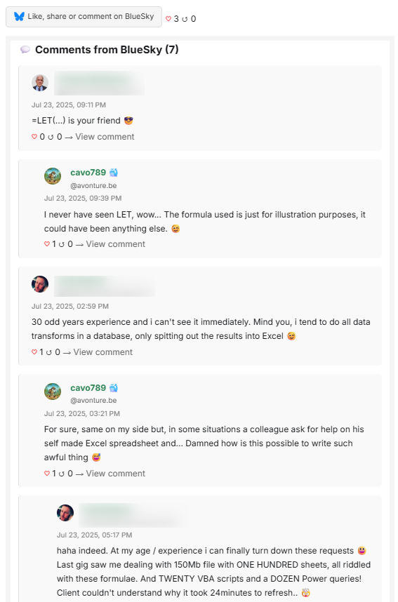

# 🟦 BlueSky Component

The `BlueSky` component is a dynamic integration for Docusaurus pages that enables interaction with the [Bluesky](https://bsky.app/) social platform. Depending on the presence of a `blueSkyRecordKey` in the document's frontmatter, it either allows visitors to share the page on their own Bluesky profile or interact with an existing post (like, repost, comment).

## ✨ Features

* 🔗 Share button for posting the current document to a user's Bluesky profile
* 💬 Like, repost, and comment interface for existing Bluesky posts
* 📊 Displays number of likes and reposts
* 🗨️ Shows comments or engagement call-to-action
* 🧠 Behavior determined by frontmatter configuration

## Example

Out-of-the-box, here is how the component will looks like:



## 📦 Usage

### 1. Add Frontmatter to Your Document

To enable full post interaction (likes, comments, etc.), include a `blueSkyRecordKey` in your document's frontmatter:

```yaml
---
title: "My Awesome Post"
blueSkyRecordKey: 3lun2qjuxc22r
---
```

If `blueSkyRecordKey` is omitted or empty, only the share button will be shown.

### 2. Configure Your Bluesky Handle

In your `docusaurus.config.js`, add your Bluesky handle under customFields:

```js
const config = {
  // ...
  customFields: {
    blueSky: {
      handle: 'avonture.be', // Replace with your actual Bluesky handle
    },
  },
};
```

## 🧪 Example

```jsx
import BlueSky from "@site/src/components/BlueSky";

<BlueSky metadata={props.metadata} />
```

## 🧾 Props

| Prop | Type | Required | Default | Description |
| --- | --- | --- | --- | --- |
| `metadata | object | ✅ | — | Docusaurus document metadata, including frontmatter |
| `metadata.frontMatter.blueSkyRecordKey`| string | ❌ | — | Unique key for the associated Bluesky post. Enables full interaction mode. |

## 🔀 Behavior

| Scenario | Outcome |
| --- | --- |
| `blueSkyRecordKey` is absent | Shows a share button to post the document to user's Bluesky profile |
| `blueSkyRecordKey` is present | Displays post interaction UI: like, repost, comment, and engagement data |

## 🧩 Internal Components

This component uses the following subcomponents:

* `BlueSkyShare` – Share button for user-generated posts
* `BlueSkyPost` – Interaction UI for existing posts
* `BlueSkyLikes` – Displays like/repost counts
* `BlueSkyComments` – Shows comments or engagement CTA

## 🎨 Styling

Wraps content in a `blueSkyContainer` class. You can customize styles via your global or module CSS.

## 📄 License

MIT — free to use, modify, and contribute.

## 💬 IA partially generated

This code has been partially generated by Christophe Avonture using IA.
