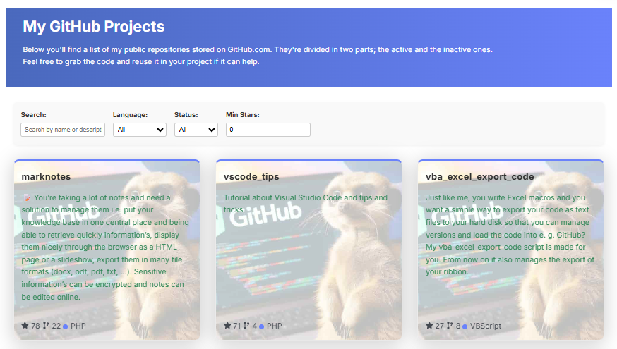

# 📦 GithubProjects Component

A React component for displaying and filtering GitHub repositories for a given user. Built for [Docusaurus](https://docusaurus.io/) sites, this component fetches public repositories from the GitHub API and presents them in a visually rich, interactive grid.

## 🚀 Features

* 🔍 **Search** by repository name or description
* 🎛️ **Filter** by language, archived status, and minimum stars
* 🎨 **Dynamic styling** based on language color
* ⚡ **Fade-in animation** for smooth visual entry
* 🧠 **Local caching** to reduce API calls
* 📊 **Sorts** by popularity (stars) or alphabetically

## Example

Out-of-the-box, here is how the component will looks like:



## 📦 Installation

Make sure your project uses React and Docusaurus 3.x. Then place the component in your desired location:

```bash
src/components/GithubProjects/GithubProjects.js
src/components/GithubProjects/styles.module.css
```

## 🧪 Usage

```jsx
import GithubProjects from "@site/src/components/GithubProjects";

<GithubProjects username="your-github-username" />
```

## 🧾 Props

| Prop | Type | Required | Default | Description |
| --- |  --- | --- | --- | --- |
| `username` | string | ✅ | — | GitHub username to fetch repositories |

## 🧠 Filtering Options

* Search: Type keywords to match repo name or description
* Language: Dynamically generated from fetched data
* Archived: Show active, archived, or all repos
* Min Stars: Filter by minimum star count

## 🎨 Styling

The component uses `styles.module.css` for scoped styling. You can customize:

* Background image
* Card hover effects
* Fade-in animation
* Filter panel layout

## 🛠️ Development Notes

* Uses GitHub REST API: `https://api.github.com/users/{username}/repos`
* Caches repo data in localStorage for 24 hours
* Handles pagination (up to 100 repos per page)
* Responsive layout using Docusaurus grid classes

## 📄 License

MIT — free to use, modify, and share.

## 💬 IA generated

This code has been generated by Christophe Avonture using IA.
