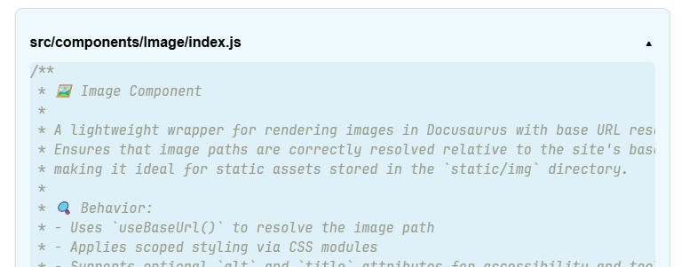

# 📄 Snippets Component

A collapsible content block for Docusaurus that displays expandable sections with a filename label and smooth animations. Perfect for code snippets, notes, or any content that benefits from toggled visibility.

## 🚀 Features

* 📂 Toggleable content block with smooth transitions
* 🧩 Displays a filename or section label
* 🎨 Styled with CSS modules
* 🛠️ Accessible with ARIA attributes
* ⚙️ Configurable default open state

## Example

Out-of-the-box, here is how the component will looks like:



## 🧪 Usage

```jsx
import Snippets from "@site/src/components/Snippets";

<Snippet filename="example.js" defaultOpen={false}>

```js
console.log("Hello, world!");
```

</Snippet>
```

## 🧾 Props

| Prop | Type | Required | Default | Description |
| --- | --- | --- | --- | --- |
| `filename` | string | ✅ | — | Label shown on the toggle button (e.g. filename) |
| `children` | ReactNode | ✅ | — | Content to display inside the collapsible block |
| `defaultOpen` | boolean | ❌ | true | Whether the snippet is expanded by default |

## 🎨 Styling

The component uses the following CSS module classes:

* `snippet_block`: Main container
* `snippet_summary`: Toggle button
* `snippet_content`: Collapsible content wrapper
* `snippet_inner`: Inner content container
* `chevron` and `rotate`: Chevron icon and rotation animation

## 🛠️ Accessibility

* Toggle button includes `aria-expanded` and `aria-controls`
* Unique ID is generated for each snippet block to ensure proper linking

## 📄 License

MIT — free to use, modify, and contribute.

## 💬 AI generated

This code has been generated by Christophe Avonture using AI.
