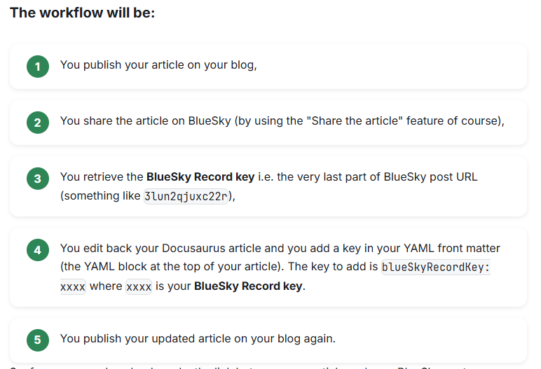

# 🧭 StepsCard Component

A reusable React component for Docusaurus 3.8 that renders a sequence of steps in a clean, card-based layout. Ideal for tutorials, onboarding flows, or any step-by-step instructions.

## ✨ Features

* ✅ Fully compatible with Docusaurus 3.8
* 🌗 Supports dark/light mode via theme config
* 🎨 Styled with Docusaurus theme variables
* 🧠 Accepts Markdown strings or React nodes
* 📦 MDX-compatible rendering

## Example

Out-of-the-box, here is how the component will looks like:



## 📁 Location

This component lives at `src/components/Steps/index.js`.

## 🚀 Usage

Import and use the component in your MDX page or React layout:

```jsx
import StepsCard from '@site/src/components/Steps';

<StepsCard
  title="Publishing Workflow"
  steps={[
    'First thing to do',
    'Then this one,',
    'As third action, do this,',
    'Almost done, think to ...',
    'Finally do this.'
  ]}
/>
```

## 🛠 Props

| Prop | Type | Default | Description |
| --- | --- | --- | --- |
| `steps` | `Array<string React.ReactNode>` | Required | List of steps to render. Markdown is supported. |
| `title` | string | "Steps to follow" | Optional title displayed above the steps list. |

## 🧪 Markdown Support

Supports basic Markdown formatting in strings:

* `**bold**` → `<strong>`
* `inline code` → `<code>`

## 🎨 Styling

The component uses scoped CSS via `styles.module.css` and Docusaurus theme variables:

* `--ifm-color-primary` for step number background
* `--ifm-background-color` and `--ifm-background-dark` for card backgrounds

## 🧩 MDX Compatibility

Steps can be passed as React nodes for full MDX flexibility. If passed as strings, they are rendered with basic Markdown support.

## 📄 License

MIT — use freely and modify as needed.

## 💬 IA generated

This code has been generated by Christophe Avonture using IA.
