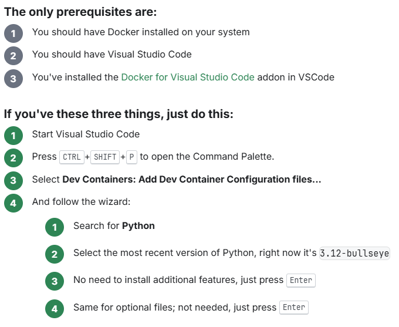
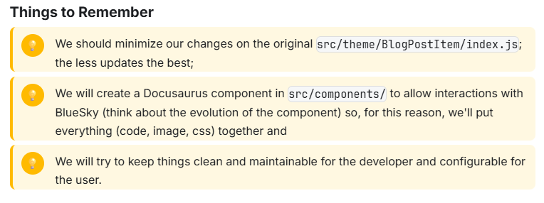

# 🧭 StepsCard Component

A flexible and theme-aware React component for Docusaurus that displays a list of steps or prerequisites in a clean, card-based layout. Each item is numbered and supports basic Markdown formatting.

## ✨ Features

* 🌗 Dark/light mode support via Docusaurus theme config
* 🎨 Theme-aware styling using CSS variables
* 📝 Markdown support for bold, inline code, and links
* 🔢 Numbered layout with visual variants
* 🧩 Optional title displayed above the list

## Example

Out-of-the-box, here is how the component will looks like:



Another example for the `remember` variant:



## 📁 Location

This component lives at `src/components/StepsCard/index.js`.

## 🚀 Usage

### ✅ Steps Variant

```jsx
<StepsCard
  title="Publishing Workflow"
  steps={[
    'Write your article',
    'Share it on BlueSky',
    'Retrieve the **BlueSky Record key** from the post URL',
    'Add `blueSkyRecordKey: xxxx` to your article front matter',
    'Republish your article',
    'Here’s the diagram: '
  ]}
/>
```

### ✅ Prerequisites Variant

```jsx
<StepsCard
  title="Before You Begin"
  variant="prerequisites"
  steps={[
    "**Node.js** installed",
    "`admin` access to your dashboard",
    "A GitHub account",
    "Install the [CLI tool](https://example.com/cli)"
  ]}
/>
```

### ✅ Remember Variant

```jsx
<StepsCard
  title="Things to Remember"
  variant="remember"
  steps={[
    "Always commit your work before running migrations",
    "Use **feature branches** instead of committing to `main`",
    "Run `npm test` before pushing to CI",
    "Check `.env.example` is updated if new env vars are added"
  ]}
/>
```

## 🛠 Props

| Prop | Type | Required | Default | Description |
| --- | --- | --- | --- | --- |
| `steps` | `Array<string React.ReactNode>` | ✅ | — | List of items to display. Markdown is supported. |
| `title` | string | ❌ | `Steps to follow` | title displayed above the list. |
| `variant` | `prerequisites`, `remember` or `steps` | ❌ | `steps` | Visual style: `prerequisites` uses neutral tone, `remember` use a bulb icon on yellow backgroudn and `steps` uses primary color . |

## 🧪 Markdown Support

Supports basic Markdown formatting in strings:

* `**bold**` → `<strong>`
* `inline code` → `<code>`
* `[link text](https://...)` → `<a href="..." target="_blank">`

Note: Markdown images (``) are supported if rendered manually via React nodes.

## 🎨 Styling

The component uses scoped CSS via `styles.module.css`. Key classes include:

* `.steps_container` — wrapper
* `.steps_title` — section title
* `.step_card` — individual card
* `.step_number` — numbered circle
* `.step_content` — content block

Customize these styles to match your site's design system.

## 📄 License

MIT — free to use and modify.

## 💬 IA generated

This code has been generated by Christophe Avonture using IA.
