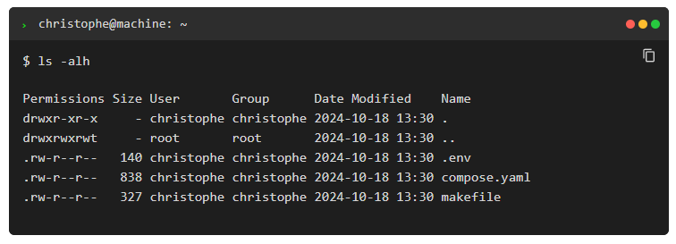

# 🖥️ Terminal Component

A stylized terminal emulator UI for Docusaurus pages. Ideal for showcasing CLI commands, installation steps, or shell output in a visually engaging format.

## ✨ Features

* 🧑‍💻 Linux-style header with icon and control dots
* 📝 Customizable terminal title
* 💻 Styled code block for terminal content
* 🎨 Theme-friendly layout using scoped CSS

## Example

Out-of-the-box, here is how the component will looks like:



## 📁 Location

This component lives at `src/components/Terminal/index.js`.

## 🚀 Usage

```jsx
import Terminal from '@site/src/components/Terminal';

<Terminal title="user@machine: ~/project">
  npm install
  npm run build
</Terminal>
```

If no title is provided, the default is: `christophe@home: ~`

### With Word Wrapping Disabled

```jsx
<Terminal wrap={false}>
  $ echo "This is a very long line that should not wrap unless explicitly allowed"
</Terminal>
```

## 🛠 Props

| Prop | Type | Required | Default | Description |
| --- | --- | --- | --- | --- |
| `children` | `React.ReactNode` | ✅ | — | Terminal content to display inside the code block |
| `title` | string | ❌ | `christophe@home: ~` | Optional terminal title shown in the header |
| `wrap` | boolean | ❌ | `true` | Enables word wrapping in the terminal body. Set to false to disable it. |

## 💡 Command Detection

Lines starting with `$` or `>` are treated as commands and rendered with a prompt symbol (`>`). This helps visually distinguish commands from output.

## 🎨 Styling

This component uses scoped CSS via `styles.module.css`. Key classes include:

* `.terminal` — outer container
* `.terminal_header` — header bar
* `.terminal_left` — icon + title
* `.terminal_controls` — control dots
* `.terminal_body` — code block area
* `.terminal_line` — individual line
* `.prompt` — command prompt symbol
* `.no_wrap` — disables word wrapping
* `.dot.red`, `.dot.yellow`, `.dot.green` — control dot colors

Customize these styles to match your site's design system.

## ⚠️ Escaping $

When writing shell commands inside JSX, be mindful that the `$` symbol is interpreted by JavaScript as the start of a template literal (e.g., `${variable}`). To prevent this and ensure your command renders correctly in the terminal, you’ll need to escape `$` signs using a backslash (`\`). For example:

```jsx
<Terminal>
  {`$ docker run --detach --name step_1_2 -p 81:80 -v $(pwd):/var/www/html -u \${UID}:\${GID} php:8.1.5-apache`}
</Terminal>
```

This ensures that `\${UID}` and `\${GID}` are treated as literal strings rather than JavaScript expressions. Without escaping, your code may throw an error or render incorrectly.

## 📄 License

MIT — free to use and modify.

## 💬 AI generated

This code has been generated by Christophe Avonture using AI.
