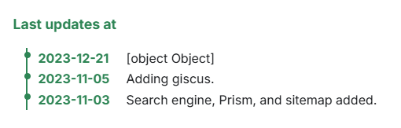

# 📢 UpdateAt Component

A simple and elegant timeline component for displaying recent updates, changelogs, or announcements. Each update includes a date and content block, with an optional title displayed above the list.

## ✨ Features

* 🕒 Timeline layout with date and content
* 📝 Optional title (defaults to `"Last updates at"`)
* 🎨 Styled using scoped CSS modules
* 🧠 Accepts rich content via React nodes

## Example

Out-of-the-box, here is how the component will looks like:



## 📁 Location

This component lives at `src/components/UpdateAt/index.js`.

## 🚀 Usage

```jsx
import UpdateAt from '@site/src/components/UpdateAt';

<UpdateAt
  title="Recent Changes"
  updates={[
    { date: "2025-08-20", content: "Added new feature to dashboard" },
    { date: "2025-08-18", content: <strong>Improved performance</strong> },
    { date: "2025-08-15", content: "Fixed minor bugs in UI" }
  ]}
/>
```

## 🛠 Props

| Prop | Type | Required | Default | Description |
| --- | --- | --- | --- | --- |
| `updates` | `Array<{ date: string, content: ReactNode }>` | ✅ | — | List of updates with date and content. |
| `title` | string | ❌ | "Last updates at" | Optional title displayed above the timeline. |

## 🎨 Styling

This component uses the following CSS classes from `styles.module.css`:

* `.timeline_wrapper` — outer container
* `.timeline_title` — title block
* `.timeline_container` — list container
* `.timeline_item` — individual update block
* `.timeline_date` — date label
* `.timeline_content` — content area

Customize these styles to match your site's theme.

## 📄 License

MIT — free to use and modify.

## 💬 IA generated

This code has been generated by Christophe Avonture using IA.
