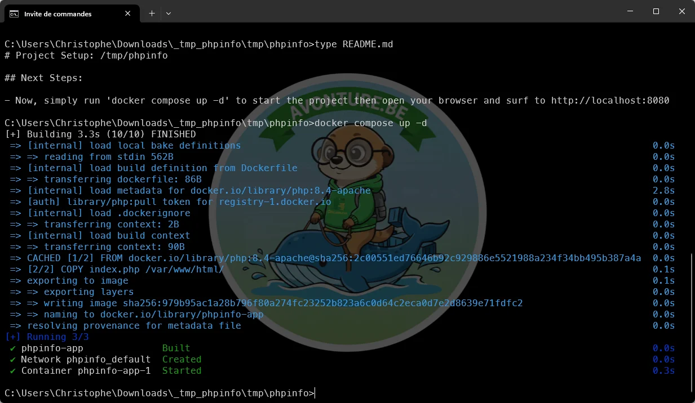
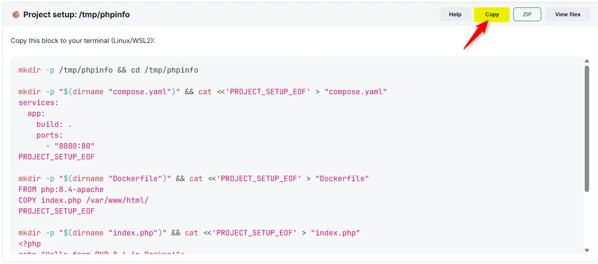
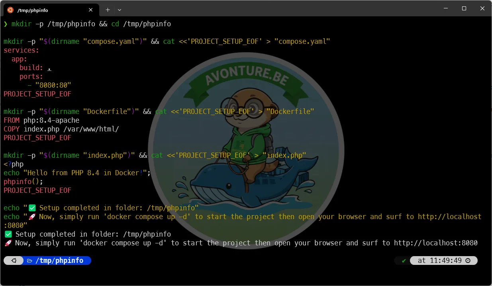

import ProjectSetup, {
  EmptyFolder,
  Guideline,
} from "@site/src/components/ProjectSetup/index.js";

import Snippet from "@site/src/components/Snippet";
import Tabs from "@theme/Tabs";
import TabItem from "@theme/TabItem";
import CodeBlock from "@theme/CodeBlock";

# How to Use the Project Setup Component

The **Project Setup** component is a powerful tool designed to help you quickly scaffold a new project. It provides a list of files and offers two main ways to get started: downloading a ZIP archive or using a generated installation script.

Below a fully functional example of the component looks like.

<ProjectSetup folderName="/tmp/phpinfo">
  <Snippet
    filename="compose.yaml"
    code={`services:
    app:
      build: .
      ports:
        - "8080:80"`}
  />
  <Snippet
    filename="Dockerfile"
    code={`FROM php:8.4-apache
COPY index.php /var/www/html/
`}
  />
  <Snippet
    filename="index.php"
    code={`<?php
echo "Hello from PHP 8.4 in Docker!";
phpinfo();
`}
  />
  <Guideline>
    Now, simply run 'docker compose up -d' to start the project then open your
    browser and surf to http://localhost:8080
  </Guideline>
</ProjectSetup>

## Option 1: Download as a ZIP File

This is the simplest way to get all the project files on your local machine.

1.  **Click the "ZIP" button**: This will bundle all the files and folders into a single `.zip` archive and trigger a download in your browser.
2.  **Save the file**: Choose a location on your computer to save the ZIP file.
3.  **Uncompress the archive**:
    <Tabs>
      <TabItem value="windows" label="Windows" default>
        

          Right-click the downloaded file and select <b>"Extract All..."</b>.
          Choose a destination folder, and the files will be uncompressed there.
        

      </TabItem>
      <TabItem value="linux" label="Linux/macOS">
        

          Open your terminal, navigate to the directory where you saved the
          file, and run:
        

        <CodeBlock language="bash">
          unzip your-project-name.zip -d your-project-name
        </CodeBlock>
      </TabItem>
    </Tabs>
4.  **Read the `README.md`**: Inside the uncompressed folder, you'll find a `README.md` file. It contains the next steps, such as installation commands (e.g., `npm install`) and how to run the project.

<AlertBox variant="tip" title="MS-DOS example">
Below an example of how using the ZIP in an MS-DOS console. Just download the archive, unzip it , use `cd` to jump in the folder where files are located then, finally, display the instructions (`type README.md`) and follow them in order to run the project.

In the example below, instructions are to run `docker compose up -d` then to open a webpage.

</AlertBox>

## Option 2: Generate Install Script

This option is ideal for users who are comfortable with the command line (Linux, macOS, or WSL on Windows). It generates a "one-liner" script that creates all the files and folders directly in your terminal.

1.  **Click the "Generate install script" button**: This will switch the view from the file list to a code block containing a Bash script.
2.  **Copy the script**: Click the **"Copy"** button to copy the entire script to your clipboard.
3.  **Paste and run in your terminal**:
    - Open your terminal.
    - Navigate to the directory where you want to create the project.
    - Paste the script and press `Enter`.
4.  **Follow the on-screen instructions**: The script will create the project folder, all the necessary subdirectories and files, and then print the next steps to follow.

<AlertBox variant="tip" title="Click on the Copy button">
Once you've clicked on the `Generate install script` button, you've to click on the `Copy` button to copy it in your clipboard.

Start a console (MS-DOS, Powershell or most likely a Linux/WSL one) and paste the content of the clipboard.

This done, press <kbd>Enter</kbd>.

Then start a console (Ubuntu in the example below) and paste:

As you can see on the image, instructions are then displayed at the bottom of the screen.

</AlertBox>

## Option 3: Manual File Creation

If you prefer to create the files yourself, you can do so by following these steps:

1.  **Create the project folder**: Manually create the main folder for your project (e.g., `my-project`) or jump in any existing one.
2.  **View the file list**: In the **Project Setup** component, you can see a list of all the files and their content.
3.  **Create each file**: For each file in the list, create a new file with the same name and copy the content into it.
4.  **Create empty folders**: If there are any empty folders specified, make sure to create them as well.
5.  **Follow the guidelines**: After creating all the files, follow the instructions provided in the "guidelines" section of the component to install dependencies and run the project.
